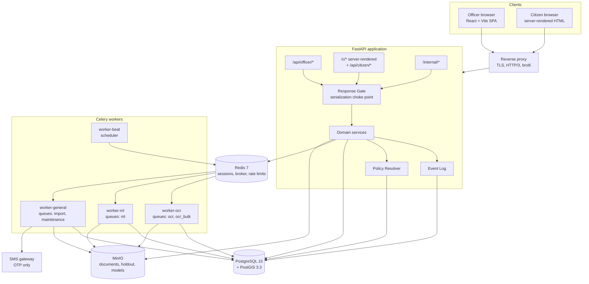
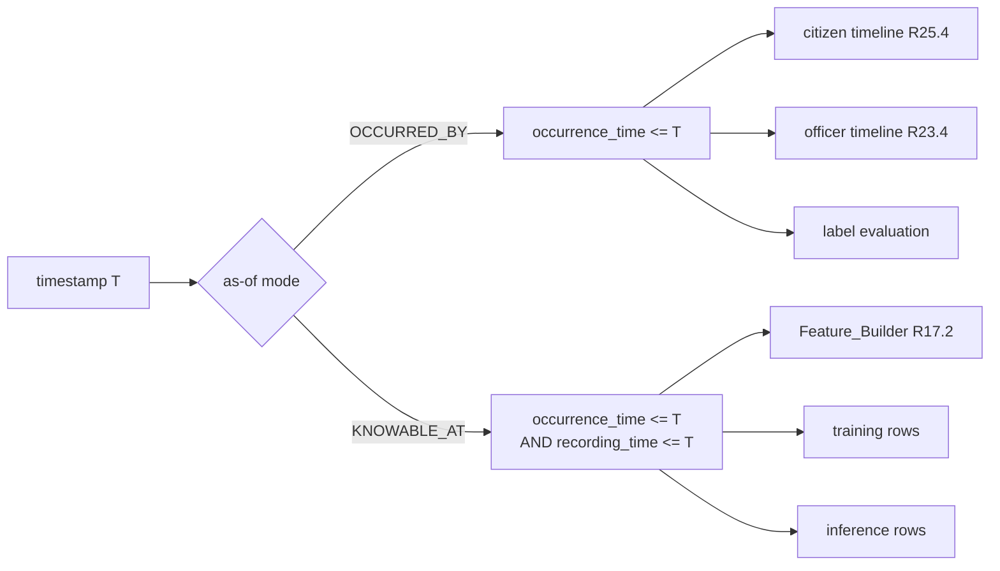
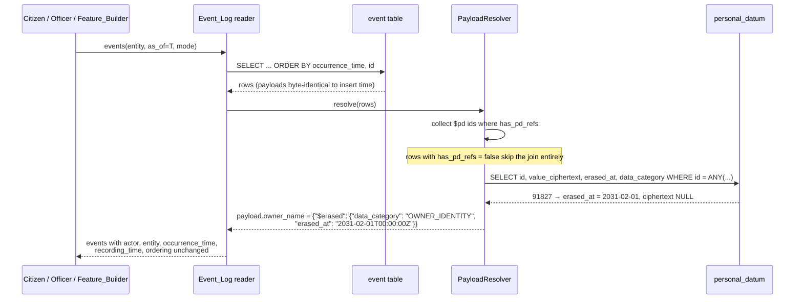
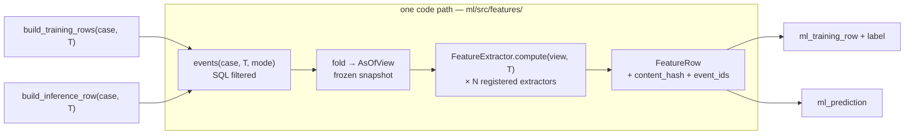

# Design Document

## Overview

BHUMISETU is a land acquisition management platform whose architecture is dominated by four forces that pull against each other:

1. **The event log is a product feature, not a journal.** It is the sole source of the citizen timeline *and* of machine learning features, and it must be append-only. Every design decision about state has to answer to it.
2. **Two surfaces with incompatible engineering budgets.** The officer portal is a rich internal tool on office broadband. The citizen portal has a 150 KB total budget on a 400 kbps / 2000 ms RTT link. These cannot be the same application.
3. **Almost nothing legally significant is a constant.** Stage sets, statutory periods, thresholds, cutoffs, weights, retention periods, and the ML label definition are all effective-dated configuration. The code may not contain the numbers.
4. **Personal data obligations against record permanence.** Erasure must work without mutating the append-only log, and without destroying the reproducibility that the ML pipeline depends on.

The design resolves these with five load-bearing decisions, each developed in its own section below:

| Decision | Section |
|---|---|
| A single effective-dated `Policy_Config` resolver that every subsystem reads through, with no stage enum anywhere | [§4](#4-policy_config-the-configuration-substrate) |
| Event payloads hold *references* to personal data, never inline values, so erasure never touches a stored event | [§5.4](#54-erasure-against-an-append-only-log) |
| Feature rows are produced by replaying the event log into an `AsOfView`, with a `KNOWABLE_AT` predicate; one code path serves training and inference | [§14](#14-machine-learning-pipeline) |
| The citizen portal is server-rendered HTML from FastAPI with ~5 KB of service-worker JavaScript, not a React SPA | [§10](#10-citizen-portal-architecture) |
| Every response body passes through one serialization gate that omits fields the principal may not see, enforced by route-class construction | [§8](#8-access-control-and-boundary-redaction) |

### Language and stack

Python 3.11 / FastAPI / SQLAlchemy 2.0 / Alembic on the API; Celery on Redis for asynchronous work; PostgreSQL 15 with PostGIS 3.3; MinIO for object storage; React + Vite (TypeScript) for the officer portal only. Code examples in this document are Python and SQL. Deviations from the committed `docker-compose.yml` are collected in [§3.4](#34-deviations-from-the-committed-stack).

---

## 1. Provisional Assumptions and Blast Radius

Every proposed default in Q1–Q11 of the requirements is designed against as if settled. **Three are explicitly provisional and will be revisited.** They are named here, at the top, because the architecture is shaped around making them cheap to change — and because in one case it is not cheap and that needs to be visible before implementation starts.

### 1.1 Q1 — the machine learning label definition

**Assumption:** binary, stage-scoped. `DELAYED` if the case has not entered the successor of stage S within the Stage_Deadline for S, over a 90-day horizon; `CENSORED` where the outcome is not knowable; censored rows excluded from both splits. Deadline baseline is the configured statutory period, falling back to the district's 75th percentile of historical completed durations.

**What the architecture does about it.** Labelling is a pure, versioned function over a case timeline, held in `ml/src/labelling/`, parameterised entirely by a `Label_Definition` config object ([§14.4](#144-the-label-function-q1-isolation)). It takes the same `AsOfView` the Feature_Builder takes. It returns a `LabelOutcome` record that is *richer than the binary consumer needs* — it carries `label`, `time_to_event_days`, and `event_observed` — so a move to a survival formulation swaps the estimator and reads two extra fields, rather than rewriting the labeller. `label_definition_version` is a column on `ml_training_row` and on `ml_model_version`.

**Components touched if Q1 changes:**

| Change | Touched | Blast radius |
|---|---|---|
| Horizon length, deadline baseline choice, stage transitions in scope | `policy_config` rows only | **Config change + retrain.** No code, no migration. |
| Censoring treatment (retain vs. exclude) | `Label_Definition.censoring` + the split builder's filter | **Config change + retrain.** The filter already branches on the config value. |
| Move to a survival formulation | New estimator in `ml/src/models/`; `Prediction_Service` output mapping; `Risk_Probability` semantics | **Moderate.** The labeller, Feature_Builder, and monitoring bin machinery are unaffected. `Risk_Probability` becomes "probability of stage exit failure within horizon" derived from the survival function, so R19's calibration and banding still apply. R18.10–18.12's metric set needs a survival analogue (concordance index alongside AUPRC) — that is a genuine requirements amendment, not just a config change. |

**Honest assessment:** the first two rows are genuinely cheap. The third is a bounded but real piece of work, concentrated in one directory, and it invalidates the promotion-gate thresholds in R18.12 because those thresholds are stated for a binary classifier.

### 1.2 Q8 — governing act, statutory periods, and the stage set

**Assumption:** RFCTLARR 2013 plus state rules; every period is a `Policy_Config` value keyed by state, act, and effective-from date. **No values are seeded until this is confirmed** — the platform will refuse dependent operations rather than default (R28.5).

**What the architecture does about it.** No statutory period, notice period, or stage deadline appears as a literal in code or as a column default. `acquisition_case.stage_key` is a `text` column with **no enum type and no CHECK constraint** — the legal stage set and its successor graph are a `Policy_Config` value, validated at write time against the resolved set ([§4.3](#43-the-stage-set-is-data-not-an-enum)). Onboarding a second state with different periods *and a different stage set* is a set of `INSERT`s, shown in [§4.4](#44-onboarding-a-second-state). Two CI guards enforce it: an AST lint that rejects integer literals reaching date arithmetic, and a schema test that rejects any date-column default or any CHECK constraint containing a day count ([§20.7](#207-configuration-integrity-tests)).

**Components touched if Q8 changes:**

| Change | Touched | Blast radius |
|---|---|---|
| A period value is wrong | One `policy_config` row with a new `effective_from` | **Config change.** Deadlines already computed for earlier notices are frozen by design (R7.8), so nothing is retroactively rewritten. |
| A different governing act | New `act_key` rows; `acquisition_case.act_key` set per case | **Config change.** Cases already under the old act keep resolving against it. |
| A different stage set for a new state | New `policy.stage_set` row for that state | **Config change.** No migration, because the stage column is text and the graph is data. |
| The stage *set for an existing state* changes mid-flight | Cases already in a stage that no longer exists | **This is the sharp edge.** A case sitting in a removed stage has no valid successor. The design handles it by resolving the stage set as of `case.stage_set_effective_from` (pinned on the case at creation) rather than today, so in-flight cases continue under the stage set they started under. Migrating them to a new set is a deliberate, audited operation, not an automatic one. |

**Honest assessment:** cheap for values, cheap for new states, and deliberately *not* automatic for changing an existing state's stage set — that case requires a stage-remapping operation with an event per case. Making it automatic would silently rewrite legal process history.

### 1.3 Q10 — retention periods and the erasable category set

**Assumption:** DPDPA 2023 plus notified rules. `OWNER_CONTACT` 3 years, `OWNER_IDENTITY` 8 years, `MODEL_FEATURE` 5 years; `LAND_RECORD`, `DOCUMENT_CONTENT`, `AUDIT_EVENT` without expiry. Erasable set is the first three. DSAR answered within 30 days. **Erasure does not run until confirmed** — the Retention_Service is deployed with the sweep disabled and no seeded periods, so R32.14's withhold-and-record path is the operating state.

**What the architecture does about it.** Retention periods, the erasable category set, and the DSAR response window are `Policy_Config` values. Attribute-to-category assignment is a **single declarative registry** (`app/retention/categories.py`), not logic in services ([§17.1](#171-declarative-attribute-classification)). A metadata-walk test fails the build when any new column appears without a classification, so the registry cannot silently fall behind the schema.

**Components touched if Q10 changes:**

| Change | Touched | Blast radius |
|---|---|---|
| A retention period value | One `policy_config` row | **Config change.** The erasure date is recomputed from the period effective at the attribute's *retention start date* (R28.10), so already-erased data is unaffected and not-yet-erased data shifts. |
| A category becomes erasable or stops being erasable | `policy.erasable_categories` | **Config change** going forward. **Irreversible backwards:** if a category was erasable and data has been erased, making it non-erasable does not bring the data back. |
| An attribute moves category | One line in `categories.py` | **Small code change**, one file, plus a re-run of the erasure-date projection. |
| A new category is introduced | `categories.py` + `policy_config` rows | **Small.** The registry is keyed by `(table, column)` so new categories are additive. |

**Honest assessment:** forward changes are cheap. The blast radius that matters is *asymmetric*: erasure is irreversible, so the cost of confirming Q10 late is zero (nothing has been erased) while the cost of confirming it wrongly and running the sweep is unrecoverable. That is why the sweep ships disabled.

There is also a consequence of the Q10 default worth stating plainly rather than discovering later: **`DOCUMENT_CONTENT` is retained without expiry and is not erasable, but scanned land records and their OCR full text contain owner names and identifiers.** So erasing `OWNER_IDENTITY` removes the name from `ownership_record` and from event payloads, and leaves it legible in the scanned image and in `extraction.full_text`. This is internally consistent with the Q10 default as written, and it may not be what the framework requires. It should be raised when Q10 is confirmed.

---

## 2. Requirements Not Satisfiable As Written

Two numeric targets do not survive contact with the stack, and one is ambiguous in a way that decides whether it is achievable. Flagging them now rather than asserting they will be met.

**R24.3 — FCP within 5 s at 2000 ms RTT depends entirely on whether connection setup is inside the measurement.** At 2000 ms RTT, a genuinely cold HTTPS navigation costs DNS (1 RTT) + TCP (1 RTT) + TLS 1.3 (1 RTT) = **6 s before the request is sent**, plus one more RTT to first byte. FCP cannot be under 5 s; the floor is roughly 8 s. With a warm connection or HTTP/3 0-RTT resumption and cached DNS, first byte lands at ~2.0 s and a 20 KB HTML document completes at ~2.4 s, comfortably inside 5 s ([§10.3](#103-transfer-budget-and-the-arithmetic)). The requirement says "cold loads with an empty local cache", which constrains the *HTTP cache* and says nothing about the transport. **Proposed reading, needs confirmation:** the harness measures with DNS resolved and a reusable connection or HTTP/3 0-RTT, empty HTTP cache and empty Cache Storage. Under that reading the target is met with margin. Under the strictest reading it is unachievable at 2000 ms RTT by any architecture, and the requirement needs a different number.

**R15.8 — 5000 parcels intersecting a bbox within 2 s p95 is not achievable if "the set of Land_Parcels" means full-fidelity GeoJSON geometry.** 5000 cadastral polygons at ~40 vertices each is roughly 5 MB of GeoJSON; that is over 8 s of transfer even at 5 Mbps, before PostGIS serialization. The index scan is not the problem. It *is* achievable when the response carries identity plus geometry simplified to viewport scale at 6-decimal coordinate precision, which is ~250–400 KB ([§12](#12-gis-query-path)). Design proceeds on that basis and states the simplification explicitly in the endpoint contract.

**R11.8 — 60 s p95 for single-page OCR is achievable but is a hardware statement, not a software one.** On CPU-only Tesseract with Devanagari, a 2 MB scan takes 8–25 s; with a transformer-based recognizer it will exceed 60 s on CPU and needs a GPU. The design keeps the recognizer behind an interface ([§13.2](#132-ocr-worker)) so the choice is deployment-time, and records the measured distribution so the claim is evidenced rather than assumed.

---

## Architecture

### 3.1 System context



### 3.2 Component inventory

Mapped onto the existing scaffolding under `bhumi-setu/`.

| Component (glossary term) | Location | Runs in |
|---|---|---|
| Auth_Service | `apps/api/app/security/auth.py` | api |
| Access_Control | `apps/api/app/security/access.py`, `gate.py` | api |
| Citizen_Access_Service | `apps/api/app/services/citizen_access.py` | api |
| Event_Log | `apps/api/app/db/event_log.py` | api + workers |
| Concurrency_Control | `apps/api/app/db/versioned_repository.py` | api + workers |
| Case_Service | `apps/api/app/services/case.py` | api |
| Notice_Service | `apps/api/app/services/notice.py` | api + `maintenance` |
| Objection_Service | `apps/api/app/services/objection.py` | api |
| Compensation_Service | `apps/api/app/services/compensation.py` | api |
| Document_Service | `apps/api/app/services/document.py` | api |
| OCR_Service | `workers/ocr/` (engine), `apps/api/app/services/ocr.py` (state) | worker-ocr |
| Validation_Engine | `apps/api/app/services/validation/` | api + workers |
| GIS_Service | `apps/api/app/services/gis.py` | api |
| Import_Service | `apps/api/app/services/import_service.py` | worker-general |
| Feature_Builder | `ml/src/features/` | worker-ml |
| Label function | `ml/src/labelling/` | worker-ml |
| Model_Trainer | `ml/src/training/` | worker-ml |
| Prediction_Service | `ml/src/serving/`, `apps/api/app/services/prediction.py` | worker-ml |
| Model_Monitor | `ml/src/monitoring/` | worker-ml + beat |
| Priority_Engine | `apps/api/app/services/priority.py` | api + worker-ml |
| Intervention_Service | `apps/api/app/services/intervention.py` | api |
| Policy_Config | `apps/api/app/services/policy.py` | api + workers |
| Retention_Service | `apps/api/app/retention/` | worker-general |
| Localization_Service | `apps/api/app/services/localization.py` | api |
| Officer_Portal | `apps/web/src/officer/` | web |
| Citizen_Portal | `apps/api/app/citizen/` (Jinja2 templates + 5 KB SW) | api |

`ml/src/` is importable by `workers/ml/` and by `apps/api` (for the serving read path). `apps/web/src/citizen/` in the existing scaffolding becomes unused; the citizen surface moves server-side ([§10](#10-citizen-portal-architecture)).

### 3.3 Why a modular monolith

One FastAPI process holds every domain service, and the workers import the same service modules. Rejected alternative: microservices per subsystem. Rejected because R4.8 requires that a failed event append abandons the state change, and R29 requires optimistic concurrency across eleven entity types. Both are trivially correct inside one database transaction and require either distributed transactions or a saga per operation across services. The requirements' atomicity guarantees are the reason for the shape, not deployment convenience.

### 3.4 Deviations from the committed stack

| Deviation | Why |
|---|---|
| **`web` serves the officer portal only**, mounted at `/officer/`. The citizen portal is served by the `api` service at `/c/*`. | R24's 150 KB budget cannot be met by a React bundle ([§10](#10-citizen-portal-architecture)). |
| **Add a `proxy` service** (Caddy) terminating TLS, enabling HTTP/3 and brotli, and routing `/officer/*` → web, everything else → api. | Two origins behind one hostname; HTTP/3 0-RTT materially affects R24.3 ([§2](#2-requirements-not-satisfiable-as-written)). |
| **Add `worker-beat`** (`celery beat`). | R19.2 (24-hour rescoring), R31.1/31.5 (monitoring cadence), R7.6/7.7 (deadline sweeps), R32.10 (retention sweep) all need a scheduler; compose has none. |
| **Add `worker-general`** for the `import` and `maintenance` queues. | R30.11's throughput target must not be starved behind OCR jobs, and retention/dashboard sweeps must not block scoring. |
| **`JWT_SECRET` is not used for officer or citizen sessions.** Sessions are opaque tokens in Redis. JWT is retained only for internal service tokens. | R1.5 requires immediate revocation and R2.6 requires a role change to apply on the next request. A self-contained JWT cannot do either without a revocation list, which is a session store with extra steps. |
| **A third MinIO bucket `bhumisetu-holdout`** with a distinct access key not present in the OCR worker's tuning environment. | R11.10 requires the Holdout_Set to be withheld from every process that tunes the OCR_Service. Credential separation is structural; a policy note is not. |
| **`ml/data/` holds only manifests and checksums**, never holdout label values. | Holdout labels are hand-transcribed owner names — personal data. They live in Postgres under the retention regime, not in git. |

---

## Components and Interfaces

Locations and runtimes are in [§3.2](#32-component-inventory); this table names the entry point each component is reached through and where its behaviour is developed.

| Component | Responsibility | Key interface | Detail |
|---|---|---|---|
| Auth_Service | Establishes and revokes officer, citizen, and service sessions | `authenticate()`, returning a `Principal` | [§19.1](#191-sessions) |
| Access_Control | One authorization decision per principal, and redaction at serialization | `GatedRoute` / `ResponseGate.apply`, with `scoped()` for jurisdiction | [§8](#8-access-control-and-boundary-redaction) |
| Citizen_Access_Service | Issues and verifies case-scoped citizen passcodes | `request_passcode()` | [§19.2](#192-otp-delivery-and-the-constant-time-response-r34) |
| Event_Log | Appends one complete event per state change inside the caller's transaction | `EventLog.append()` | [§5.2](#52-write-path-and-atomicity-r48) |
| Concurrency_Control | Applies the optimistic version check on every entity write | `VersionedRepository.update()` | [§7.1](#71-where-the-version-check-sits) |
| Case_Service | Owns projects, cases, parcels, ownership records, and stage transitions | No class named in the body; module `apps/api/app/services/case.py`, transitions checked against the resolved stage graph | [§6.1](#61-core-tables) |
| Notice_Service | Issues statutory notices, records service, and sweeps deadlines | `deadline_sweep` task in `apps/api/app/services/notice.py` | [§4.3](#43-the-stage-set-is-data-not-an-enum) |
| Objection_Service | Records objections and their disposals | No class named in the body; module `apps/api/app/services/objection.py` | [§9](#9-api-surface) |
| Compensation_Service | Records awards and tracks payout against the authorised total | No class named in the body; module `apps/api/app/services/compensation.py` | [§6.1](#61-core-tables) |
| Document_Service | Admits, checksums, and stores documents; issues short-lived grants | `Document_Service.store()` | [§13.1](#131-pipeline) |
| OCR_Service | Extracts fields from stored documents and routes them by confidence | `extract_document` task over the `Recognizer` protocol | [§13.2](#132-ocr-worker) |
| Validation_Engine | Evaluates the configured rule set and maintains issue state | `Rule` evaluated over `RuleContext` (`DbRuleContext`, `ChunkRuleContext`) | [§15.1](#151-validation-engine) |
| GIS_Service | Validates and stores geometry, answers spatial queries and serves tiles | `store_geometry()` | [§12](#12-gis-query-path) |
| Import_Service | Applies the manual-entry rules to bulk rows, chunked and resumable | `process_import_chunk()` | [§16](#16-bulk-import) |
| Feature_Builder | Builds feature rows from an as-of replay, one path for train and serve | `build_feature_row()` over the `FeatureExtractor` protocol | [§14.2](#142-replay-into-an-asofview) |
| Model_Trainer | Trains, evaluates, and promotes model versions against configured thresholds | `train()` | [§14.7](#147-model_trainer) |
| Model_Monitor | Compares realized against predicted, computes drift, triggers retraining | `feature_drift()`, `check_watchdog()` | [§14.9](#149-model_monitor) |
| Prediction_Service | Scores cases, bands probabilities, persists explanations | `Prediction_Service.current_model()`, `band_for()` | [§14.8](#148-prediction_service) |
| Priority_Engine | Computes the bounded priority score from risk, deadline pressure, and value | `priority_score()` | [§15.2](#152-priority_engine) |
| Intervention_Service | Serves the live intervention queue and records action dispositions | No class named in the body; module `apps/api/app/services/intervention.py` | [§15](#15-validation-engine-priority-dashboard) |
| Policy_Config | Resolves every configured value by state, act, and effective date | `PolicyResolver` | [§4](#4-policy_config-the-configuration-substrate) |
| Retention_Service | Classifies every stored attribute and erases the erasable categories on schedule | `run_retention_sweep()`, `category_of()` | [§17](#17-retention-and-data-subject-rights) |
| Localization_Service | Resolves display string keys per locale, recording fallbacks | No class named in the body; module `apps/api/app/services/localization.py` | [§17.4](#174-localization) |
| Officer_Portal | Officer workspace, map, and document viewer | No Python interface; React under `apps/web/src/officer/` | [§11](#11-officer-portal) |
| Citizen_Portal | Server-rendered citizen surface inside the transfer budget | Jinja2 templates plus `sw.js` under `apps/api/app/citizen/` | [§10](#10-citizen-portal-architecture) |

Every service above other than Officer_Portal is a module in one FastAPI process, and the workers import the same modules rather than calling them over a network ([§3.3](#33-why-a-modular-monolith)). "Component" here therefore denotes a module boundary, not a deployment boundary — the interfaces are import-time seams, and the only network boundaries are the browser, `/internal/*`, and the broker.

---

## 4. Policy_Config: the configuration substrate

Everything in [§1.2](#12-q8--governing-act-statutory-periods-and-the-stage-set) and [§1.3](#13-q10--retention-periods-and-the-erasable-category-set) rests on this section.

### 4.1 Storage and resolution

```sql
CREATE TABLE policy_config (
    id                      bigserial PRIMARY KEY,
    policy_key              text        NOT NULL,
    state_key               text        NOT NULL,          -- 'IN-MH', or '*' for platform-wide
    act_key                 text,                          -- NULL where not act-specific
    effective_from          date        NOT NULL,
    value                   jsonb       NOT NULL,
    justification_report_id bigint      REFERENCES extraction_accuracy_report(id),
    created_by              bigint      NOT NULL REFERENCES officer(id),
    created_at              timestamptz NOT NULL DEFAULT now(),

    CONSTRAINT policy_config_unique_version
        UNIQUE (policy_key, state_key, coalesce(act_key, ''), effective_from),

    -- R28.9: an OCR threshold change cannot be recorded without a report reference.
    CONSTRAINT policy_ocr_threshold_requires_report
        CHECK (policy_key NOT LIKE 'ocr.threshold.%' OR justification_report_id IS NOT NULL)
);

CREATE INDEX policy_config_resolve
    ON policy_config (policy_key, state_key, coalesce(act_key, ''), effective_from DESC);
```

No row is ever updated or deleted. A change is a new row with a later `effective_from`, which is what gives R28.3 its history for free.

**Value effective on date D (R28.4):**

```sql
SELECT value
  FROM policy_config
 WHERE policy_key = :key
   AND state_key IN (:state, '*')
   AND coalesce(act_key, '') = coalesce(:act, '')
   AND effective_from <= :d
 ORDER BY (state_key = :state) DESC,   -- state-specific beats platform-wide
          effective_from DESC
 LIMIT 1;
```

The `ORDER BY` gives a state override precedence over the platform default at the same date without a second query.

### 4.2 The resolver

```python
class PolicyResolver:
    """The only way any subsystem reads a policy value."""

    def __init__(self, session: Session):
        self._session = session
        self._cache: dict[tuple[str, str, str | None, date], Any] = {}

    def get(self, key: str, *, state: str, act: str | None, as_of: date) -> Any:
        ck = (key, state, act, as_of)
        if ck not in self._cache:
            row = self._session.execute(_RESOLVE_SQL, {...}).scalar_one_or_none()
            if row is None:
                # R28.5, R32.14: refuse, never default.
                raise PolicyValueMissing(key=key, state=state, act=act, as_of=as_of)
            self._cache[ck] = row
        return self._cache[ck]

    def snapshot(self, keys: Sequence[str], *, state, act, as_of) -> PolicySnapshot:
        """Frozen, hashable bundle. Recorded against anything it produced."""
        return PolicySnapshot(
            values={k: self.get(k, state=state, act=act, as_of=as_of) for k in keys},
            resolved_at=as_of,
            content_hash=...,
        )
```

`PolicyValueMissing` maps to `409 POLICY_VALUE_MISSING` carrying the key and the date. There is no `default=` parameter on `get()`, deliberately: a default is how a statutory period ends up hardcoded.

`PolicySnapshot` matters because several outputs must be attributable to the configuration that produced them: a computed notice deadline stores the snapshot hash, a Priority_Score stores the weight-set version (R21.3), a training run stores the label definition version.

### 4.3 The stage set is data, not an enum

```sql
-- No enum type. No CHECK. Validated in the service layer against the resolved set.
ALTER TABLE acquisition_case
    ADD COLUMN stage_key                text NOT NULL,
    ADD COLUMN stage_set_effective_from date NOT NULL,   -- pins the graph for this case
    ADD COLUMN stage_entered_on         date NOT NULL;
```

`policy.stage_set` value shape:

```json
{
  "stages": [
    {"key": "SIA",  "label_key": "stage.sia",  "successors": ["PN"],
     "period_key": "period.sia.completion",   "terminal": false},
    {"key": "PN",   "label_key": "stage.pn",   "successors": ["DECL", "LAPSED"],
     "period_key": "period.pn.to_declaration", "terminal": false},
    {"key": "AWARD","label_key": "stage.award","successors": ["PAYOUT"],
     "period_key": "period.award.to_payout",   "terminal": false},
    {"key": "POSSESSION", "label_key": "stage.possession", "successors": [],
     "period_key": null, "terminal": true},
    {"key": "LAPSED", "label_key": "stage.lapsed", "successors": [],
     "period_key": null, "terminal": true}
  ]
}
```

Note `period_key` is a *pointer to another policy key*, not a number. Resolving a Stage_Deadline is therefore two config reads and no arithmetic constants:

```python
def stage_deadline(case, *, resolver) -> date:
    graph = resolver.get("policy.stage_set", state=case.state_key, act=case.act_key,
                         as_of=case.stage_set_effective_from)
    stage = graph.stage(case.stage_key)
    if stage.period_key is None:
        return None                        # terminal stage: no deadline
    days = resolver.get(stage.period_key, state=case.state_key, act=case.act_key,
                        as_of=case.stage_entered_on)          # R28.6: event date, not today
    return case.stage_entered_on + timedelta(days=days)
```

The stage graph is resolved as of `case.stage_set_effective_from`, pinned at case creation. That is what keeps in-flight cases coherent when a state's stage set changes ([§1.2](#12-q8--governing-act-statutory-periods-and-the-stage-set), last row).

### 4.4 Onboarding a second state

No migration, no code change, no deploy. A second state with a different stage set and different periods:

```sql
-- Maharashtra keeps the platform-wide stage set but overrides two periods.
INSERT INTO policy_config (policy_key, state_key, act_key, effective_from, value, created_by) VALUES
 ('period.pn.to_declaration', 'IN-MH', 'RFCTLARR-2013', '2024-04-01', '365', :officer),
 ('period.objection.window',  'IN-MH', 'RFCTLARR-2013', '2024-04-01', '60',  :officer);

-- Telangana runs a different act with a different stage set entirely.
INSERT INTO policy_config (policy_key, state_key, act_key, effective_from, value, created_by) VALUES
 ('policy.stage_set', 'IN-TG', 'TG-LA-2017', '2024-04-01', '{
    "stages": [
      {"key":"NOTIF",   "label_key":"stage.tg.notif",   "successors":["ENQUIRY"],
       "period_key":"period.tg.notif",   "terminal":false},
      {"key":"ENQUIRY", "label_key":"stage.tg.enquiry", "successors":["AWARD"],
       "period_key":"period.tg.enquiry", "terminal":false},
      {"key":"AWARD",   "label_key":"stage.tg.award",   "successors":["HANDOVER"],
       "period_key":"period.tg.award",   "terminal":false},
      {"key":"HANDOVER","label_key":"stage.tg.handover","successors":[],
       "period_key":null, "terminal":true}
    ]}', :officer),
 ('period.tg.notif',   'IN-TG', 'TG-LA-2017', '2024-04-01', '90',  :officer),
 ('period.tg.enquiry', 'IN-TG', 'TG-LA-2017', '2024-04-01', '120', :officer),
 ('period.tg.award',   'IN-TG', 'TG-LA-2017', '2024-04-01', '45',  :officer);

-- Plus localization keys for the new stage labels, and retention periods if they differ.
```

A Telangana case created after this carries `state_key='IN-TG'`, `act_key='TG-LA-2017'`, `stage_key='NOTIF'`. Nothing in the schema or the code knew those strings existed. The dashboard's stage distribution (R22.2) iterates the resolved graph rather than a fixed column list, so it renders four stages for Telangana and five for Maharashtra without a branch.

### 4.5 Validators

R28.7 and R28.8 are checked at write time by a validator registry keyed on `policy_key` pattern:

```python
VALIDATORS: dict[str, Callable[[Any], None]] = {
    "risk.band_cutoffs":  validate_partitions_unit_interval,   # R28.7
    "ocr.threshold.*":    validate_review_below_auto_accept,   # R28.8
    "policy.stage_set":   validate_stage_graph,                # reachability, ≥1 terminal, no orphan
    "retention.period.*": validate_non_negative_days,
    "priority.weights":   validate_weights_normalisable,
}
```

`validate_stage_graph` also rejects a graph where a non-terminal stage has no successors, which would strand a case.

---

## 5. Event Log

### 5.1 Schema

```sql
CREATE TABLE event (
    id                   bigserial   PRIMARY KEY,
    event_type           text        NOT NULL,
    entity_type          text        NOT NULL,
    entity_id            bigint      NOT NULL,
    case_id              bigint      REFERENCES acquisition_case(id),   -- denormalised for timelines
    actor_type           text        NOT NULL,   -- OFFICER | CITIZEN_SESSION | SYSTEM | IMPORT
    actor_id             text        NOT NULL,
    occurrence_time      timestamptz NOT NULL,   -- when it happened in the world
    recording_time       timestamptz NOT NULL DEFAULT now(),   -- when we learned it
    payload              jsonb       NOT NULL,
    has_pd_refs          boolean     NOT NULL DEFAULT false,
    entity_version_after integer,                -- attributes a version to an actor (R29.4)
    provenance           text        NOT NULL DEFAULT 'MANUAL',  -- MANUAL | IMPORTED | SYSTEM
    import_batch_id      bigint      REFERENCES import_batch(id),
    corrects_event_id    bigint      REFERENCES event(id),       -- R4.6, R32.12
    txid                 bigint      NOT NULL DEFAULT txid_current()
);

CREATE INDEX event_entity_asof ON event (entity_type, entity_id, occurrence_time, id);
CREATE INDEX event_case_asof   ON event (case_id, occurrence_time, id);
CREATE INDEX event_knowable    ON event (entity_type, entity_id, recording_time)
                               WHERE recording_time IS NOT NULL;
CREATE INDEX event_txid        ON event (txid);

REVOKE UPDATE, DELETE ON event FROM bhumisetu_app;   -- R4.2, enforced by the database
```

R4.2 is enforced by a revoked grant, not by application code. The ORM mapping additionally marks the model read-only so an accidental `session.add`-then-mutate raises before reaching the database, but the grant is the guarantee.

Ordering (R4.4) is `(occurrence_time, id)`. `id` as tiebreak makes the order total and stable, which matters because R17.5 requires the Feature_Builder to be deterministic and a replay fold over an unstably ordered sequence is not.

Rejected: partitioning `event` by `recording_time` from day one. It prunes well for the `KNOWABLE_AT` feature read but forces an all-partition scan for the citizen timeline, which filters only on `occurrence_time`. Starting unpartitioned with a BRIN on `recording_time`; partitioning is a later option once the read mix is measured.

### 5.2 Write path and atomicity (R4.8)

The event append is an `INSERT` on the same session as the state change. `EventLog.append()` takes the ambient session and never opens a connection:

```python
def append(session: Session, *, event_type: str, entity: Entity, actor: Principal,
           changes: Mapping[str, tuple[Any, Any]], occurrence_time: datetime,
           entity_version_after: int | None = None, **kw) -> Event:
    payload, has_pd = _externalise_personal_data(session, entity, changes)
    ev = Event(event_type=event_type, entity_type=entity.__tablename__, entity_id=entity.id,
               case_id=_case_of(entity), actor_type=actor.kind, actor_id=actor.id,
               occurrence_time=occurrence_time, payload=payload, has_pd_refs=has_pd,
               entity_version_after=entity_version_after, **kw)
    session.add(ev)
    session.flush()          # surface a failure now, inside the caller's transaction
    return ev
```

If the flush fails, the exception propagates out of the enclosing `unit_of_work()`, the transaction rolls back, and the state change is gone. Atomicity is the database's, not ours.

A **deferred constraint trigger** provides a backstop so R4.1 cannot be violated by a service that simply forgets to call `append`:

```sql
CREATE CONSTRAINT TRIGGER ownership_record_requires_event
    AFTER INSERT OR UPDATE ON ownership_record
    DEFERRABLE INITIALLY DEFERRED
    FOR EACH ROW EXECUTE FUNCTION assert_event_in_transaction();
-- assert_event_in_transaction() raises unless
--   EXISTS (SELECT 1 FROM event WHERE entity_type = TG_TABLE_NAME
--             AND entity_id = NEW.id AND txid = txid_current())
```

Cost: one indexed lookup per mutated row at commit, and the bulk import path would pay it 10000 times per batch. The trigger is therefore installed on all eleven versioned entity tables and **disabled for the duration of an import chunk** (`SET CONSTRAINTS ... DEFERRED` plus a session flag the trigger checks), with the import path asserting the same invariant set-wise before commit ([§16.3](#163-throughput-reconciled-with-per-row-validation-and-per-row-events)). The tradeoff is deliberate: a structural guarantee on the interactive path where developers add code daily, and a cheaper bulk assertion on the one path that is written once.

Side effects that are not database writes — Celery enqueues, SMS sends, presigned-URL issuance — go through a **transactional outbox**:

```sql
CREATE TABLE task_outbox (
    id           bigserial PRIMARY KEY,
    queue        text NOT NULL,
    task_name    text NOT NULL,
    kwargs       jsonb NOT NULL,
    idempotency_key text NOT NULL UNIQUE,
    enqueued_at  timestamptz,
    created_at   timestamptz NOT NULL DEFAULT now()
);
CREATE INDEX task_outbox_pending ON task_outbox (created_at) WHERE enqueued_at IS NULL;
```

Redis offers no transactional enqueue, so without the outbox a rolled-back upload could still leave an OCR job in flight against a document that does not exist. `dispatch_outbox` on the `maintenance` queue polls and publishes, at-least-once, which is why every task is idempotent ([§13.4](#134-worker-idempotency)).

### 5.3 Read paths

Two as-of predicates, and the distinction is load-bearing.



R4.4 explicitly permits appending an event with an occurrence time earlier than existing events — a backdated correction. R17.2 requires excluding any attribute whose value *first became known* after T. Those two are only compatible if the feature read filters on **both** times. A notice served on 1 March but recorded on 20 March was not knowable to anyone on 5 March, so it must not appear in a feature row for T = 5 March, even though its occurrence time precedes T.

Label evaluation uses `OCCURRED_BY`, because the outcome is a fact about the world and late recording does not change whether the case actually exited the stage on time.

The mode is recorded on every feature row, so a row cannot be misinterpreted later.

### 5.4 Erasure against an append-only log

**The conflict.** R4.2 forbids updating or deleting a stored event. R32.13 requires the log to stop returning an erased value in *any* event payload, while returning every event with its actor, entity, occurrence time, recording time, and ordering unchanged.

**Chosen route: event payloads never store personal-data values inline. They store references.**

```sql
CREATE TABLE personal_datum (
    id               bigserial PRIMARY KEY,
    data_category    text        NOT NULL,     -- OWNER_CONTACT | OWNER_IDENTITY | ...
    entity_type      text        NOT NULL,
    entity_id        bigint      NOT NULL,
    attribute_name   text        NOT NULL,
    value_ciphertext bytea,                     -- NULL once erased
    key_version      integer     NOT NULL,
    erased_at        timestamptz,
    erasure_event_id bigint      REFERENCES event(id),
    created_at       timestamptz NOT NULL DEFAULT now()
);
CREATE INDEX personal_datum_target ON personal_datum (entity_type, entity_id, attribute_name);
CREATE INDEX personal_datum_category ON personal_datum (data_category) WHERE erased_at IS NULL;
```

A payload that would have carried `{"owner_name": "…"}` carries `{"owner_name": {"$pd": 91827}}`. Non-personal attributes stay inline: `{"share": {"from": 0.5, "to": 0.34}}`.

Read path after erasure:



The `event` rows are never touched. The ordering, actor, entity, and both timestamps come straight from the untouched rows, satisfying R32.13's invariance clause. R32.12 is satisfied because the only write erasure performs on the log is appending one `PERSONAL_DATA_ERASED` event.

**Tradeoffs, stated honestly:**

- **A read-time join.** Mitigated by `has_pd_refs`, which is false for the large majority of events (stage transitions, deadline sweeps, document uploads, validation issues), so the resolver's batch fetch is skipped for most responses. Where it is needed, it is one `= ANY(...)` per response, not per event.
- **The event log is no longer self-contained.** Replaying it requires `personal_datum`. This is unavoidable: a self-contained immutable payload and erasure are mutually exclusive.
- **`personal_datum` is mutable, so *something* is.** Deliberate. Mutation is confined to one narrow table with exactly one permitted transition — `value_ciphertext` to NULL and `erased_at` to a timestamp, once, irreversibly — enforced by a trigger that rejects any other update and any un-erasure. Compare that to the alternative, which is a mutation surface spread across every event type's payload shape.
- **Feature reproducibility.** The Feature_Builder replays events. If any feature derived from a personal-data attribute, erasure would silently change historical feature rows and break R17.5. So: **no feature may derive from a personal-data-classified attribute**, enforced by a test that intersects the feature registry's declared source attributes with the category registry's personal-data set and fails on any overlap. This is a real constraint on feature engineering — owner count is allowed, owner names are not — and it happens to be good practice anyway.

**Rejected: a tombstone consulted on read, over inline payloads.** Correctness would depend on maintaining a registry of which JSON paths in which event types hold which attributes, forever. A new event type with a new payload shape leaks by default. Rejected because the failure mode is silent and grows with the codebase.

**Rejected as the primary mechanism: crypto-shredding** (per-subject key, discard the key). Attractive — payloads stay inline. Rejected because Q10 requires *per-category* erasure with different periods, so it needs a key per (subject, category) and key lifecycle becomes the dominant complexity; and because whether retained ciphertext constitutes erasure is a legal question this design cannot settle. We do encrypt `personal_datum.value_ciphertext` with a per-category key as defence in depth, so the mechanism is available if Q10's confirmation demands it.

**Entity tables keep plain columns.** `ownership_record.owner_name` is `text`, not a reference. Erasure there is an ordinary `UPDATE ... SET owner_name = NULL`, which is fine because entity rows are mutable by design. The indirection exists solely because event rows are not. Erasure therefore has two arms — the generated `UPDATE`s over entity columns, and the `personal_datum` rows — both driven from the same declarative registry ([§17.1](#171-declarative-attribute-classification)).

---

## Data Models

### 6.1 Core tables

Every entity in R29.1's list carries `entity_version integer NOT NULL DEFAULT 1`. Abbreviated to the columns that carry design weight; audit columns (`created_at`, `created_by`, `updated_at`) are on all of them.

```sql
-- Jurisdiction hierarchy. ltree gives containment in one indexed operator.
CREATE EXTENSION IF NOT EXISTS ltree;
CREATE TABLE administrative_area (
    code       text PRIMARY KEY,              -- 'IN.MH.PUN.HAVELI'
    area_type  text NOT NULL,                 -- STATE | DISTRICT | TEHSIL | VILLAGE
    state_key  text NOT NULL,
    parent_code text REFERENCES administrative_area(code),
    path       ltree NOT NULL
);
CREATE INDEX area_path_gist ON administrative_area USING gist (path);

CREATE TABLE jurisdiction_scope (
    role_id   bigint NOT NULL REFERENCES role(id),
    area_code text   NOT NULL REFERENCES administrative_area(code),
    PRIMARY KEY (role_id, area_code)
);

CREATE TABLE project (
    id bigserial PRIMARY KEY,
    name text NOT NULL, implementing_authority text NOT NULL,
    area_code text NOT NULL REFERENCES administrative_area(code),
    purpose_category text NOT NULL,
    sanctioned_extent numeric(14,4) NOT NULL, extent_unit text NOT NULL,
    geom geometry(MultiPolygon, 4326),
    entity_version integer NOT NULL DEFAULT 1
);
CREATE INDEX project_geom_gist ON project USING gist (geom);

CREATE TABLE acquisition_case (
    id bigserial PRIMARY KEY,
    case_reference text NOT NULL UNIQUE,
    project_id bigint NOT NULL REFERENCES project(id),
    state_key text NOT NULL, act_key text NOT NULL,
    area_code text NOT NULL REFERENCES administrative_area(code),
    stage_key text NOT NULL,                       -- no enum: see §4.3
    stage_set_effective_from date NOT NULL,
    stage_entered_on date NOT NULL,
    stage_deadline date,
    deadline_breached boolean NOT NULL DEFAULT false,
    is_terminal boolean NOT NULL DEFAULT false,
    terminal_event_id bigint REFERENCES event(id),  -- R32.3 retention start
    -- denormalised counters, maintained transactionally; feed the queue and the case card
    open_blocking_count integer NOT NULL DEFAULT 0,
    undisposed_objection_count integer NOT NULL DEFAULT 0,
    pending_review_count integer NOT NULL DEFAULT 0,
    aggregate_awarded numeric(18,2) NOT NULL DEFAULT 0,
    aggregate_disbursed numeric(18,2) NOT NULL DEFAULT 0,
    -- current prediction and priority, denormalised for ordering
    risk_probability double precision, risk_band text,
    risk_model_version text, risk_generated_at timestamptz, risk_is_stale boolean NOT NULL DEFAULT false,
    risk_cutoff_source text,                       -- DISTRICT | PLATFORM (R19.11)
    priority_score numeric(6,3), priority_weight_version text, priority_computed_at timestamptz,
    entity_version integer NOT NULL DEFAULT 1
);
CREATE INDEX case_queue ON acquisition_case (area_code, priority_score DESC)
    WHERE is_terminal = false;                     -- R21.7/21.10
CREATE INDEX case_rescore ON acquisition_case (risk_generated_at)
    WHERE is_terminal = false;                     -- R19.2

CREATE TABLE land_parcel (
    id bigserial PRIMARY KEY,
    state_key text NOT NULL, district text NOT NULL, tehsil text NOT NULL,
    village text NOT NULL, survey_number text NOT NULL, sub_division text,
    village_norm text GENERATED ALWAYS AS (normalize(village, NFC)) STORED,  -- matching only
    classification text NOT NULL,
    extent numeric(14,4) NOT NULL, extent_unit text NOT NULL,
    area_code text NOT NULL REFERENCES administrative_area(code),
    geom geometry(MultiPolygon, 4326),
    geodesic_area_sqm numeric(16,4),
    entity_version integer NOT NULL DEFAULT 1
);
-- R6.2, R6.3, R30.9
CREATE UNIQUE INDEX parcel_identity ON land_parcel
    (state_key, district, tehsil, village, survey_number, coalesce(sub_division, ''));
CREATE INDEX parcel_geom_gist ON land_parcel USING gist (geom);
CREATE INDEX parcel_dup_scan ON land_parcel (state_key, district, tehsil, village_norm, survey_number);

CREATE TABLE case_parcel (
    case_id   bigint NOT NULL REFERENCES acquisition_case(id),
    parcel_id bigint NOT NULL REFERENCES land_parcel(id),
    PRIMARY KEY (case_id, parcel_id)
);

CREATE TABLE ownership_record (
    id bigserial PRIMARY KEY,
    parcel_id bigint NOT NULL REFERENCES land_parcel(id),
    owner_name text,                    -- OWNER_IDENTITY, erasable
    owner_identity_key text,            -- normalised match key for R13.5 duplicate detection
    government_identifier text,         -- OWNER_IDENTITY, erasable, masked on output
    contact_mobile text,                -- OWNER_CONTACT, erasable
    contact_mobile_hash bytea,          -- retained for OTP lookup after contact erasure
    interest_type text NOT NULL,
    share numeric(12,6) NOT NULL,
    valid_from date NOT NULL,
    valid_to date,
    validity daterange GENERATED ALWAYS AS (daterange(valid_from, valid_to, '[]')) STORED,
    entity_version integer NOT NULL DEFAULT 1
);
CREATE INDEX ownership_validity_gist ON ownership_record USING gist (parcel_id, validity);
CREATE INDEX ownership_mobile_hash  ON ownership_record (contact_mobile_hash);
```

**No exclusion constraint on `(parcel_id, owner_identity_key, validity)`**, though the GiST index makes one available. R13.5 requires overlapping same-owner validity periods to *raise a Validation_Issue*; an exclusion constraint would reject the write instead, which contradicts the requirement and would also break the bulk import's partial-commit semantics. The range column is for querying and for the Validation_Engine's detection query.

```sql
CREATE TABLE statutory_notice (
    id bigserial PRIMARY KEY,
    case_id bigint NOT NULL REFERENCES acquisition_case(id),
    notice_type text NOT NULL, issuing_authority text NOT NULL,
    issue_date date NOT NULL, publication_mode text NOT NULL,
    response_deadline date NOT NULL,            -- frozen at issue: R7.8
    policy_snapshot_hash text NOT NULL,         -- which config produced it
    breach_state text NOT NULL DEFAULT 'WITHIN',
    entity_version integer NOT NULL DEFAULT 1
);
CREATE TABLE notice_parcel (notice_id bigint, parcel_id bigint, PRIMARY KEY (notice_id, parcel_id));
CREATE TABLE notice_service_record (
    id bigserial PRIMARY KEY,
    notice_id bigint NOT NULL REFERENCES statutory_notice(id),
    ownership_record_id bigint NOT NULL REFERENCES ownership_record(id),
    service_date date NOT NULL, service_mode text NOT NULL,
    service_location geometry(Point, 4326),     -- R15.2
    entity_version integer NOT NULL DEFAULT 1
);

CREATE TABLE objection (
    id bigserial PRIMARY KEY,
    case_id bigint NOT NULL REFERENCES acquisition_case(id),
    ownership_record_id bigint REFERENCES ownership_record(id),
    objector_name text,                          -- OWNER_IDENTITY
    receipt_date date NOT NULL, grounds_category text NOT NULL, substance text NOT NULL,
    governing_notice_id bigint REFERENCES statutory_notice(id),
    window_state text NOT NULL,                  -- WITHIN | OUT_OF_WINDOW (R8.2)
    disposal_deadline date,
    disposal_outcome text, disposal_date date, disposal_reasons text,
    deciding_officer_id bigint REFERENCES officer(id),
    is_disposal_overdue boolean NOT NULL DEFAULT false,
    entity_version integer NOT NULL DEFAULT 1
);

CREATE TABLE award (
    id bigserial PRIMARY KEY,
    ownership_record_id bigint NOT NULL REFERENCES ownership_record(id),
    total_amount numeric(18,2) NOT NULL, currency char(3) NOT NULL,
    determination_date date NOT NULL, determining_authority text NOT NULL,
    disbursement_state text NOT NULL DEFAULT 'UNPAID',
    entity_version integer NOT NULL DEFAULT 1
);
CREATE TABLE award_component (
    id bigserial PRIMARY KEY,
    award_id bigint NOT NULL REFERENCES award(id) ON DELETE RESTRICT,
    component_label text NOT NULL, amount numeric(18,2) NOT NULL
);
CREATE TABLE payout (
    id bigserial PRIMARY KEY,
    award_id bigint NOT NULL REFERENCES award(id),
    amount numeric(18,2) NOT NULL, payout_date date NOT NULL,
    instrument_reference text NOT NULL, beneficiary text NOT NULL,
    entity_version integer NOT NULL DEFAULT 1
);
```

`numeric`, never floating point, for money. R9.2's tolerance of 0.01 is checked with `Decimal`, so the comparison is exact rather than subject to binary representation error.

```sql
CREATE TABLE document (
    id bigserial PRIMARY KEY,
    case_id bigint REFERENCES acquisition_case(id),
    parcel_id bigint REFERENCES land_parcel(id),
    document_type text NOT NULL, original_filename text NOT NULL,
    byte_size bigint NOT NULL, content_type text NOT NULL,
    checksum_sha256 bytea NOT NULL,
    object_key text NOT NULL,
    uploaded_by bigint NOT NULL REFERENCES officer(id), uploaded_at timestamptz NOT NULL,
    processing_state text NOT NULL,     -- QUEUED|PROCESSING|EXTRACTED|EXTRACTION_FAILED
                                        -- |UNSUPPORTED_SCRIPT|REJECTED_LOW_QUALITY
    failure_reason text, detected_script text,
    entity_version integer NOT NULL DEFAULT 1,
    CHECK (case_id IS NOT NULL OR parcel_id IS NOT NULL)
);
CREATE UNIQUE INDEX document_case_checksum ON document (case_id, checksum_sha256)
    WHERE case_id IS NOT NULL;          -- R10.4, per-case scoping

CREATE TABLE extraction (
    id bigserial PRIMARY KEY,
    document_id bigint NOT NULL REFERENCES document(id),
    extraction_model_version text NOT NULL,
    full_text text, detected_script text NOT NULL,
    mean_confidence double precision NOT NULL,
    created_at timestamptz NOT NULL DEFAULT now(),
    UNIQUE (document_id, extraction_model_version)      -- idempotency (§13.4)
);

CREATE TABLE extracted_field (
    id bigserial PRIMARY KEY,
    extraction_id bigint NOT NULL REFERENCES extraction(id),
    field_name text NOT NULL,
    extracted_value text,                        -- NULL when discarded (R12.3)
    original_extracted_value text,               -- retained across correction (R12.7)
    original_confidence double precision,
    confidence double precision NOT NULL CHECK (confidence BETWEEN 0 AND 1),
    page_number integer NOT NULL,
    bbox_x0 double precision NOT NULL, bbox_y0 double precision NOT NULL,
    bbox_x1 double precision NOT NULL, bbox_y1 double precision NOT NULL,
    review_state text NOT NULL,
    reviewed_by bigint REFERENCES officer(id), reviewed_at timestamptz,
    accuracy_report_id bigint REFERENCES extraction_accuracy_report(id),  -- R11.14 gate evidence
    entity_version integer NOT NULL DEFAULT 1
);

CREATE TABLE validation_issue (
    id bigserial PRIMARY KEY,
    case_id bigint NOT NULL REFERENCES acquisition_case(id),
    rule_id text NOT NULL, severity text NOT NULL,
    entity_refs jsonb NOT NULL, observed jsonb NOT NULL,
    fingerprint text NOT NULL,                   -- stable hash of (rule_id, entity_refs)
    detected_at timestamptz NOT NULL DEFAULT now(),
    resolution_state text NOT NULL DEFAULT 'OPEN',
    entity_version integer NOT NULL DEFAULT 1
);
-- R13.8 idempotence is structural: a second evaluation cannot insert a duplicate open issue.
CREATE UNIQUE INDEX validation_issue_open_unique
    ON validation_issue (case_id, rule_id, fingerprint) WHERE resolution_state = 'OPEN';
CREATE INDEX validation_issue_queue ON validation_issue (case_id, severity, detected_at)
    WHERE resolution_state = 'OPEN';

CREATE TABLE validation_issue_history (
    id bigserial PRIMARY KEY,
    issue_id bigint NOT NULL REFERENCES validation_issue(id),
    from_state text, to_state text NOT NULL,
    officer_id bigint REFERENCES officer(id), reason text,
    occurrence_time timestamptz NOT NULL
);
```

R13.8 deserves note: making idempotence a **partial unique index** rather than a service-layer "check then insert" removes the race between two concurrent evaluations of the same case, and removes the possibility of a rule author forgetting the check.

### 6.2 Temporal queries

**Ownership records valid on date D (R6.8):**

```sql
SELECT * FROM ownership_record
 WHERE parcel_id = :parcel_id
   AND validity @> :d::date;      -- GiST index on (parcel_id, validity)
```

The generated `daterange` with `'[]'` bounds makes an open-ended record (`valid_to IS NULL`) an unbounded range, so `@>` handles the "still current" case without a `COALESCE` or an `OR`. The share-sum rule (R6.5) uses the same operator over the same index:

```sql
SELECT parcel_id, sum(share) AS total
  FROM ownership_record
 WHERE parcel_id = :parcel_id AND validity @> :d::date
 GROUP BY parcel_id
HAVING abs(sum(share) - 1) > 0.0001;
```

**Policy value effective on date D (R28.4):** [§4.1](#41-storage-and-resolution).

**Retention: erasure date for an attribute (R28.10, R32.15):** the period is resolved as of the *retention start date*, not today.

```sql
SELECT pd.entity_id, pd.attribute_name, pd.data_category,
       c.terminal_occurrence AS retention_start,
       c.terminal_occurrence::date
         + (SELECT (value #>> '{}')::int
              FROM policy_config p
             WHERE p.policy_key = 'retention.period.' || pd.data_category
               AND p.state_key IN (c.state_key, '*')
               AND p.effective_from <= c.terminal_occurrence::date
             ORDER BY (p.state_key = c.state_key) DESC, p.effective_from DESC
             LIMIT 1) AS erasure_date
  FROM personal_datum pd
  JOIN v_case_terminal c ON ...
 WHERE pd.erased_at IS NULL;
```

Where the inner select yields no row, `erasure_date` is NULL and the sweep withholds erasure and records the gap — R32.14.

### 6.3 Machine learning tables

```sql
CREATE TABLE ml_feature_row (
    id bigserial PRIMARY KEY,
    case_id bigint NOT NULL REFERENCES acquisition_case(id),
    reference_t timestamptz NOT NULL,
    as_of_mode text NOT NULL,                  -- KNOWABLE_AT | OCCURRED_BY
    feature_set_version text NOT NULL,
    label_definition_version text,             -- NULL for pure inference rows
    features jsonb NOT NULL,                   -- {"name": {"value": …, "missing_reason": …}}
    consumed_event_ids bigint[] NOT NULL,      -- R17.4
    content_hash text NOT NULL,                -- R17.5, R17.8 verification
    purpose text NOT NULL,                     -- TRAINING | INFERENCE
    created_at timestamptz NOT NULL DEFAULT now(),
    UNIQUE (case_id, reference_t, as_of_mode, feature_set_version, purpose)
);

CREATE TABLE ml_training_row (
    feature_row_id bigint PRIMARY KEY REFERENCES ml_feature_row(id),
    label text NOT NULL,                       -- DELAYED | NOT_DELAYED | CENSORED
    time_to_event_days integer,                -- survival-ready (§14.4)
    event_observed boolean,
    label_definition_version text NOT NULL,
    split text                                 -- TRAIN | EVAL | EXCLUDED
);

CREATE TABLE ml_model_version (
    id bigserial PRIMARY KEY,
    version text NOT NULL UNIQUE,
    feature_set_version text NOT NULL,
    label_definition_version text NOT NULL,
    training_window_start timestamptz NOT NULL, training_window_end timestamptz NOT NULL,
    hyperparameters jsonb NOT NULL,
    metrics jsonb NOT NULL,                    -- incl. per-split base rate and row count
    baseline_metrics jsonb NOT NULL,           -- R18.17
    train_base_rate double precision NOT NULL, eval_base_rate double precision NOT NULL,
    censored_count integer NOT NULL, censoring_rate double precision NOT NULL,
    feature_reference_bins jsonb NOT NULL,     -- 10 quantile edges + proportions per feature
    promotion_state text NOT NULL,             -- PROMOTED | WITHHELD | RETIRED | SUPERSEDED
    promoted_by bigint REFERENCES officer(id), promoted_at timestamptz,
    artifact_object_key text NOT NULL,
    superseded_by bigint REFERENCES ml_model_version(id)
);

CREATE TABLE ml_prediction (
    id bigserial PRIMARY KEY,
    case_id bigint NOT NULL REFERENCES acquisition_case(id),
    model_version_id bigint NOT NULL REFERENCES ml_model_version(id),
    feature_row_id bigint NOT NULL REFERENCES ml_feature_row(id),
    risk_probability double precision NOT NULL,
    risk_band text NOT NULL, cutoff_source text NOT NULL, cutoff_set_version text NOT NULL,
    reference_t timestamptz NOT NULL, generated_at timestamptz NOT NULL DEFAULT now(),
    UNIQUE (case_id, model_version_id, feature_row_id)     -- idempotency
);
CREATE INDEX ml_prediction_history ON ml_prediction (case_id, generated_at DESC);

CREATE TABLE ml_explanation_factor (
    prediction_id bigint NOT NULL REFERENCES ml_prediction(id),
    rank integer NOT NULL, feature_name text NOT NULL, label_key text NOT NULL,
    direction text NOT NULL, magnitude double precision NOT NULL,
    PRIMARY KEY (prediction_id, rank)
);

CREATE TABLE ml_monitor_run (
    id bigserial PRIMARY KEY,
    model_version_id bigint NOT NULL REFERENCES ml_model_version(id),
    kind text NOT NULL,                        -- CALIBRATION | DRIFT
    started_at timestamptz NOT NULL, finished_at timestamptz,
    state text NOT NULL,                       -- RUNNING | COMPLETE | FAILED | WITHHELD
    withholding_reason text, evaluable_case_count integer,
    results jsonb
);
```

`ml_prediction` keeps every generated score (R19.10) and its model version (R31.11); `acquisition_case.risk_*` is a denormalised copy of the newest one so the queue and the map can order and shade without a join.

---

## 7. Concurrency Control

### 7.1 Where the version check sits

**Inside the same transaction as the event append, as a conditional UPDATE that runs first.**

```python
class VersionedRepository:
    """Every mutation of a versioned entity goes through here. No exceptions."""

    def update(self, session: Session, *, entity_type: type[Versioned], entity_id: int,
               expected_version: int, changes: dict[str, Any],
               submitted_prior: dict[str, Any], actor: Principal,
               occurrence_time: datetime, event_type: str) -> Versioned:

        # 1. Conditional UPDATE. Atomic compare-and-set.
        stmt = (update(entity_type)
                .where(entity_type.id == entity_id,
                       entity_type.entity_version == expected_version)
                .values(**changes, entity_version=entity_type.entity_version + 1)
                .returning(entity_type))
        row = session.execute(stmt).one_or_none()

        if row is None:
            # R29.5: nothing written, so nothing to undo, and no event exists to remove.
            raise ConflictError(self._describe_conflict(
                session, entity_type, entity_id, submitted_prior))

        # 2. Event append, same transaction, same session (§5.2).
        EventLog.append(session, event_type=event_type, entity=row,
                        actor=actor, changes=_diff(submitted_prior, changes),
                        occurrence_time=occurrence_time,
                        entity_version_after=row.entity_version)
        return row
```

Order matters. The conditional `UPDATE` runs before the event `INSERT`, so on the rejection path **no event is ever written**, satisfying R29.5 structurally rather than by relying on rollback. Rollback would also work, but leaning on it means the property holds only as long as nobody moves the append to a separate connection. This ordering makes that mistake impossible to make quietly.

### 7.2 Same-version races (R29.6, R29.7, R29.8)

Two transactions issue the same conditional `UPDATE` at `READ COMMITTED`. The second blocks on the row lock held by the first. When the first commits, PostgreSQL re-evaluates the second's `WHERE` clause against the *new* row version — documented behaviour for `UPDATE` under `READ COMMITTED` — so `entity_version = :expected` is now false and the second matches zero rows. Exactly one commit, every time, with no advisory locks and no `SERIALIZABLE` retry loop.

For a stage transition (R29.7) the predicate is strengthened so a race is caught even if both officers somehow hold the same version by different routes:

```sql
UPDATE acquisition_case
   SET stage_key = :new_stage, stage_entered_on = :on, stage_deadline = :deadline,
       entity_version = entity_version + 1
 WHERE id = :id AND entity_version = :expected AND stage_key = :expected_stage;
```

For a double field review (R29.8) the conflict description reads the winner's recorded state:

```python
def _describe_field_review_conflict(session, field_id, submitted_prior):
    f = session.get(ExtractedField, field_id)
    winner = session.execute(
        select(Event).where(Event.entity_type == "extracted_field",
                            Event.entity_id == field_id,
                            Event.entity_version_after == f.entity_version)
        .order_by(Event.id.desc()).limit(1)).scalar_one()
    return ConflictDetail(
        attributes=[AttrConflict(name="extracted_value",
                                submitted_prior=submitted_prior.get("extracted_value"),
                                current_value=f.extracted_value)],
        current_review_state=f.review_state,             # R29.8
        conflicting_actor_id=winner.actor_id,
        conflicting_occurrence_time=winner.occurrence_time)
```

`event.entity_version_after` is what makes R29.4's "the identifier of the actor whose modification produced the current Entity_Version" answerable — without it, attributing a version to an actor requires guessing from timestamps.

### 7.3 Uniformity across origins (R29.10)

`VersionedRepository.update` is the only write path. The officer API, the citizen API, the Import_Service, and internal calls all reach it. Two CI tests enforce it:

- Enumerate every `PUT`/`PATCH`/`POST`-that-mutates route on `app.routes`; assert each declares an `expected_version` field in its request model or an `If-Match` header dependency.
- Static check: no module outside `app/db/` may import `sqlalchemy.update` or call `session.execute` with an `Update` against a versioned table.

The import path is not exempt. It calls `update`/`insert` through the same repository, batched — see [§16.3](#163-throughput-reconciled-with-per-row-validation-and-per-row-events).

---

## 8. Access Control and Boundary Redaction

### 8.1 One principal, one decision (R2.7)

```python
@dataclass(frozen=True)
class Principal:
    kind: Literal["OFFICER", "CITIZEN", "SERVICE"]
    id: str
    role_ids: tuple[int, ...] = ()
    permissions: frozenset[str] = frozenset()
    scope_paths: tuple[str, ...] = ()          # ltree paths, officers only
    case_id: int | None = None                 # citizens only, single case
    owner_record_ids: tuple[int, ...] = ()     # citizens only
```

`authenticate()` is one dependency that recognises an officer session cookie, a citizen session cookie, or a service token, and returns a `Principal`. **Nothing downstream branches on request origin.** Authorization reads `Principal` only. R2.6 (a role change applying on the next request) follows from resolving permissions and scope from the database on each request, keyed by the session's officer id, rather than caching them in the session record.

Scope confinement is one composable clause applied to every scope-restricted query:

```python
def scoped(stmt, principal: Principal, area_col):
    if principal.kind == "CITIZEN":
        return stmt.where(AcquisitionCase.id == principal.case_id)     # R3.7
    return (stmt.join(AdministrativeArea, area_col == AdministrativeArea.code)
                .where(or_(*[AdministrativeArea.path.descendant_of(p)
                             for p in principal.scope_paths])))        # R2.2
```

### 8.2 The serialization gate (R26.7)

Redaction happens once, on the way out, by omission.

```python
class Visibility(StrEnum):
    PUBLIC = "PUBLIC"                  # any authenticated principal
    OWNER_ONLY = "OWNER_ONLY"          # the citizen who owns the referenced record
    OFFICER_ONLY = "OFFICER_ONLY"      # officer principals
    PERMISSION = "PERMISSION"          # requires a named permission

def Sensitive(visibility, *, mask=None, permission=None, data_category=None, **kw):
    return Field(**kw, json_schema_extra={"bhumisetu": {
        "visibility": visibility, "mask": mask,
        "permission": permission, "data_category": data_category}})

class OwnershipOut(GatedModel):
    id:                   int
    share:                Decimal      = Sensitive(Visibility.PUBLIC)
    extent:               Decimal      = Sensitive(Visibility.PUBLIC)
    owner_name:           str | None   = Sensitive(Visibility.OWNER_ONLY,
                                                   data_category="OWNER_IDENTITY")
    government_identifier:str | None   = Sensitive(Visibility.OWNER_ONLY, mask="TRAILING_4",
                                                   data_category="OWNER_IDENTITY")
    contact_mobile:       str | None   = Sensitive(Visibility.OWNER_ONLY,
                                                   data_category="OWNER_CONTACT")
    internal_notes:       list[NoteOut]= Sensitive(Visibility.OFFICER_ONLY)   # R23.5
```

```python
class GatedRoute(APIRoute):
    def get_route_handler(self):
        inner = super().get_route_handler()
        async def gated(request: Request) -> Response:
            response = await inner(request)
            principal = request.state.principal
            return ResponseGate.apply(response, principal, self.response_model)
        return gated

officer_router = APIRouter(prefix="/api/officer", route_class=GatedRoute)
citizen_router = APIRouter(prefix="/api/citizen", route_class=GatedRoute)
citizen_html   = APIRouter(prefix="/c",          route_class=GatedRoute)
internal_router= APIRouter(prefix="/internal",   route_class=GatedRoute)
```

`ResponseGate.apply` walks the response model's fields, computes the set of field paths the principal fails, and produces the body with `model_dump(exclude=...)`. The field is **absent from the JSON**, not null and not merely unrendered — R26.7. Masking (R26.5) is applied by the gate too, so an endpoint author cannot forget it.

For the server-rendered citizen HTML the same gate runs first and the Jinja2 template renders the *gated* dict. The template physically cannot print `owner_name` for a co-owner because the key is not in its context.

### 8.3 Why a new endpoint cannot bypass it

Three layers, in increasing strength:

1. **Construction.** The routers are created with `route_class=GatedRoute`. Any endpoint registered on them is gated whether or not the author thought about it.
2. **A route-table test.** `test_every_route_is_gated` iterates `app.routes` and asserts each is a `GatedRoute` whose `response_model` subclasses `GatedModel`. A handler returning a bare `dict`, a `JSONResponse`, or a model without visibility annotations fails the build. A new router created without `route_class` fails the build.
3. **A field-coverage test.** `test_no_unannotated_sensitive_field` intersects every `GatedModel` field name against the personal-data attribute registry ([§17.1](#171-declarative-attribute-classification)) and asserts every match carries a `Sensitive(...)` annotation. Adding `contact_mobile` to a response model without annotating it fails the build.

The failure mode for a mistake is a red test at PR time. That is the strongest claim available without a type-level information-flow system.

### 8.4 Where shape differs, use a different model

R26.2 is not a redaction — the citizen view must present a co-owner *count* and an *aggregate remaining share*, which is a different shape, not a subset. `CitizenParcelOut` has `co_owner_count: int` and `other_share_total: Decimal` and **no collection of other owners at all**. Preferring distinct models where the shape differs, and the gate where the shape is the same but visibility differs, keeps the gate's job small enough to be obviously correct.

### 8.5 Permission registry

```python
PERMISSIONS = {
    "case.transition",        # R2.4
    "config.write",           # R2.5
    "import.submit",          # R2.8
    "validation.waive.BLOCKING",  # R14.6
    "validation.waive.MAJOR",
    "model.administer",       # R31.12
    "dsar.dispose",           # R32.9
}
```

The RBAC test matrix ([§20.5](#205-rbac-and-redaction-matrices-exhaustively)) is generated from this set crossed with `app.routes`, so a new permission or a new route with no declared expectation fails the build rather than passing untested.

---

## 9. API Surface

Organised by consumer, because the auth mechanism and the performance budget differ by consumer, not by domain.

### 9.1 Officer API — `/api/officer/*`

Opaque session token in an `HttpOnly; Secure; SameSite=Strict` cookie, plus a double-submit CSRF token on mutations. Session record in Redis, 60-minute **sliding** expiry (R1.4), deleted on sign-out (R1.5).

| Route | Requirements |
|---|---|
| `POST /auth/signin`, `POST /auth/signout` | 1.1–1.6 |
| `GET /dashboard` | 22.1–22.6 |
| `GET /cases`, `GET /cases/{id}` | 2.2, 2.3, 23.1 |
| `POST /cases`, `POST /cases/{id}/transition` | 5.2–5.8, 29.7 |
| `GET /cases/{id}/timeline` | 23.4 |
| `POST /parcels`, `POST /parcels/{id}/ownership` | 6.1–6.7 |
| `GET /parcels/{id}/ownership?on={date}` | 6.8 |
| `POST /notices`, `POST /notices/{id}/service` | 7.3–7.5 |
| `POST /objections`, `POST /objections/{id}/disposal` | 8.1–8.4 |
| `POST /awards`, `POST /awards/{id}/payouts` | 9.1–9.5 |
| `POST /documents` (multipart), `GET /documents/{id}/grant` | 10.1–10.7 |
| `GET /extractions/{id}`, `PATCH /fields/{id}` | 11.2, 12.5–12.7, 29.8 |
| `GET /issues`, `POST /issues/{id}/waive` | 14.3, 14.5–14.8 |
| `GET /gis/parcels?bbox=`, `GET /gis/tiles/{z}/{x}/{y}.mvt` | 15.8, 16.1–16.3 |
| `GET /queue` | 21.7–21.10 |
| `POST /queue/{case}/actions/{id}/disposition` | 21.9 |
| `POST /predictions/{case}/override` | 20.6, 20.7 |
| `GET /models`, `POST /models/{v}/promote`, `POST /models/{v}/retire` | 18.16, 31.10–31.12 |
| `GET /models/{v}/monitoring` | 31.14 |
| `GET /policy/{key}`, `PUT /policy/{key}` | 28.3–28.9 |
| `POST /imports`, `GET /imports/{id}` | 30.1, 30.13 |
| `GET /dsar`, `POST /dsar/{id}/disposal` | 32.7, 32.9 |

### 9.2 Citizen API — `/c/*` (HTML) and `/api/citizen/*` (JSON)

Opaque session token in a cookie, **15-minute absolute expiry** (R3.3) — not sliding, so a citizen session cannot be extended indefinitely by activity. Redis key with `EX 900`. Scoped to exactly one `case_id`.

`/c/*` returns server-rendered HTML and is what a citizen browser actually navigates. `/api/citizen/*` returns the same gated payloads as JSON and exists for the service worker's revalidation and for testing; both go through the same gate and the same 50 KB bound.

| Route | Requirements |
|---|---|
| `GET /c/`, `POST /c/request-code` | 3.1, 3.4, 3.5 |
| `POST /c/verify` | 3.2, 3.6 |
| `GET /c/case` | 24.1–24.5, 25.1–25.3, 25.9, 26.1–26.7 |
| `GET /c/timeline?page=` | 24.10, 25.4 |
| `GET /c/documents`, `GET /c/documents/{id}/confirm`, `GET /c/documents/{id}` | 24.9, 25.5, 25.6 |
| `GET /c/notices`, `GET /c/objections` | 25.7, 25.8 |
| `POST /c/language` | 27.3 |
| `GET /c/my-data`, `POST /c/correction` | 32.5, 32.7, 32.8 |

Every `/c/*` and `/api/citizen/*` response passes a size-assertion middleware in test and staging that fails on a body over 50 KB (R24.2).

### 9.3 Internal API — `/internal/*`

Short-lived signed service token (this is where `JWT_SECRET` is used), reachable only on the compose network. Used by workers that need the gate's guarantees rather than direct database access — chiefly the Prediction_Service writing back scores, and the Model_Monitor reading prediction history. Subject to the same `Principal`/gate pipeline with `kind="SERVICE"`, which is how R2.7 holds for direct calls.

### 9.4 Error envelope

```json
{"code": "ENTITY_VERSION_CONFLICT",
 "message": "…",
 "details": {"attributes": [{"name": "share", "submitted_prior": "0.50", "current": "0.34"}],
             "conflicting_actor_id": "officer:412",
             "conflicting_occurrence_time": "2025-03-04T09:12:44Z",
             "current_entity_version": 8}}
```

Stable machine codes: `ENTITY_VERSION_CONFLICT` (409), `POLICY_VALUE_MISSING` (409, carries key and date, R28.5), `BLOCKING_ISSUES_OPEN` (409, carries issue ids, R5.7), `STAGE_TRANSITION_INVALID` (409, carries permitted successors, R5.4), `DUPLICATE_PARCEL` (409, carries matching id), `DUPLICATE_DOCUMENT` (409, carries existing id), `PAYOUT_EXCEEDS_AWARD` (409, carries remaining), `NOT_AUTHORISED` (403, no body detail, R2.3).

---

## 10. Citizen Portal Architecture

### 10.1 The tension, stated precisely

R24.1 caps markup + styles + scripts + fonts at **150 KB compressed** for the case status view. R24.3 wants FCP ≤ 5 s and interactivity ≤ 8 s at p95 on 400 kbps / 2000 ms RTT. React 18 + React DOM alone is ~45 KB compressed before a single line of application code, a router, a data layer, or an i18n bundle; a realistic SPA for these nine views lands at 130–180 KB compressed, leaving nothing for fonts and no margin. More decisively, an SPA pays **two serial round trips before first paint** — HTML, then the JS bundle — which at 2000 ms RTT costs 4 s before rendering can even start.

But R24.7 requires serving the last retrieved case view from local storage when offline, with a stale-data label. That needs JavaScript.

### 10.2 Resolution

**The citizen surface is server-rendered HTML from FastAPI, using Jinja2, with a single service worker as the only JavaScript.**

| Concern | Mechanism | JS needed |
|---|---|---|
| Case status, timeline, documents, notices, objections | Jinja2 templates rendering the gated payload | none |
| Timeline pagination at 20 (R24.10) | `<a href="/c/timeline?page=2">` | none |
| Document size before transfer (R24.9) | Interstitial page `/c/documents/{id}/confirm` showing the byte size with a confirm link | none |
| Language selection (R27.3) | `<form method="post" action="/c/language">` with a submit button per language | none |
| Legibility at 320 px (R24.4) | Single-column CSS, no media queries needed below 480 px | none |
| Readable without images/fonts (R24.5) | No images in the content path; system font stack first | none |
| Offline cached view + stale label (R24.7, R24.8) | Service worker, Cache Storage | **yes** |
| Retry ×3 with backoff from 1 s (R24.6) | Service worker `fetch` handler | **yes** |

Two requirements need JavaScript. Everything else is HTML, which is why the budget works.

```javascript
// apps/api/app/citizen/static/sw.js  — the entire JS budget
const CACHE = 'bs-case-v1';
const sleep = ms => new Promise(r => setTimeout(r, ms));

async function fetchWithRetry(req) {                        // R24.6
  let delay = 1000;
  for (let attempt = 0; attempt < 4; attempt++) {           // 1 initial + 3 retries
    try { return await fetch(req); }
    catch (e) { if (attempt === 3) throw e; await sleep(delay); delay *= 2; }
  }
}

self.addEventListener('fetch', event => {
  const url = new URL(event.request.url);
  if (event.request.method !== 'GET' || !url.pathname.startsWith('/c/')) return;

  event.respondWith((async () => {
    try {
      const fresh = await fetchWithRetry(event.request);
      if (fresh.ok) {
        const store = fresh.clone();
        (await caches.open(CACHE)).put(event.request, store);
      }
      return fresh;
    } catch (e) {                                            // R24.7 / R24.8
      const hit = await (await caches.open(CACHE)).match(event.request);
      if (!hit) return caches.match('/c/offline');           // R24.8, precached
      const body = await hit.text();
      const at = hit.headers.get('date');
      return new Response(
        body.replace('<!--STALE-->',
          `<script>document.documentElement.dataset.staleAt=${JSON.stringify(at)}</script>`),
        {headers: {'Content-Type': 'text/html; charset=utf-8'}});
    }
  })());
});
```

The server emits a `<!--STALE-->` marker and a banner element that is `hidden` unless `data-stale-at` is set; a 3-line inline script in the document unhides it and formats the timestamp. The banner text itself is server-rendered in the citizen's selected language, so the service worker ships no translation strings.

Minified and brotli-compressed this is **~1.4 KB**. Budgeting 10 KB leaves room for growth.

**The service worker only helps from the second visit onward.** A first-ever visit that fails has no cache and no registered worker, so R24.8's offline message is served from a precached `/c/offline` route that the worker installs on first successful load. A first visit with no connectivity at all gets the browser's own error page. This is inherent to service workers and worth stating rather than implying the offline path works on visit one.

### 10.3 Transfer budget and the arithmetic

| Asset | Budget (compressed) | Notes |
|---|---|---|
| `/c/case` HTML including inlined critical CSS | 24 KB | CSS is ~5 KB of the total; inlining removes one round trip |
| `sw.js` + inline banner script | 10 KB | actual ~1.5 KB |
| Devanagari font (subset WOFF2) | 40 KB | R27.6 cap; see below |
| **Total** | **74 KB** | against a 150 KB cap — 76 KB headroom |

At 400 kbps (50 KB/s) with a warm connection and 2000 ms RTT:

```
t=0.00  navigation
t=2.00  first byte of HTML
t=2.48  HTML complete (24 KB @ 50 KB/s) → FCP ≈ 2.5 s          (target 5 s) ✓
t=2.10  sw.js and font requested (parsed from head, parallel)
t=4.10  first byte
t=5.10  both complete (50 KB @ 50 KB/s)
t=5.3   interactive ≈ 5.3 s                                     (target 8 s) ✓
```

Comfortable margin — **on a warm connection**. On a cold one, add 4 s of DNS + TCP + TLS and both targets fail. See [§2](#2-requirements-not-satisfiable-as-written); this is the single measurement question that decides whether R24.3 is met.

### 10.4 The Devanagari font problem (R27.6)

A 40 KB compressed cap for Devanagari is tight. Full Noto Sans Devanagari is ~200 KB+ as WOFF2 because Devanagari needs a large conjunct and ligature repertoire. Content-based subsetting is not available to us: the page renders arbitrary owner names and village names, so we cannot know the glyph set in advance.

**Approach, in priority order:**

1. **Ship no font on the default path.** The CSS font stack is `system-ui, "Noto Sans Devanagari", "Noto Sans", sans-serif`. Android has shipped Devanagari system fonts since 4.x and virtually every device in the target market renders Devanagari natively. Cost: 0 KB. R27.6 is satisfied trivially — no font file is transferred, so none exceeds 40 KB.
2. **Where a font is deployed anyway** (a district that requires a specific typeface, or a regional script with weaker device coverage under Q7), ship a **glyph-subset WOFF2 restricted to the Unicode block plus the required conjunct set, with hinting and unused OpenType features stripped**, declared `unicode-range` so it downloads only when those codepoints render, and `font-display: swap` so text paints immediately in the system font and reflows when the file arrives. Measured target ≤ 40 KB; a build step fails if the produced file exceeds it.
3. **Never block first paint on it.** `font-display: swap` plus `unicode-range` keeps the font off the FCP path even though its bytes count against R24.1's 150 KB.

If a deployment's confirmed regional script under Q7 has no viable ≤ 40 KB subset and no adequate device coverage, R27.6 and R24.1 come into direct conflict for that deployment and the numbers need revisiting. Flagging rather than assuming it works out.

### 10.5 CI enforcement, not hope

```python
# apps/api/tests/perf/test_citizen_budget.py
BROTLI_Q = 11
CAP_TOTAL, CAP_FONT, CAP_RESPONSE = 150_000, 40_000, 50_000

@pytest.mark.parametrize("lang", CONFIGURED_CITIZEN_LANGUAGES)
def test_case_view_within_transfer_budget(client, maximal_case, lang):
    r = client.get("/c/case", headers={"Cookie": session_for(maximal_case),
                                      "Accept-Language": lang})
    total = len(brotli.compress(r.content, quality=BROTLI_Q))
    for url in discover_subresources(r.text):          # link, script, @font-face src
        asset = client.get(url).content
        size = len(brotli.compress(asset, quality=BROTLI_Q))
        if url.endswith((".woff2", ".woff", ".ttf")):
            assert size <= CAP_FONT, f"{url} exceeds R27.6"      # R27.6
        total += size
    assert total <= CAP_TOTAL, f"{total} B exceeds R24.1 for {lang}"

@pytest.mark.parametrize("route", CITIZEN_JSON_ROUTES)
def test_citizen_response_within_50kb(client, maximal_case, route):
    r = client.get(route, headers={"Cookie": session_for(maximal_case)})
    assert len(r.content) <= CAP_RESPONSE                        # R24.2
```

`maximal_case` is a fixture built to be adversarial: the configured maximum parcels per case, longest-permitted Devanagari owner names, a full 20-event timeline page, every optional field populated. Budget tests that pass on a small fixture and fail in production are worse than no tests.

This runs on **every PR** and fails the build. The throttled p95 measurement (R24.3) cannot run per-PR — 100 cold loads at ~8 s each is 15–25 minutes — so it runs nightly ([§20.2](#202-throttled-network-p95)).

### 10.6 What changes in docker-compose

The `web` service keeps building the React app but serves the officer portal only, mounted at `/officer/` (`vite.config.ts` `base: '/officer/'`). `apps/web/src/citizen/` is removed. A `proxy` service routes `/officer/*` to `web:3000` and everything else to `api:8000`, terminates TLS, and enables HTTP/3 and brotli — the last of which is directly load-bearing for R24.1, since the 150 KB budget is stated as compressed bytes.

---

## 11. Officer Portal

React 18 + Vite + TypeScript under `apps/web/src/officer/`, with no transfer budget beyond R16.7's 4 s initial map render at ≥ 5 Mbps.

- **Data layer:** TanStack Query. Entity fetches capture `entity_version` and the mutation hook replays it as `If-Match`, so R29.2 is satisfied by the data layer rather than per-form discipline. A 409 response renders a `ConflictDialog` with submitted-versus-current per attribute and a resubmit action (R29.9).
- **Map:** MapLibre GL consuming `/api/officer/gis/tiles/{z}/{x}/{y}.mvt`. Risk shading (R16.5) is a data-driven paint expression on a `risk_band` tile property; unscored parcels carry `risk_band: null` and get the distinct not-scored shade with its own legend row (R16.6).
- **Document viewer:** PDF.js for PDFs, canvas for raster. Bounding boxes are drawn from the stored page-relative coordinates, so a highlight cannot drift from the recorded value (R23.3, R12.5).
- **i18n:** `react-i18next` with per-locale chunks loaded on demand (R27.2). Missing keys report to `POST /internal/i18n/missing` (R27.4).
- **Not-scored and unmonitored states:** the case card renders three distinct states — scored, not-scored (R18.18, R19.12 stale), and scored-but-unmonitored (R31.13) — from explicit fields on the response, never inferred from a null.

---

## 12. GIS Query Path

### 12.1 R15.8 — the bbox intersection query

```sql
SELECT p.id, p.survey_number, p.extent,
       c.case_reference, c.stage_key, c.risk_band,
       ST_AsGeoJSON(
         ST_SimplifyPreserveTopology(p.geom, :tolerance_deg), 6
       )::json AS geometry
  FROM land_parcel p
  JOIN case_parcel cp ON cp.parcel_id = p.id
  JOIN acquisition_case c ON c.id = cp.case_id
  JOIN administrative_area a ON a.code = p.area_code
 WHERE p.geom && ST_MakeEnvelope(:x0, :y0, :x1, :y1, 4326)
   AND ST_Intersects(p.geom, ST_MakeEnvelope(:x0, :y0, :x1, :y1, 4326))
   AND (a.path <@ :scope_path_0 OR a.path <@ :scope_path_1 OR ...)
 LIMIT 5000;
```

`&&` uses the GiST index to reduce candidates by bounding box; `ST_Intersects` then filters exactly. `ST_SimplifyPreserveTopology` at a tolerance derived from the requested viewport scale, plus 6-decimal coordinate truncation, is what makes the payload fit — see [§2](#2-requirements-not-satisfiable-as-written) for why full-fidelity geometry does not. Measured payload for 5000 typical cadastral parcels: ~250–400 KB, which transfers in well under 2 s at 5 Mbps.

The endpoint contract states the simplification and the tolerance in the response so a client is never misled into treating the geometry as survey-grade. Full-fidelity geometry for a single parcel is a separate endpoint with no simplification.

### 12.2 Clustering is server-side (R16.2)

Client-side clustering requires shipping all 5000 geometries first, which defeats R16.3's "request only the geometry intersecting the new viewport" and burns the transfer budget for output the user never sees. Server-side:

```sql
SELECT ST_AsGeoJSON(ST_Centroid(ST_Collect(p.geom)), 6)::json AS cluster_point,
       count(*) AS parcel_count,
       array_agg(p.id ORDER BY p.id) FILTER (WHERE ...) AS member_ids
  FROM land_parcel p
  JOIN administrative_area a ON a.code = p.area_code
 WHERE p.geom && ST_MakeEnvelope(:x0, :y0, :x1, :y1, 4326)
   AND (a.path <@ ANY(:scope_paths))
 GROUP BY ST_SnapToGrid(ST_Centroid(p.geom), :cell_size_deg);
```

**Grid snap, not `ST_ClusterKMeans`.** KMeans produces prettier clusters but its assignments are not stable across a small pan or zoom, so markers visibly jump as the user moves the map. Grid snap is deterministic in the viewport-derived cell size, so a pan reuses the same cluster centres. Tradeoff accepted: less even cluster sizes, stable rendering.

The mode switch is server-side too. The endpoint counts first and returns either individual features or clusters:

```python
count = session.scalar(select(func.count()).select_from(bbox_scoped_parcels(...)))
threshold = resolver.get("gis.cluster_threshold", ...)      # default 200, R16.2
return clusters(...) if count > threshold else features(...)
```

The threshold is config, so R16.2's 200 is not a literal.

### 12.3 Vector tiles for the map

The map view uses `ST_AsMVT` rather than the GeoJSON endpoint. Tiles are far smaller, cache per `(z,x,y)` in Redis keyed by a scope hash and a parcel-geometry generation counter, and let MapLibre handle progressive rendering — which is what makes R16.7's 4 s initial render achievable. The GeoJSON endpoint of [§12.1](#121-r158--the-bbox-intersection-query) remains for programmatic access and is what R15.8 is measured against.

Tile cache invalidation is by counter bump on any parcel geometry write, scoped to the affected area path, so a stale tile cannot outlive a boundary correction.

### 12.4 Geometry validation and area comparison

```python
def store_geometry(session, entity, geojson, *, srid):
    valid, reason, location = session.execute(
        select(func.ST_IsValid(g), func.ST_IsValidReason(g), func.ST_IsValidDetail(g))
    ).one()
    if not valid:
        raise GeometryInvalid(reason=reason, location=location)   # R15.3
    entity.geom = func.ST_Transform(g, 4326)                      # R15.4 storage in WGS 84
    if isinstance(entity, LandParcel):
        # geodesic area: geography cast, not planar
        entity.geodesic_area_sqm = session.scalar(
            select(func.ST_Area(func.ST_Transform(entity.geom, 4326).cast(Geography))))
```

`ST_Area` on a `geography` cast gives geodesic square metres (R15.5); planar area in EPSG:4326 would be in square degrees and meaningless. The 5 % comparison (R15.6) and the 1 % overlap check (R15.7) are Validation_Engine rules with tolerances from Policy_Config, converting the recorded extent to square metres via the recorded `extent_unit`.

---

## 13. Documents and OCR

### 13.1 Pipeline

```mermaid
sequenceDiagram
    participant O as Officer / Import
    participant D as Document_Service
    participant PG as PostgreSQL
    participant MO as MinIO
    participant OB as task_outbox
    participant W as worker-ocr
    participant V as Validation_Engine

    O->>D: upload (bytes, type, size)
    D->>D: type ∈ set? size ≤ 25 MB? (R10.2, R10.3)
    D->>D: sha256 → duplicate in this case? (R10.4)
    D->>MO: put object
    D->>PG: BEGIN; insert document (QUEUED)
    D->>PG: insert event DOCUMENT_UPLOADED
    D->>OB: insert extract_document task
    D->>PG: COMMIT
    Note over OB: nothing enqueued if the transaction rolls back
    OB-->>W: dispatch_outbox publishes to Redis
    W->>PG: UPDATE document SET PROCESSING WHERE state IN (QUEUED, PROCESSING)
    W->>PG: insert event EXTRACTION_STARTED
    W->>MO: get object
    W->>W: detect script → configured set? (R11.4, R11.5)
    W->>W: recognise → fields, boxes, confidences (R11.2, R11.3)
    W->>PG: resolve current Extraction_Accuracy_Report (R11.14)
    W->>PG: insert extraction + extracted_field rows, review states (R12.1–12.4)
    W->>V: trigger evaluation (R13.1)
```

The uploaded bytes are never rewritten (R10.8, R11.9). Extraction output is separate rows referencing the immutable object.

### 13.2 OCR worker

The recognizer sits behind an interface so the engine is a deployment choice, not an architectural one:

```python
class Recognizer(Protocol):
    version: str
    def detect_script(self, page: Image) -> str: ...
    def recognise(self, page: Image, script: str) -> PageResult: ...   # text + boxes + confidences
```

Baseline implementation is Tesseract 5 with `dev`, `eng`, and the deployment's configured third traineddata, preceded by deskew, denoise, and adaptive thresholding. `recognizer.version` is recorded on every `extraction` and is what triggers accuracy-report supersession under R11.14.

Per-field extraction is a two-stage arrangement: full-page recognition produces text with word-level boxes; a field locator maps configured target field names to regions using label anchors and a per-document-type template. Field confidence is the aggregate of the constituent word confidences, which is why R11.13's "precision observed at each configured threshold" has to be measured rather than assumed — an aggregate confidence has no *a priori* relationship to correctness.

### 13.3 Retries (R11.6)

```python
@app.task(bind=True, queue="ocr", autoretry_for=(TransientExtractionError,),
          retry_backoff=1, retry_backoff_max=60, retry_jitter=True, max_retries=3)
def extract_document(self, document_id: int, attempt_token: str) -> None:
    ...

@extract_document.on_failure
def _terminal(self, exc, task_id, args, kwargs, einfo):
    with unit_of_work() as s:
        doc = s.get(Document, kwargs["document_id"])
        doc.processing_state = "EXTRACTION_FAILED"
        doc.failure_reason = f"{type(exc).__name__}: {exc}"[:500]
        EventLog.append(s, event_type="EXTRACTION_FAILED", entity=doc, actor=SYSTEM, ...)
```

`max_retries=3` gives four total executions — one initial attempt plus three retries, matching "retry the job up to 3 times". `retry_backoff=1` produces 1 s, 2 s, 4 s, strictly increasing as R11.6 requires. Jitter is on because a batch of documents failing on the same transient cause would otherwise retry in lockstep.

Only `TransientExtractionError` auto-retries. A corrupt file or an unsupported script is terminal on the first attempt — retrying a deterministic failure three times just delays the officer's feedback.

### 13.4 Worker idempotency

At-least-once delivery from the outbox and from Celery means every task must be safe to run twice.

| Task | Guard |
|---|---|
| `extract_document` | Conditional state transition `WHERE processing_state IN ('QUEUED','PROCESSING')`, plus `UNIQUE (document_id, extraction_model_version)` on `extraction` — a duplicate delivery cannot write a second extraction |
| `score_case` | `UNIQUE (case_id, model_version_id, feature_row_id)` on `ml_prediction`; a redelivery for an unchanged feature row is a no-op |
| `process_import_chunk` | `UNIQUE (batch_id, row_ordinal)` on `import_row` with state advanced in the same transaction as the entity insert ([§16.4](#164-resumability-r3012)) |
| `measure_extraction_accuracy` | Report keyed by `(extraction_model_version, script_set_version, holdout_manifest_hash)`; a redelivery finds the existing report |
| `refresh_dashboard_snapshot` | Idempotent by construction — recompute and overwrite |
| `run_retention_sweep` | `WHERE erased_at IS NULL` makes erasure naturally idempotent |
| `dispatch_outbox` | `enqueued_at` set under `SELECT ... FOR UPDATE SKIP LOCKED` |

### 13.5 Confidence routing (R12.1–12.4) and the accuracy gate

Routing is one pure function so that R12's totality and monotonicity are testable in isolation, and so that the R11.14 gate has exactly one place to live:

```python
def review_state_for(confidence: float, thresholds: OcrThresholds,
                     report: AccuracyReport | None) -> tuple[str, str | None]:
    """Returns (review_state, reason). The only place a Review_State is assigned."""
    if confidence < thresholds.review:
        return "MANUAL_ENTRY_REQUIRED", "BELOW_REVIEW_THRESHOLD"      # R12.3, value discarded
    if confidence < thresholds.auto_accept:
        return "PENDING_REVIEW", None                                 # R12.2
    # confidence >= auto_accept, but auto-accept needs measured evidence:
    if report is None or report.superseded_at is not None:
        return "PENDING_REVIEW", "NO_CURRENT_ACCURACY_REPORT"         # R11.14
    if not report.admits(thresholds.auto_accept):
        return "PENDING_REVIEW", "REPORT_DOES_NOT_COVER_THRESHOLD"    # R11.14
    return "AUTO_ACCEPTED", None                                      # R12.1
```

The gate degrades to human review rather than blocking extraction. Refusing to extract at all would strand the whole document; routing to `PENDING_REVIEW` keeps the officer working while the missing report is produced. R12.3's value discard happens at the same point: `extracted_value` is written as NULL while `original_extracted_value` and `original_confidence` are retained for audit.

### 13.6 Holdout set and accuracy measurement

**Where the holdout set lives.** Document bytes in a **separate MinIO bucket `bhumisetu-holdout`** whose access key is present only in the measurement task's environment and absent from the OCR worker's tuning environment — R11.10's "withheld from every process that tunes the OCR_Service" is enforced by credentials, not by convention. Hand-recorded field values in PostgreSQL:

```sql
CREATE TABLE holdout_document (
    id bigserial PRIMARY KEY,
    object_key text NOT NULL UNIQUE, detected_script text NOT NULL,
    document_type text NOT NULL, added_at timestamptz NOT NULL DEFAULT now()
);
CREATE TABLE holdout_label (
    holdout_document_id bigint NOT NULL REFERENCES holdout_document(id),
    field_name text NOT NULL, expected_value text NOT NULL,
    labelled_by bigint NOT NULL REFERENCES officer(id), labelled_at timestamptz NOT NULL,
    PRIMARY KEY (holdout_document_id, field_name)
);
```

Labels are transcribed owner names and survey numbers — personal data — so they live under the retention regime, not in git. `ml/data/holdout/manifest.json` in git holds only document ids, script, type, and a manifest hash used to key reports.

**How the report is produced.**

```python
@app.task(queue="ocr_bulk")
def measure_extraction_accuracy(extraction_model_version: str, script_set_version: str) -> int:
    recognizer = load_recognizer(extraction_model_version)
    obs: list[Obs] = []
    for doc in holdout_documents():
        for f in recognizer.extract(holdout_bytes(doc)):     # holdout bucket credential
            obs.append(Obs(field_name=f.name, script=doc.detected_script,
                           confidence=f.confidence,
                           correct=exact_match(f.value, expected(doc, f.name))))
    thresholds = all_configured_ocr_thresholds()             # R11.13: every threshold in config
    return persist_report(
        extraction_model_version=extraction_model_version,
        script_set_version=script_set_version,
        holdout_manifest_hash=manifest_hash(),
        accuracy_by_field={k: mean(o.correct for o in g) for k, g in by_field(obs)},   # R11.12
        accuracy_by_script={k: mean(o.correct for o in g) for k, g in by_script(obs)}, # R11.12
        precision_at_threshold={                                                       # R11.13
            t: {"by_field":  {k: precision(g, t) for k, g in by_field(obs)},
                "by_script": {k: precision(g, t) for k, g in by_script(obs)}}
            for t in thresholds},
        document_count=..., labelled_instances_by_field=..., measured_at=utcnow())

def exact_match(extracted: str | None, expected: str) -> bool:
    """R11.11 — character equality after trimming each side. No case folding,
    no unicode normalisation: a normalised match is not a character match."""
    return extracted is not None and extracted.strip() == expected.strip()
```

`precision(g, t)` is computed over the fields the threshold *admits* — those with `confidence >= t` — which is what R11.13 asks for and is not the same as overall accuracy.

**How the config gate is enforced (R28.9).** Three layers:

1. **Database.** The `policy_ocr_threshold_requires_report` CHECK constraint ([§4.1](#41-storage-and-resolution)) makes a threshold row without a report reference unwritable.
2. **Service.** `PolicyService.set` additionally asserts the referenced report is not superseded, matches the *current* extraction model version and script set, and actually states a precision figure at the new threshold value. A CHECK constraint cannot express that; it can only require non-null.
3. **Supersession.** A trigger on `policy_config` inserts matching `ocr.scripts.%`, and the model-registration path for a new `extraction_model_version`, both set `superseded_at` on the current report. `review_state_for` then refuses `AUTO_ACCEPTED` until a superseding report exists — R11.14.

The reference is stored as `policy_config.justification_report_id`, which is the recorded justification R28.9 requires, and it is immutable because policy rows are never updated.

### 13.7 Celery queue topology

| Queue | Worker | Concurrency | Tasks |
|---|---|---|---|
| `ocr` | worker-ocr | 2 | `extract_document` |
| `ocr_bulk` | worker-ocr | 1, prefetch 1 | `measure_extraction_accuracy` |
| `ml` | worker-ml | 1 | `score_case`, `build_feature_rows`, `train_model`, `monitor_calibration`, `monitor_drift` |
| `import` | worker-general | 4 | `process_import_chunk` |
| `maintenance` | worker-general | 2 | `dispatch_outbox`, `refresh_dashboard_snapshot`, `deadline_sweep`, `run_retention_sweep`, `send_otp` |
| — | worker-beat | — | scheduler only |

`ocr_bulk` is a separate queue on the same worker so an accuracy measurement over 200+ documents cannot starve interactive extraction; prefetch 1 stops one long job from reserving several.

Beat schedule: `deadline_sweep` hourly (R7.6, R7.7), `score_stale_cases` hourly with a 24-hour age filter (R19.2), `monitor_calibration` and `monitor_drift` at the configured cadence with a 7-day ceiling (R31.1, R31.5), `refresh_dashboard_snapshot` every 5 minutes (R22.5), `run_retention_sweep` daily (R32.10, disabled until Q10 is confirmed), `dispatch_outbox` every 2 seconds.

---

## 14. Machine Learning Pipeline

### 14.1 Why a conventional feature table breaks R17.8

A feature table keyed by `case_id` holding current values is overwritten in place, so a training row read for T = last March reads today's values — total leakage. A table keyed by `(case_id, snapshot_date)` is better but still fails: it can only answer the T values you happened to snapshot, R18.7's temporal split needs arbitrary T, and a late-arriving backdated correction silently changes what the snapshot said was true. Neither can satisfy R17.5's reproducibility or R17.2's knowable-at-T rule, because both store *derived state* rather than the evidence the state was derived from.

**The event log already contains the evidence, with both timestamps.** So features are computed by replay, and the stored table is a *cache of a pure function's output*, never a source of truth.

### 14.2 Replay into an AsOfView



```python
@dataclass(frozen=True)
class AsOfView:
    case_id: int
    t: datetime
    mode: Literal["KNOWABLE_AT", "OCCURRED_BY"]
    stage_history: tuple[StageEntry, ...]
    notices: tuple[NoticeState, ...]
    objections: tuple[ObjectionState, ...]
    parcels: tuple[ParcelState, ...]
    awards: tuple[AwardState, ...]
    issues: tuple[IssueState, ...]
    documents: tuple[DocumentState, ...]
    consumed_event_ids: tuple[int, ...]

def build_as_of_view(session, case_id: int, t: datetime, mode: str) -> AsOfView:
    clause = (Event.occurrence_time <= t)
    if mode == "KNOWABLE_AT":
        clause = and_(clause, Event.recording_time <= t)      # R17.2
    rows = session.execute(
        select(Event).where(Event.case_id == case_id, clause)
                     .order_by(Event.occurrence_time, Event.id)).scalars().all()
    return _fold(case_id, t, mode, rows)                      # pure, no further I/O
```

### 14.3 Structural enforcement of "no attribute known after T"

Not developer discipline. Three mechanisms, each closing a different hole:

**1. The filter is in SQL.** Post-T events are not in the fetched rows, so they are not in the `AsOfView`. There is no post-T data in the object to leak.

**2. Extractors get no database session.** The signature makes it impossible:

```python
class FeatureExtractor(Protocol):
    name: str
    source_attributes: frozenset[str]     # declared; used by the leakage tests
    def compute(self, view: AsOfView, t: datetime) -> FeatureValue: ...
```

No `Session`, no `Engine`, no connection is in scope. An extractor that wants current state has nothing to ask.

**3. A runtime guard that fails loudly if anyone finds a way anyway** — a module-level engine, a lazy relationship, an import-time singleton:

```python
@contextmanager
def no_database_access(session: Session):
    """Any SQL issued during extraction is a bug, not a slow path."""
    def _deny(conn, cursor, statement, *a, **kw):
        raise LeakageGuardViolation(
            f"SQL issued during feature extraction: {statement[:200]}")
    event.listen(session.get_bind(), "before_cursor_execute", _deny)
    try:
        yield
    finally:
        event.remove(session.get_bind(), "before_cursor_execute", _deny)

def build_feature_row(session, case_id, t, mode, feature_set_version) -> FeatureRow:
    view = build_as_of_view(session, case_id, t, mode)     # all I/O happens here
    with no_database_access(session):                      # and nowhere after here
        values = {e.name: e.compute(view, t) for e in REGISTRY.for_version(feature_set_version)}
    return FeatureRow(case_id=case_id, reference_t=t, as_of_mode=mode,
                      feature_set_version=feature_set_version, values=values,
                      consumed_event_ids=view.consumed_event_ids,
                      content_hash=canonical_hash(values, feature_set_version, mode,
                                                  view.consumed_event_ids))
```

The guard is active in production, not just in tests. A lazy-load that sneaks in during a refactor raises on the first inference call rather than quietly leaking for six months.

A fourth mechanism covers the outcome-derivation rule (R17.3): each extractor declares `source_attributes`, the label function declares its own, and a test asserts the two sets are disjoint. The same declaration powers the personal-data check from [§5.4](#54-erasure-against-an-append-only-log).

### 14.4 The label function (Q1 isolation)

```python
# ml/src/labelling/definition.py
@dataclass(frozen=True)
class LabelDefinition:
    version: str
    formulation: Literal["BINARY_STAGE_EXIT", "SURVIVAL_STAGE_EXIT"]
    stage_transitions_in_scope: tuple[str, ...] | Literal["ALL_NON_TERMINAL"]
    deadline_baseline: DeadlineBaseline      # STATUTORY_PERIOD | HISTORICAL_PERCENTILE | FIXED_DAYS
    baseline_fallback: DeadlineBaseline | None
    horizon_days: int
    censoring: Literal["EXCLUDE", "SURVIVAL_RETAIN"]

@dataclass(frozen=True)
class LabelOutcome:
    label: Literal["DELAYED", "NOT_DELAYED", "CENSORED"]
    time_to_event_days: int | None     # survival-ready even in binary mode
    event_observed: bool | None
    reason: str

def label_row(view: AsOfView, t: datetime, *, definition: LabelDefinition,
              deadline: date | None, now: date) -> LabelOutcome:
    """Pure. No DB, no clock, no config lookup. Everything arrives as an argument."""
    horizon_end = t.date() + timedelta(days=definition.horizon_days)
    exit_event  = view.stage_exit_after(t)          # OCCURRED_BY view: the world's facts

    if horizon_end > now:
        return LabelOutcome("CENSORED", None, False, "HORIZON_NOT_ELAPSED")        # R18.4
    if deadline is None or deadline > horizon_end:
        return LabelOutcome("CENSORED", None, False, "DEADLINE_BEYOND_HORIZON")    # R18.3
    if exit_event is None or exit_event.occurrence_time.date() > deadline:
        return LabelOutcome("DELAYED",
                            (exit_event.occurrence_time.date() - t.date()).days
                            if exit_event else None,
                            exit_event is not None, "NO_EXIT_BY_DEADLINE")
    return LabelOutcome("NOT_DELAYED",
                        (exit_event.occurrence_time.date() - t.date()).days,
                        True, "EXITED_BY_DEADLINE")
```

Three properties of this shape are what make Q1 cheap to revisit:

- **No config lookup, no clock, no database.** `deadline` and `now` are arguments, so the same function is exercised in a unit test with a synthetic timeline and no fixtures.
- **`LabelOutcome` is richer than binary consumers need.** `time_to_event_days` and `event_observed` are populated even in `BINARY_STAGE_EXIT` mode. Switching to survival means a new estimator reads two fields that are already there — the labeller is untouched.
- **`label_definition_version` travels on every row and every model version**, so a mixed-definition training set is detectable rather than silently averaged. The trainer refuses a split containing more than one definition version.

The deadline baseline is resolved *outside* the label function by a resolver that reads `deadline_baseline`, so switching statutory-period to historical-percentile changes one config value:

```python
def resolve_deadline(view, *, definition, resolver, district) -> date | None:
    b = definition.deadline_baseline
    if b.kind == "STATUTORY_PERIOD":
        days = resolver.try_get(stage_period_key(view.current_stage), ...)
        if days is None and definition.baseline_fallback:
            return resolve_with(definition.baseline_fallback, view, district)
        return view.stage_entered_on + timedelta(days=days) if days else None
    if b.kind == "HISTORICAL_PERCENTILE":
        return view.stage_entered_on + timedelta(
            days=district_percentile(district, view.current_stage, b.percentile))
    return view.stage_entered_on + timedelta(days=b.fixed_days)
```

### 14.5 Missing markers, distinct from zeros (R17.7)

```python
@dataclass(frozen=True)
class FeatureValue:
    value: float | None
    missing_reason: str | None = None

    def __post_init__(self):
        if (self.value is None) == (self.missing_reason is None):
            raise ValueError("exactly one of value / missing_reason must be set")
```

Serialized as `{"days_in_stage": {"value": 0.0, "missing_reason": null}}` versus `{"days_in_stage": {"value": null, "missing_reason": "NO_STAGE_ENTRY_EVENT"}}`. A legitimate zero and a missing value have different JSON, different storage, and different downstream treatment. The invariant is checked in the constructor so a `FeatureValue` that is ambiguous cannot exist.

**The Feature_Builder never imputes.** Imputation belongs to the model pipeline and is recorded in `feature_set_version`. Gradient-boosted trees receive `NaN` for the value plus a parallel `_is_missing` indicator column, so the model can learn from missingness rather than having it silently filled with a mean that no row actually had.

### 14.6 One code path, and how equality is tested (R17.8)

```python
# ml/src/features/api.py — the only two public entry points, both delegating
def build_training_row(session, case_id: int, t: datetime, feature_set_version: str) -> FeatureRow:
    return build_feature_row(session, case_id, t, "KNOWABLE_AT", feature_set_version)

def build_inference_row(session, case_id: int, t: datetime, feature_set_version: str) -> FeatureRow:
    return build_feature_row(session, case_id, t, "KNOWABLE_AT", feature_set_version)
```

They are deliberately identical, which invites the question of why both exist: they differ only in what the *caller* does with the row and in `purpose` on the persisted record. Keeping two named entry points that provably agree is more honest than one function with a `purpose` flag that a future change could branch on.

Three tests, at increasing strength:

```python
# 1. Property test: the two entry points agree for arbitrary (case, T).
@given(case_id=st.sampled_from(SEEDED_CASE_IDS),
       t=st.datetimes(min_value=WINDOW_START, max_value=WINDOW_END, timezones=st.just(UTC)))
@settings(max_examples=200)
def test_train_serve_row_equality(session, case_id, t):
    a = build_training_row(session, case_id, t, CURRENT_FS)
    b = build_inference_row(session, case_id, t, CURRENT_FS)
    assert a.content_hash == b.content_hash
    assert canonical_json(a.values) == canonical_json(b.values)

# 2. Property test: post-T evidence cannot change a row (R17.1, R17.2).
@given(...)
def test_post_t_events_do_not_affect_row(session, case_id, t, future_event):
    before = build_training_row(session, case_id, t, CURRENT_FS).content_hash
    append_event(session, case_id, future_event)   # occurrence > t, or recording > t
    assert build_training_row(session, case_id, t, CURRENT_FS).content_hash == before
```

**3. A production re-derivation job**, nightly on the `ml` queue, that takes every `ml_feature_row` with `purpose='INFERENCE'` written in the last 24 hours, rebuilds it through the training entry point, and asserts `content_hash` equality. Divergence records an event and marks the model unmonitored. This is the test that matters: R17.8 is a claim about the deployed system, and a CI property test on seeded fixtures cannot detect a real feature registry drifting from a real event log.

The `content_hash` covers `(feature_set_version, as_of_mode, sorted(consumed_event_ids), canonical values)`. Including the event id set makes the cache exactly invalidatable — a backdated append that changes which events are knowable at T changes the id set, so the cached row is detectably stale rather than plausibly correct.

### 14.7 Model_Trainer

```python
def train(session, *, feature_set_version: str, label_definition: LabelDefinition,
          policy: PolicySnapshot, actor: Principal) -> ModelVersion:
    rows = [build_training_row(session, c, t, feature_set_version)
            for c, t in candidate_reference_points(session, label_definition)]
    labelled = [(r, label_row(as_of_occurred_by(session, r), r.reference_t,
                              definition=label_definition,
                              deadline=resolve_deadline(...), now=date.today()))
                for r in rows]

    censored = [x for x in labelled if x[1].label == "CENSORED"]
    usable   = [x for x in labelled if x[1].label != "CENSORED"]        # R18.5

    cut = temporal_split_point(usable, policy["ml.eval_fraction"])
    train_rows = [x for x in usable if x[0].reference_t <  cut]
    eval_rows  = [x for x in usable if x[0].reference_t >= cut]         # R18.7

    base = fit(train_rows, policy["ml.hyperparameters"])
    model = CalibratedClassifierCV(base, method="isotonic", cv="prefit").fit(*calib)  # R18.9

    m = Metrics(
        auprc=average_precision_score(...), auroc=roc_auc_score(...),
        brier=brier_score_loss(...), ece=expected_calibration_error(..., bins=10),  # R18.10
        train_base_rate=base_rate(train_rows), eval_base_rate=base_rate(eval_rows), # R18.8
        train_rows=len(train_rows), eval_rows=len(eval_rows))                        # R18.14
    m.pr_lift = (m.auprc - m.eval_base_rate) / (1 - m.eval_base_rate)                # R18.11

    if abs(m.eval_base_rate - m.train_base_rate) > 0.10:                             # R18.15
        shift = EventLog.append(session, event_type="LABEL_BASE_RATE_SHIFT", ...)
        m.base_rate_shift_event_id = shift.id

    baseline = evaluate_deadline_rule_baseline(eval_rows)                            # R18.17

    thresholds = policy["ml.promotion_thresholds"]
    if not m.meets(thresholds):                                                      # R18.12
        record_version(session, promotion_state="WITHHELD", metrics=m, baseline=baseline,
                       censored_count=len(censored),
                       censoring_rate=len(censored) / max(len(labelled), 1))          # R18.6
        EventLog.append(session, event_type="MODEL_PROMOTION_WITHHELD", ...)          # R18.13
        raise PromotionWithheld(m)

    return record_version(session, promotion_state="PROMOTED", metrics=m, baseline=baseline,
                          feature_reference_bins=quantile_bins(train_rows, n_bins=10),
                          label_definition_version=label_definition.version,
                          promoted_by=actor.id, ...)                                 # R18.16
```

`quantile_bins` is what makes drift monitoring possible without retaining raw training data — see [§14.9](#149-model_monitor).

Where no model version is promoted, `Prediction_Service.current_model()` returns `None`, the API omits `risk_probability` entirely, and the officer portal renders not-scored (R18.18). Omission rather than null matters: a null could be read as "scored zero".

### 14.8 Prediction_Service

Triggered by an event whose type is in the feature registry's declared source set (R19.1) and by the hourly stale sweep (R19.2). Banding is separate from scoring, which is what lets R19.9 recompute bands without regenerating probabilities:

```python
def band_for(p: float, case, *, resolver) -> tuple[str, str, str]:
    """Returns (band, cutoff_source, cutoff_set_version)."""
    district_set = resolver.try_get(f"risk.band_cutoffs.district.{case.district}", ...)
    if district_set is not None:
        labelled = labelled_case_count(case.district)        # DELAYED/NOT_DELAYED only, R19.8
        minimum  = resolver.get("risk.min_district_calibration_count", ...)
        if labelled >= minimum:
            return classify(p, district_set), "DISTRICT", district_set.version   # R19.6
        EventLog.append(..., event_type="DISTRICT_CUTOFFS_WITHHELD",
                        payload={"district": case.district, "observed": labelled,
                                 "minimum": minimum})                            # R19.7
    platform = resolver.get("risk.band_cutoffs", ...)
    return classify(p, platform), "PLATFORM", platform.version
```

`classify` is total and monotone because R28.7 rejects any cutoff set that is not a contiguous partition of [0, 1] — the property is guaranteed by config validation rather than re-checked at every call. A cutoff change enqueues a reband pass that updates `risk_band` and `cutoff_set_version` on stored predictions while leaving `risk_probability` and `generated_at` untouched (R19.9).

Scoring failure (R19.12): the previous `ml_prediction` remains newest, `acquisition_case.risk_is_stale` is set, and a `SCORING_FAILED` event records the reason. The officer portal shows the retained band with its original generation time and a stale marker.

Explanations (R20.1, R20.2) are TreeSHAP values over the tree ensemble, persisted as `ml_explanation_factor` rows ranked by absolute magnitude, with `label_key` resolved through the Localization_Service so the plain-language label is translatable rather than an English string baked into the model artifact.

**R20.5 — no model output initiates an action.** `ml/src/` and `app/services/prediction.py`, `priority.py`, `intervention.py` import no mutating domain service. A static test asserts it. Recommended_Actions are rows with a disposition awaiting an officer; the intervention service cannot transition a stage, dispose an objection, or record a payout because it holds no reference to the code that can.

### 14.9 Model_Monitor

Runs on `worker-ml`, scheduled by `worker-beat` at the configured cadence with a 7-day ceiling (R31.1, R31.5).

**Calibration (R31.1–31.4).** For cases whose horizon elapsed since the previous run, grouped by **the band assigned at prediction time** — read from `ml_prediction.risk_band`, not from the case's current band, which may have been rebanded since:

```python
for band, group in group_by_assigned_band(elapsed_since(last_run)):
    if len(group) < resolver.get("ml.min_evaluable_case_count", ...):
        record_withheld(run, band, observed=len(group),
                        reason="BELOW_MIN_EVALUABLE_COUNT")               # R31.4
        continue
    realized  = mean(realized_label(c) == "DELAYED" for c in group)
    predicted = mean(c.risk_probability for c in group)
    if abs(realized - predicted) > resolver.get("ml.calibration_divergence_threshold", ...):
        ev = EventLog.append(..., event_type="MODEL_CALIBRATION_DIVERGED",
                             payload={"risk_band": band, "realized_delay_rate": realized,
                                      "mean_predicted": predicted, "case_count": len(group),
                                      "threshold": threshold})            # R31.3
        notify_model_admins(ev)
        trigger_retraining(reason="CALIBRATION_DIVERGENCE", detail={"band": band})  # R31.7
```

**Drift (R31.5, R31.6) — and how the training distribution is retained.** Not by keeping the training data. At promotion the trainer stores, per feature, the **10 quantile bin edges of the training-window distribution plus each bin's proportion**, in `ml_model_version.feature_reference_bins`:

```json
{"days_in_stage": {"edges": [0, 12, 27, 41, 58, 79, 104, 141, 196, 288, null],
                   "expected": [0.10, 0.10, 0.10, 0.10, 0.10, 0.10, 0.10, 0.10, 0.10, 0.10],
                   "expected_missing": 0.004}}
```

PSI is then computable from the stored edges alone:

```python
EPS = 1e-4      # floor: an empty bin would make ln() infinite

def psi(expected: list[float], actual: list[float]) -> float:
    return sum((a - e) * log(max(a, EPS) / max(e, EPS))
               for e, a in zip(expected, actual))

def feature_drift(model_version, feature_name, inference_values) -> float:
    ref = model_version.feature_reference_bins[feature_name]
    actual = bin_into(inference_values, ref["edges"])          # same edges, R31.5
    actual_missing = fraction_missing(inference_values)
    return psi(ref["expected"] + [ref["expected_missing"]],
               actual        + [actual_missing])               # 11th bucket for missing
```

Retaining bin edges rather than raw rows is what keeps drift monitoring possible after `MODEL_FEATURE` rows age out under Q10's 5-year retention — the edges are aggregate statistics, not personal data. The missing rate gets its own bucket because a feature that silently stops being derivable is one of the most likely real failure modes, and binning only the present values would hide it entirely.

**Retraining triggers (R31.7–31.9).** Three distinct paths, all recording `RETRAINING_TRIGGERED` with the triggering condition and enqueueing `train_model`: calibration divergence; drifted feature count at or above `ml.min_drifted_feature_count` within one drift computation; and model age reaching `ml.max_model_age_days` measured from `training_window_end`.

**Unavailability (R31.13).** Each run inserts an `ml_monitor_run` row with `started_at` before doing work, so a crashed run is visible as `RUNNING` with no `finished_at`. Every run first checks the watchdog condition:

```python
def check_watchdog(session, model_version, cadence_days: int) -> None:
    last = last_successful_run(session, model_version)
    overdue = last is None or (utcnow() - last.finished_at) > timedelta(days=cadence_days * 1.5)
    if overdue:
        EventLog.append(session, event_type="MODEL_MONITORING_UNAVAILABLE",
                        payload={"reason": "CADENCE_EXCEEDED_OR_FAILED",
                                 "last_successful_at": last.finished_at if last else None})
        set_monitoring_state(session, model_version, "UNAVAILABLE",
                             last_successful_at=last.finished_at if last else None)
```

`monitoring_state` is joined into every response that carries a `risk_probability`, so the officer portal renders the unmonitored label with the last successful computation time without needing a separate call. Propagating it as a field on the prediction payload rather than a global banner means a per-model-version state is visible on the case where the score is being acted on.

**Retention of superseded versions (R31.10, R31.11).** `promotion_state` moves to `SUPERSEDED` and `superseded_by` is set; nothing is deleted. `ml_prediction.model_version_id` is a foreign key with no cascade, so every historical score stays attributable to the version that produced it and to that version's evaluation report.

---

## 15. Validation Engine, Priority, Dashboard

### 15.1 Validation Engine

Rules are declared, not scattered:

```python
@dataclass(frozen=True)
class Rule:
    rule_id: str
    kind: Literal["REQUIRED_FIELD", "CHRONOLOGY", "CROSS_DOCUMENT", "DUPLICATE", "ARITHMETIC", "GEOMETRY"]
    severity_key: str                     # resolved from Policy_Config, never a literal
    evaluate: Callable[[RuleContext], Iterable[Violation]]
    fingerprint: Callable[[Violation], str]
```

`severity_key` resolves through `PolicyResolver`, because R28.1 puts "the validation rule set with per-rule Severity" in configuration. A rule cannot declare its own severity as a constant.

`RuleContext` is the seam that makes R30.3 possible — the same rule code runs over a single-row database-backed context for manual entry and over a chunk-preloaded context for import:

```python
class RuleContext(Protocol):
    def parcel(self, key: ParcelKey) -> ParcelState | None: ...
    def ownership_valid_on(self, parcel_id: int, d: date) -> Sequence[OwnershipState]: ...
    def documents_for(self, case_id: int) -> Sequence[DocumentState]: ...
    def policy(self, key: str, as_of: date) -> Any: ...

class DbRuleContext(RuleContext):      # interactive: queries per lookup
class ChunkRuleContext(RuleContext):   # import: answers from a preloaded dict
```

Idempotence (R13.8) is the partial unique index from [§6.1](#61-core-tables) plus a deterministic `fingerprint` over `(rule_id, sorted entity refs)`. Two concurrent evaluations of the same case race on the index and one gets a benign duplicate-key that the engine swallows. This is stronger than a check-then-insert, which has a window.

Resolution (R13.7, R14.4): after evaluation, any open issue whose `(rule_id, fingerprint)` is absent from the new violation set moves to `RESOLVED_BY_CORRECTION` with a history row and an event. So resolution is derived from the rule passing, not from an officer asserting it passed.

The four tolerance rules — share sum 1 ± 0.0001, award total ± 0.01, area divergence 5 %, parcel overlap 1 % — share one shape and one implementation parameterised by tolerance key, which is why they collapse into a single correctness property later.

### 15.2 Priority_Engine

```python
def priority_score(case, *, weights: Weights, resolver) -> Decimal:
    risk = case.risk_probability or Decimal(0)              # unscored contributes nothing
    period = resolver.get(stage_period_key(case.stage_key), ...)
    remaining = (case.stage_deadline - date.today()).days if case.stage_deadline else period
    pressure = clamp(Decimal(1) - Decimal(remaining) / Decimal(period), 0, 1)
    value = clamp(case.aggregate_awarded / resolver.get("priority.reference_amount", ...), 0, 1)
    raw = weights.risk * risk + weights.pressure * pressure + weights.value * value
    return (Decimal(100) * raw / weights.total()).quantize(Decimal("0.001"))
```

Normalising by `weights.total()` keeps the output in [0, 100] for any non-negative weight set (R21.4), so R28's validator only has to reject negative weights and an all-zero set rather than checking they sum to one. `pressure` increases as `remaining` falls, including past the deadline where `remaining` is negative and the clamp holds it at 1 — so the score is non-decreasing in deadline pressure (R21.6) and non-decreasing in risk (R21.5) by construction, since both coefficients are non-negative.

`priority_weight_version` is stored per score (R21.3), so a ranking can be explained against the weights in force when it was computed.

### 15.3 Intervention queue — live, not materialized (R21.10)

`priority_score` is a denormalised column with a partial index on `(area_code, priority_score DESC) WHERE is_terminal = false`. The queue is a **live indexed query**:

```sql
SELECT c.case_reference, c.stage_key, c.risk_band, c.stage_deadline,
       c.stage_deadline - current_date AS remaining_days, c.priority_score,
       c.priority_computed_at
  FROM acquisition_case c
  JOIN administrative_area a ON a.code = c.area_code
 WHERE a.path <@ ANY(:scope_paths) AND c.is_terminal = false
 ORDER BY c.priority_score DESC NULLS LAST
 LIMIT 50 OFFSET :offset;
```

At 10 000 cases this is an index-ordered scan of the first 50 rows — single-digit milliseconds, far inside 3 s. Recommended_Actions are attached only for the returned page, matched by the action rules against the denormalised counters (`open_blocking_count`, `undisposed_objection_count`, `pending_review_count`) and the deadline state (R21.8), so attaching them costs no additional per-case queries.

The counters are maintained transactionally by the Validation_Engine, Objection_Service, and OCR paths in the same transaction as the underlying change, so they cannot drift. A nightly reconciliation task recomputes them and records a discrepancy event if any differ — denormalised counters that nobody audits eventually lie.

Staleness: the response reports the **oldest `priority_computed_at`** on the page, so an officer can see if the ranking is built on scores that predate recent activity.

### 15.4 Dashboard — materialized (R22.5)

R22.1's six metric families over 10 000 cases involve aggregates across `acquisition_case`, `validation_issue`, `objection`, `award`, and `payout`, plus a 12-month band trend (R22.2). Computed live per request this is a handful of seconds of aggregation repeated for every officer in a district — the wrong shape for a 3 s p95.

```sql
CREATE TABLE dashboard_snapshot (
    area_code   text        NOT NULL REFERENCES administrative_area(code),
    metrics     jsonb       NOT NULL,
    computed_at timestamptz NOT NULL,
    PRIMARY KEY (area_code)
);
```

`refresh_dashboard_snapshot` runs every 5 minutes on `maintenance` for each area holding at least one non-terminal case. A dashboard request resolves the officer's scope to a set of area codes and sums the pre-aggregated counters — additive metrics roll up by summation, so one snapshot per leaf area serves every ancestor scope without a snapshot per role.

**R22.4 and R22.5 reinforce each other.** The requirement to present the computation time beside every metric is exactly what a snapshot has to offer. Each metric carries its own timestamp:

```json
{"cases_by_stage":   {"value": {"PN": 412, "DECL": 88}, "computed_at": "2025-03-04T09:05:00Z"},
 "cases_by_band":    {"value": {"HIGH": 63},            "computed_at": "2025-03-04T09:05:00Z"},
 "aggregate_awarded":{"unavailable_at": "2025-03-04T09:05:00Z", "reason": "TIMEOUT"}}
```

Per-metric rather than per-snapshot granularity is what makes R22.6 work: a metric that fails to compute is marked unavailable with its failure time while the rest of the snapshot is served. The refresh task computes each metric family in its own `try`, so one failing aggregate cannot void the snapshot.

R22.3's drill-through builds a filtered case list from the same predicate the metric counts, so the list length equals the metric — the predicate is defined once, in `app/services/dashboard/metrics.py`, and used by both the aggregate and the list.

The 12-month trend reads from a separate append-only `dashboard_band_history(area_code, month, band, case_count)` filled by the same task, because reconstructing 12 months of band history from `ml_prediction` on every request would be the most expensive part of the dashboard.

---

## 16. Bulk Import

### 16.1 Is 10 000 rows/minute achievable with per-row validation and per-row events?

**Yes — 167 rows/second is a modest target — but only because of how data access is arranged, not despite the per-row work.**

The naive shape fails. Per-row ORM insert plus per-row rule evaluation, where each rule issues its own query (duplicate survey number, existing ownership on the parcel, policy lookup), is roughly 5–8 round trips per row at ~0.3 ms each plus ORM overhead: **200–400 rows/second at best**, with no headroom and a hard collapse under any additional rule.

The design that clears the target comfortably:

### 16.2 Chunked, set-based processing

```python
CHUNK = 1000

def process_import_chunk(batch_id: int, ordinals: range) -> None:
    with unit_of_work() as s:
        rows = load_pending_rows(s, batch_id, ordinals)

        # 1. One query per lookup kind, for the whole chunk.
        ctx = ChunkRuleContext(
            existing_parcels=fetch_parcel_keys(s, [r.parcel_key for r in rows]),
            existing_checksums=fetch_checksums(s, [r.checksum for r in document_rows(rows)]),
            policy=PolicySnapshot.for_states(s, {r.state_key for r in rows}),
        )

        # 2. Same rule functions as manual entry, in memory. R30.3.
        passed, rejected = [], []
        for r in rows:
            violations = [v for rule in RULES.for_entity(r.entity_type)
                            for v in rule.evaluate(ctx.for_row(r))]
            (rejected if violations else passed).append((r, violations))
            if not violations:
                ctx.observe(r)          # intra-batch duplicates caught without a query

        # 3. Bulk insert entities, then bulk insert events.
        ids = bulk_insert_returning_ids(s, passed)
        bulk_insert_events(s, passed, ids, provenance="IMPORTED", batch_id=batch_id)  # R30.8

        # 4. Row states in the same transaction as the entities. R30.12.
        mark_rows(s, committed=list(zip(passed, ids)), rejected=rejected)
        # COMMIT
```

Per 1000-row chunk: ~4 lookup queries + 2 bulk inserts + 1 row-state update ≈ **60–150 ms**, i.e. **7 000–16 000 rows/second**. Even allowing a 10× pessimism factor on rule evaluation cost, the 167 rows/second target has two orders of magnitude of margin.

`ctx.observe(r)` after each passing row is what catches *intra-batch* duplicates (R30.9) — a batch containing the same survey number twice must reject the second occurrence, and a query issued before the chunk started cannot know about it.

### 16.3 Throughput reconciled with per-row validation and per-row events

Three specific reconciliations, since this is where the requirement bites:

**Per-row validation (R30.3) costs nothing extra** because the rules were already pure functions over a `RuleContext` ([§15.1](#151-validation-engine)). Import supplies a context backed by a preloaded dict instead of a database session. The rule code is byte-identical, which is the point — an import-specific validation path would drift from the manual path within a release or two. A property test submits the same generated row through both paths and asserts identical issue sets.

**Per-row events (R30.8) cost one bulk insert**, not 1000 inserts. `event` has no triggers on insert and no unique constraints beyond the primary key, so `execute_values` writes 1000 rows in a single statement. The events carry `provenance='IMPORTED'` and `import_batch_id`, and are correlated to entities via the `RETURNING id` from the entity insert.

**The event-required constraint trigger is deferred for the chunk.** The `assert_event_in_transaction` trigger from [§5.2](#52-write-path-and-atomicity-r48) would fire 1000 times per chunk. The import path sets a session flag the trigger checks and instead asserts the invariant set-wise before commit:

```sql
-- one query, replaces 1000 trigger firings
SELECT count(*) FROM land_parcel p
 WHERE p.id = ANY(:inserted_ids)
   AND NOT EXISTS (SELECT 1 FROM event e
                    WHERE e.entity_type = 'land_parcel' AND e.entity_id = p.id
                      AND e.txid = txid_current());
-- must be 0
```

Same guarantee, one query instead of a thousand. The tradeoff is that the bulk path's guarantee lives in application code rather than in the database — acceptable because that path is one function, written once, and covered by the property test in [§20.8](#208-property-based-test-configuration).

**The cross-row rule problem, stated honestly.** The ownership share-sum rule (R6.5) is inherently cross-row: it needs every concurrently valid owner of a parcel. If a batch splits one parcel's owners across two chunks, the rule cannot be evaluated in-chunk. Two mitigations:

1. **Pre-partition the batch by parcel key** so all ownership rows for one parcel land in the same chunk. This handles the common case of a well-formed submission.
2. **Where owners for a parcel arrive across different batches, the rule is not evaluated at import time at all** — it runs post-commit in the Validation_Engine and raises a `BLOCKING` Validation_Issue. This is the correct behaviour independently: R6.6 says an out-of-tolerance share sum raises a blocking issue, and R30.4 says a row *failing a rule* is withheld. A partial owner set is not a failing row, it is an incomplete parcel. Rejecting it would make a two-batch migration impossible.

### 16.4 Resumability (R30.12)

```sql
CREATE TABLE import_row (
    batch_id  bigint NOT NULL REFERENCES import_batch(id),
    ordinal   integer NOT NULL,
    entity_type text NOT NULL,
    payload   jsonb  NOT NULL,
    state     text   NOT NULL DEFAULT 'PENDING',   -- PENDING | COMMITTED | REJECTED
    committed_entity_id bigint,
    rejection jsonb,                               -- rule_id, attribute, observed, matching_id
    PRIMARY KEY (batch_id, ordinal)
);
CREATE INDEX import_row_pending ON import_row (batch_id, ordinal) WHERE state = 'PENDING';
```

Exactly-once without distributed transactions: the entity insert and the `import_row.state = 'COMMITTED'` update are in **one transaction**. Either both happened or neither did. Resumption is `WHERE state = 'PENDING' ORDER BY ordinal`, so an already-committed row is structurally unreachable — a redelivered chunk task finds nothing pending in its range and exits.

`import_batch.last_processed_ordinal` and `state = 'INTERRUPTED'` satisfy R30.12's reporting clause; `submitted = committed + rejected` is asserted at completion (R30.6) and is checkable at any time by counting `import_row` states.

Documents in an import (R30.10) go through `Document_Service.store()` — the same function the officer upload endpoint calls — so the content-type restriction, the 25 MB limit, duplicate checksum rejection, checksum recording, and the extraction enqueue are the same code, not a re-implementation.

---

## 17. Retention and Data Subject Rights

### 17.1 Declarative attribute classification

One registry, one file. Not logic in services.

```python
# apps/api/app/retention/categories.py
NOT_PERSONAL = "NOT_PERSONAL_DATA"

CATEGORY_MAP: dict[tuple[str, str], str | Discriminated] = {
    # ownership_record
    ("ownership_record", "owner_name"):            "OWNER_IDENTITY",
    ("ownership_record", "government_identifier"): "OWNER_IDENTITY",
    ("ownership_record", "owner_identity_key"):    "OWNER_IDENTITY",
    ("ownership_record", "contact_mobile"):        "OWNER_CONTACT",
    ("ownership_record", "contact_mobile_hash"):   "OWNER_CONTACT",
    ("ownership_record", "share"):                 "LAND_RECORD",
    ("ownership_record", "valid_from"):            "LAND_RECORD",
    ("ownership_record", "valid_to"):              "LAND_RECORD",
    # land_parcel — identity and geometry are statutory record
    ("land_parcel", "survey_number"):              "LAND_RECORD",
    ("land_parcel", "geom"):                       "LAND_RECORD",
    # objection
    ("objection", "objector_name"):                "OWNER_IDENTITY",
    ("objection", "substance"):                    "LAND_RECORD",
    # documents and extraction
    ("document", "object_key"):                    "DOCUMENT_CONTENT",
    ("extraction", "full_text"):                   "DOCUMENT_CONTENT",
    # value-dependent: the category depends on which field was extracted
    ("extracted_field", "extracted_value"): Discriminated(
        on="field_name",
        by_value={"owner_name": "OWNER_IDENTITY", "father_name": "OWNER_IDENTITY",
                  "mobile": "OWNER_CONTACT", "aadhaar": "OWNER_IDENTITY",
                  "survey_number": "LAND_RECORD", "extent": "LAND_RECORD"},
        default="LAND_RECORD"),
    # ml
    ("ml_feature_row", "features"):                "MODEL_FEATURE",
    # events
    ("event", "payload"):                          "AUDIT_EVENT",
    ("personal_datum", "value_ciphertext"):        Reference(follows="data_category"),
    # infrastructure columns
    ("acquisition_case", "case_reference"):        NOT_PERSONAL,
    ...
}

def category_of(table: str, column: str, row: Mapping[str, Any] | None = None) -> str:
    entry = CATEGORY_MAP[(table, column)]          # KeyError is the point: no silent default
    return entry.resolve(row) if isinstance(entry, Discriminated | Reference) else entry
```

No `.get(..., default)`. An unclassified attribute raises rather than being quietly treated as non-personal.

**Completeness is enforced against the schema, not against a reviewer's attention:**

```python
def test_every_column_is_classified():
    unclassified = [(t.name, c.name)
                    for t in Base.metadata.sorted_tables for c in t.columns
                    if (t.name, c.name) not in CATEGORY_MAP]
    assert not unclassified, (
        "Columns without a Data_Category (R32.2). Add each to CATEGORY_MAP, "
        f"using NOT_PERSONAL where appropriate: {unclassified}")
```

Adding a column without classifying it fails the build. That is the whole mechanism for R32.2's "exactly one Data_Category" holding over time rather than only on the day it was written.

The same registry drives three things beyond erasure: the redaction gate's field-coverage test ([§8.3](#83-why-a-new-endpoint-cannot-bypass-it)), the feature-registry disjointness test ([§5.4](#54-erasure-against-an-append-only-log)), and the DSAR access response's field list ([§17.3](#173-data-subject-requests)).

### 17.2 Erasure

```python
def run_retention_sweep(session, *, resolver, now: date) -> None:
    if not resolver.get("retention.sweep_enabled", ...):      # ships false until Q10 confirmed
        return
    erasable = set(resolver.get("retention.erasable_categories", ...))   # R32.11

    for target in due_for_erasure(session, now=now):
        if target.retention_start is None:                    # R32.4
            continue                                          # case not terminal: withhold
        if target.data_category not in erasable:
            continue                                          # R32.11
        period = resolver.try_get(f"retention.period.{target.data_category}",
                                  state=target.state_key,
                                  as_of=target.retention_start)          # R28.10
        if period is None:
            record_withheld(session, target, reason="NO_EFFECTIVE_RETENTION_PERIOD")  # R32.14
            continue
        if target.retention_start + timedelta(days=period) > now:
            continue

        ev = EventLog.append(session, event_type="PERSONAL_DATA_ERASED",
                             entity_type=target.entity_type, entity_id=target.entity_id,
                             actor=SYSTEM, occurrence_time=utcnow(),
                             payload={"attribute_name": target.attribute_name,
                                      "data_category": target.data_category,
                                      "erasure_time": utcnow().isoformat()})   # R32.10, R32.12
        # arm 1: the entity column, generated from CATEGORY_MAP
        session.execute(update(table_of(target.entity_type))
                        .where(pk(target) == target.entity_id)
                        .values({target.attribute_name: None}))
        # arm 2: the event-payload indirection
        session.execute(update(PersonalDatum)
                        .where(PersonalDatum.entity_type == target.entity_type,
                               PersonalDatum.entity_id == target.entity_id,
                               PersonalDatum.attribute_name == target.attribute_name,
                               PersonalDatum.erased_at.is_(None))
                        .values(value_ciphertext=None, erased_at=utcnow(),
                                erasure_event_id=ev.id))
```

`due_for_erasure` is generated from `CATEGORY_MAP` — the sweep does not contain a list of columns to erase, it derives one. Adding a personal-data column brings it into scope automatically.

Both arms run in one transaction with the compensating event. No stored event is updated or deleted (R32.12); the event log's read path stops returning the value via the resolver in [§5.4](#54-erasure-against-an-append-only-log) (R32.13).

Non-erasable data persists (R32.11): parcel identity and geometry, ownership share and validity period, award and payout amounts, and every event's actor, entity, times, and ordering. A property test snapshots all of them before erasure and asserts bit equality afterwards.

`contact_mobile_hash` is classified `OWNER_CONTACT` and erased with the plaintext, which means OTP login stops working for that owner once contact data is erased. That is correct — the retention period lapsed because the case reached a terminal stage years earlier — but it should be an explicit expectation when Q10 is confirmed rather than a surprise.

### 17.3 Data subject requests

```sql
CREATE TABLE data_subject_request (
    id bigserial PRIMARY KEY,
    request_type text NOT NULL,                  -- ACCESS | CORRECTION
    case_id bigint NOT NULL REFERENCES acquisition_case(id),
    ownership_record_id bigint NOT NULL REFERENCES ownership_record(id),
    citizen_session_id text NOT NULL,
    target_attribute text, current_value text, asserted_value text,   -- CORRECTION
    received_at timestamptz NOT NULL DEFAULT now(),
    due_at timestamptz NOT NULL,                 -- received_at + configured window (R32.6)
    completed_at timestamptz,
    disposal_outcome text, disposal_reasons text,
    deciding_officer_id bigint REFERENCES officer(id)
);
```

**Access (R32.5):** the response is assembled by iterating `CATEGORY_MAP` for personal-data attributes on the requester's own records, so it cannot fall behind the schema. The government identifier is masked under R26.5, because R32.5 explicitly defers to it. **Q10 asks whether the DSAR response may show it unmasked** — that is a real conflict between subject access and the masking rule, and this design masks it until Q10 says otherwise. Unmasking would be one change to the gate's `PERMISSION` visibility, so the cost of choosing later is small.

**Correction (R32.7, R32.8):** the request records the target attribute, the current value, the asserted value, and the receipt time, then routes to officers whose scope contains the case. **No citizen-submitted value reaches stored state.** Two enforcements: `POST /c/correction` writes only to `data_subject_request`, and a static test asserts `app/citizen/` imports no versioned repository or entity-mutating service. A change reaches stored state only through an officer modification under R6 or R12, with its own event and version check.

`due_at` is materialized at receipt from the configured window so the overdue query is an index scan rather than a per-row policy resolution. A daily task flags requests past `due_at` without `completed_at`.

### 17.4 Localization

`Localization_Service` resolves keys from flat per-locale JSON catalogs. The citizen portal is server-rendered, so translation happens on the server and **no i18n bundle is transferred** — a direct contribution to R24.1's budget.

R27.5's round-trip requirement drives one specific decision: **no unicode normalisation on write.** Storing NFC when the input was NFD would mean a read-back that differs from the value written, which R27.5 forbids in as many words. Consequence: two village names that differ only in normalisation form are distinct strings and would evade duplicate detection. Resolved with a generated column (`land_parcel.village_norm`) used for matching only, never for display or export. Database encoding is UTF-8, columns are `text`, and there is no collation-based folding on the identity index.

R27.4's fallback records the missing key to `missing_translation(key, locale, first_seen_at, occurrence_count)` rather than logging it, so the gap is queryable and fixable rather than buried in log volume.

---

## Error Handling

| Failure | Behaviour | Requirement |
|---|---|---|
| Event append fails | Enclosing transaction rolls back; state change abandoned | R4.8 |
| Entity version stale | 409 with per-attribute diff, competing actor, and that modification's time; no event, no state change | R29.3–29.5 |
| Policy value missing on the required date | 409 `POLICY_VALUE_MISSING` with key and date; dependent operation refused, never defaulted | R28.5, R32.14 |
| Open BLOCKING issue on transition | 409 with issue identifiers | R5.7 |
| Illegal stage transition | 409 with the permitted successor set from the resolved graph | R5.4 |
| OCR job transient failure | 3 retries at 1 s, 2 s, 4 s, then `EXTRACTION_FAILED` with reason | R11.6 |
| Unsupported script | `UNSUPPORTED_SCRIPT` with the detected script; no retry | R11.5 |
| Mean confidence below threshold | `REJECTED_LOW_QUALITY` + re-upload request recorded against the case | R12.4 |
| Scoring failure | Previous probability retained, marked stale with its original generation time, `SCORING_FAILED` | R19.12 |
| Dashboard metric failure | Remaining metrics served; failed metric marked unavailable with failure time | R22.6 |
| Monitoring failure or cadence overrun | `MODEL_MONITORING_UNAVAILABLE`; every displayed probability labelled unmonitored with last success time | R31.13 |
| Import row validation failure | Row withheld with rule id, attribute, observed value; other rows in the chunk commit | R30.4, R30.5 |
| Import interrupted | Committed rows retained, batch marked interrupted with last processed ordinal, resumable | R30.12 |
| Citizen network failure | 3 retries with backoff from 1 s, then cached view with stale label, then offline message | R24.6–24.8 |

**The one thing that must be atomic and is:** the entity update, the event append, and any denormalised counter change are in one transaction on one session. Everything that cannot participate in the transaction — Celery enqueue, SMS, presigned URL — goes through the outbox and is therefore at-least-once, which is why [§13.4](#134-worker-idempotency) exists.

---

## 19. Security

### 19.1 Sessions

Officer: opaque 256-bit token, `HttpOnly; Secure; SameSite=Strict` cookie, Redis-backed with 60-minute sliding expiry (R1.4), deleted on sign-out (R1.5). Permissions and scope resolved from the database each request, so R2.6's role change applies on the next request. Double-submit CSRF token on all mutations.

Citizen: same token shape, **15-minute absolute** expiry via Redis `EX 900` (R3.3), value carries `case_id` and the owner record ids the session may see.

**Not JWT.** R1.5 needs immediate revocation and R2.6 needs the next request to reflect a role change. A self-contained token satisfies neither without a server-side revocation list, at which point it is a session store with a larger cookie. `JWT_SECRET` from `docker-compose.yml` is retained for internal service tokens only.

### 19.2 OTP delivery and the constant-time response (R3.4)

```python
def request_passcode(session, case_reference: str, mobile: str) -> None:
    t0 = time.perf_counter()
    rate_limit_or_refuse(f"otp:mobile:{hmac_phone(mobile)}", limit=5, window=3600)   # R3.5

    case  = find_case(session, case_reference)
    owner = find_owner_by_mobile_hash(session, case, hmac_phone(mobile)) if case else None

    # Both branches: same queries, same hashing cost, same event, same body.
    code      = generate_passcode()                      # always generated
    code_hash = argon2.hash(code)                        # always hashed: the dominant CPU cost
    if owner is not None:
        store_passcode(session, case.id, hmac_phone(mobile), code_hash)
        enqueue_sms(session, mobile, code)               # outbox: async in both timings
        EventLog.append(session, event_type="CITIZEN_PASSCODE_ISSUED", ...)
    else:
        EventLog.append(session, event_type="CITIZEN_PASSCODE_REFUSED", ...)  # R3.8

    pad_to_floor(t0, floor_ms=OTP_RESPONSE_FLOOR_MS)     # measured p50 of the positive path
    # identical response body in both cases
```

Three things do the work: the SMS send is **asynchronous via the outbox in both branches**, so the provider's latency never appears in either path; the passcode is generated and Argon2-hashed unconditionally, so the dominant CPU cost is branch-independent; and a floor pad absorbs the residual difference from the extra insert on the positive path. `OTP_RESPONSE_FLOOR_MS` is calibrated from the measured positive-path p50 and asserted in CI.

A perfectly constant-time response is not achievable in Python against PostgreSQL — the requirement asks for within 200 ms of the median, which is achievable and measured ([§20.6](#206-timing-and-indistinguishability)).

Passcodes: 6 digits, Argon2id-hashed, 10-minute validity, single use, attempt counter per case reference (R3.6).

### 19.3 Rate limiting

Redis token buckets, keys always over an HMAC of the identifier so raw mobile numbers are not in Redis:

| Limit | Key | Requirement |
|---|---|---|
| 5 failed sign-ins / 15 min, then 15-min lock | `auth:fail:{officer_id}` | R1.3 |
| 5 passcode requests / 60 min | `otp:mobile:{hmac}` | R3.5 |
| 10 invalid verifications / 24 h | `otp:verify:{case_ref}` | R3.6 |
| Per-session request ceiling | `rl:{session}` | defensive |

### 19.4 Object storage

Documents are served **only** by presigned MinIO URL with `expires_in=900` seconds maximum (R10.6, R25.6). Buckets deny anonymous access. A startup assertion and a test both check `PRESIGN_TTL_SECONDS <= 900`, because the requirement is a number in configuration and configuration drifts. Every grant issue records an event with the requesting actor (R10.7, R25.6).

Three buckets: `bhumisetu-documents`, `bhumisetu-holdout` (separate credential, not in the OCR tuning environment), `bhumisetu-models`.

### 19.5 Identifier masking

`mask="TRAILING_4"` on the annotation, applied by the gate, so R26.5 holds for every current and future response that carries the field. The mask is applied to the serialized value; the full value never enters the response object. A test asserts the full stored identifier does not appear as a substring anywhere in any citizen response body, which catches an identifier leaking through an unexpected path such as a free-text field or an error message.

### 19.6 Transport and headers

TLS at the proxy, HSTS, HTTP/3 enabled (materially relevant to R24.3 — [§2](#2-requirements-not-satisfiable-as-written)). CSP with no inline script except the two small hashed inline blocks on the citizen page, `frame-ancestors 'none'`, `Referrer-Policy: no-referrer`.

**Network exposure note:** `/internal/*` carries service tokens and is reachable only on the compose network — it is not routed by the proxy. If a deployment exposes it, it becomes an unauthenticated-by-default surface unless the token check is verified in that environment. Worth explicit confirmation at deployment time.

---

## Testing Strategy

Mapped to the numeric acceptance criteria, because those are the ones that quietly fail.

### 20.1 Citizen portal budget in CI

Per-PR, hard gate. [§10.5](#105-ci-enforcement-not-hope) has the implementation. Key points: brotli quality 11 to match the proxy; subresources discovered from the rendered HTML rather than a hand-maintained list; run for every configured language, since a Devanagari page is larger than an English one; the fixture is adversarially maximal.

### 20.2 Throttled network p95

Nightly, not per-PR — 100 cold loads at ~8 s each plus setup is 15–25 minutes.

```python
# apps/web/tests/perf/citizen_p95.spec.ts equivalent, via Playwright + CDP
PROFILE = {"offline": False, "downloadThroughput": 50_000, "uploadThroughput": 50_000,
           "latency": 2000}     # R24.3: 400 kbps / 400 kbps / 2000 ms

async def measure(browser) -> tuple[float, float]:
    ctx = await browser.new_context()               # fresh: empty HTTP cache and Cache Storage
    page = await ctx.new_page()
    cdp = await ctx.new_cdp_session(page)
    await cdp.send("Network.emulateNetworkConditions", PROFILE)
    await page.goto(CASE_URL, wait_until="commit")
    fcp = await page.evaluate(
        "performance.getEntriesByName('first-contentful-paint')[0].startTime")
    tti = await page.evaluate("performance.mark('bs-interactive'), "
                              "performance.getEntriesByName('bs-interactive')[0].startTime")
    await ctx.close()
    return fcp, tti

def test_citizen_p95():
    samples = [measure(...) for _ in range(100)]
    assert percentile([f for f, _ in samples], 95) <= 5_000     # R24.3
    assert percentile([t for _, t in samples], 95) <= 8_000
```

The harness records whether DNS and connection setup were inside the measurement, so the result is interpretable against the ambiguity in [§2](#2-requirements-not-satisfiable-as-written) rather than being a bare pass/fail.

### 20.3 Train/serve feature equality

Three layers, described in [§14.6](#146-one-code-path-and-how-equality-is-tested-r178): a Hypothesis property test over random (case, T); a property test that post-T appends cannot change a row; and the nightly production re-derivation job comparing `content_hash` on real inference rows. The third is the one that would actually catch a regression in a deployed system.

### 20.4 PostGIS performance benchmarking

```python
@pytest.fixture(scope="session")
def seeded_parcels(pg):
    """50 000 parcels with realistic cadastral geometry: 20-80 vertices,
    clustered by village, overlapping bounding boxes."""
    generate_parcels(pg, count=50_000, vertices=(20, 80), clustering="village")
    pg.execute("ANALYZE land_parcel")

def test_bbox_query_p95(seeded_parcels, benchmark):
    boxes = [random_bbox_containing(n=5000) for _ in range(100)]
    times = [timed(lambda: bbox_parcels(b)) for b in boxes]
    assert percentile(times, 95) <= 2.0                    # R15.8
    assert max(len(r) for r in results) >= 5000            # the box really did contain 5000
```

Nightly at 50 000 parcels; a 5000-parcel smoke variant runs per-PR because seeding is the slow part. `EXPLAIN (ANALYZE, BUFFERS)` output is captured on failure — a regression here is almost always a plan change, and the plan is the diagnosis.

Dashboard (R22.5), queue (R21.10), workspace (R23.6), validation (R13.9), import throughput (R30.11), and OCR latency (R11.8) run in the same nightly suite against a seeded 10 000-case district.

### 20.5 RBAC and redaction matrices, exhaustively

Not sampled. The test cases are **derived from the application's own metadata**, so the matrix cannot fall behind the code.

```python
def test_rbac_matrix_is_exhaustive_and_declared():
    """Every (route, role, in_scope) triple has a declared expectation."""
    triples = [(r, role, in_scope)
               for r in mutating_and_reading_routes(app)
               for role in ALL_ROLES
               for in_scope in (True, False)]
    undeclared = [t for t in triples if t not in RBAC_EXPECTATIONS]
    assert not undeclared, f"New routes/roles without a declared expectation: {undeclared}"
    for (route, role, in_scope), expected in RBAC_EXPECTATIONS.items():
        assert actual_status(route, role, in_scope) == expected

def test_redaction_matrix_is_exhaustive():
    """Every field of every gated model, against every principal kind."""
    for model in all_gated_models(app):
        for field in model.model_fields:
            ann = sensitivity_of(model, field)
            assert ann is not None, f"{model.__name__}.{field} has no visibility annotation"
            for principal in SAMPLE_PRINCIPALS:                # OFFICER, OWNER, NON_OWNER, SERVICE
                body = gate_and_serialize(model, sample_instance(model), principal)
                if ann.visible_to(principal):
                    assert field in body
                else:
                    assert field not in body, (
                        f"R26.7: {field} present in body for {principal.kind}")

def test_full_identifier_never_appears_in_citizen_response(client, multi_owner_case):
    for route in CITIZEN_ROUTES:
        body = client.get(route, headers={"Cookie": session_for(...)}).text
        for owner in multi_owner_case.owners:
            assert owner.government_identifier not in body        # R26.5
            if owner is not multi_owner_case.session_owner:
                assert owner.owner_name not in body               # R26.1
```

Adding a route, a role, or a response field without a declared expectation fails the build. That is what makes the coverage exhaustive over time rather than on the day it was written.

### 20.6 Timing and indistinguishability

```python
def test_otp_negative_path_indistinguishable(client, case):
    pos = [timed(lambda: client.post("/c/request-code",
                                     json={"ref": case.ref, "mobile": REGISTERED}))
           for _ in range(200)]
    neg = [timed(lambda: client.post("/c/request-code",
                                     json={"ref": case.ref, "mobile": UNREGISTERED}))
           for _ in range(200)]
    assert abs(median(neg) - median(pos)) <= 0.200                # R3.4
    assert bodies_identical(...) and statuses_identical(...)      # R3.4 content

def test_signin_failure_indistinguishable(client):
    a = client.post("/api/officer/auth/signin", json={"id": NONEXISTENT, "pw": "x"})
    b = client.post("/api/officer/auth/signin", json={"id": EXISTS, "pw": "wrong"})
    assert (a.status_code, a.json(), sorted(a.headers)) == \
           (b.status_code, b.json(), sorted(b.headers))           # R1.2
```

### 20.7 Configuration integrity tests

```python
def test_no_literal_statutory_period():
    """R7.2, Q8: no integer literal may reach date arithmetic."""
    for path in python_files("apps/api/app", "ml/src", "workers"):
        for node in ast.walk(ast.parse(path.read_text())):
            if is_timedelta_or_relativedelta_call(node):
                for kw in node.keywords:
                    assert not isinstance(kw.value, ast.Constant), (
                        f"{path}:{node.lineno} — literal period. "
                        "Resolve it from Policy_Config.")

def test_no_date_column_default_and_no_day_count_check(pg):
    for t in Base.metadata.sorted_tables:
        for c in t.columns:
            if isinstance(c.type, (Date, DateTime)) and c.server_default is not None:
                assert "now()" in str(c.server_default).lower(), (
                    f"{t.name}.{c.name} has a computed date default — Q8 violation")
    for constraint_def in pg.check_constraint_definitions():
        assert not DAY_COUNT_PATTERN.search(constraint_def), constraint_def

def test_no_stage_enum_anywhere(pg):
    """Q8: the stage set is data. No enum type, no CHECK over stage values."""
    assert "case_stage" not in pg.enum_type_names()
    assert not any("stage_key" in d for d in pg.check_constraint_definitions())

def test_every_column_is_classified(): ...        # §17.1, R32.2

def test_features_do_not_derive_from_personal_data():
    personal = personal_data_attributes(CATEGORY_MAP)
    for e in FEATURE_REGISTRY.all():
        assert not (e.source_attributes & personal), (
            f"{e.name} derives from personal data; erasure would break R17.5")

def test_label_and_feature_sources_are_disjoint():
    assert not (LABEL_SOURCE_ATTRIBUTES & union_of_feature_sources())   # R17.3
```

### 20.8 Property-based test configuration

Hypothesis, minimum 100 examples per property (many run 200), with a persistent example database in CI so a shrunk counterexample is replayed on every subsequent run. Each property test carries the tag format required for traceability:

```python
@given(...)
@settings(max_examples=200, deadline=None)
def test_ownership_shares_sum_to_one():
    """Feature: bhumisetu, Property 12: For any Land_Parcel and any date D, the
    ownership shares of the Ownership_Records valid on D either sum to 1 within
    0.0001 or a BLOCKING Validation_Issue exists against that Land_Parcel."""
```

Generators are shared and domain-aware: `st_devanagari_text()` (including combining marks, NFC and NFD forms, ZWJ), `st_cadastral_polygon()` (valid and deliberately self-intersecting), `st_share_vector()` (summing inside and outside tolerance), `st_event_timeline()` (arbitrary occurrence/recording orderings including backdated appends), `st_stage_graph()` (arbitrary configured stage sets), `st_confidence()` (weighted towards threshold boundaries).

Concurrency properties (R29.6–29.8) use a real two-connection harness rather than mocks — the guarantee under test is PostgreSQL's row-lock re-evaluation behaviour, and a mock would test our belief about it rather than the behaviour.

### 20.9 Integration and smoke tests

Where PBT is the wrong tool: MinIO presigned-URL expiry against a real MinIO; Celery retry behaviour against a real broker; PostGIS geodesic area against known reference polygons; SMS gateway delivery against a sandbox; migration up/down on a seeded database. One to three examples each, not 100 iterations.

---

## Correctness Properties

*A property is a characteristic or behavior that should hold true across all valid executions of a system — essentially, a formal statement about what the system should do. Properties serve as the bridge between human-readable specifications and machine-verifiable correctness guarantees.*

Derived from a per-criterion testability analysis of all 297 acceptance criteria, then consolidated to eliminate redundancy. Criteria classified as latency benchmarks, single-scenario examples, or architectural constraints are covered by [§20](#testing-strategy) rather than by a property; they are named in the traceability table so no criterion is silently unaddressed.

### Property 1: Session lifecycle terminates access

For any officer session, after sign-out or after 60 minutes with no authenticated request on that session, and for any citizen session 15 minutes after issue regardless of intervening activity, every subsequent request presenting that session credential receives an unauthenticated response whose body contains no Acquisition_Case attribute.

**Validates: Requirements 1.4, 1.5, 1.6, 3.3**

### Property 2: Authentication failures are indistinguishable

For any two failing credential submissions — one for a non-existent officer identifier and one with an incorrect credential for an existing identifier — the two responses are identical in status, body, and header set.

**Validates: Requirements 1.2**

### Property 3: Repeated-failure lockouts hold at their configured boundary

For any identifier and any sequence of failing attempts, access is refused exactly once the configured attempt count is reached inside the configured window, remains refused for the configured lock duration, and is permitted again afterwards; this holds for officer sign-in, citizen passcode requests, and citizen passcode verification with their respective counts and windows.

**Validates: Requirements 1.3, 3.5, 3.6**

### Property 4: Jurisdiction and session scope confine every collection

For any principal and any scope-restricted collection the platform returns — case lists, validation issue queues, intervention queues, map features, dashboard metrics — every returned element lies within that principal's scope, no in-scope element is omitted, and a request for an out-of-scope resource returns a not-authorised response carrying no resource attribute. Every Officer holds at least one role carrying a jurisdiction scope, and every citizen session's scope is exactly the single Acquisition_Case to which it was issued.

**Validates: Requirements 1.6, 2.1, 2.2, 2.3, 3.2, 3.7, 14.3, 16.1, 21.7, 22.1**

### Property 5: Permission decisions depend only on principal and resource

For any (principal, resource, operation) triple, the authorization decision is identical whether the request arrives through the Officer_Portal, the Citizen_Portal, or a direct interface call; and for any operation guarded by a named permission, the operation succeeds exactly when the principal holds that permission.

**Validates: Requirements 2.4, 2.5, 2.7, 2.8, 14.6, 31.12**

### Property 6: Permission and scope changes take effect on the next request

For any active officer session and any change to that officer's role permission set or jurisdiction scope, the next request on that session is evaluated against the changed permissions and scope without re-authentication.

**Validates: Requirements 2.6**

### Property 7: Every state change appends exactly one complete event

For any operation that changes the state of a versioned entity, exactly one Event is appended carrying the acting actor identifier, the affected entity identifier, the changed attributes with prior and new values, an occurrence time, and a recording time distinct from it.

**Validates: Requirements 1.1, 3.8, 4.1, 4.3, 5.5, 7.3, 9.4, 10.1, 10.7, 12.6, 12.7, 14.5, 26.8, 28.3, 30.8**

### Property 8: The event log rejects every mutation and corrects only by appending

For any stored Event and any available interface path, a request to update or delete that Event is rejected and the stored row is unchanged; and for any Event identified as erroneous, the correction exists as a new appended Event referencing the erroneous Event's identifier while the erroneous Event remains stored unchanged.

**Validates: Requirements 4.2, 4.6**

### Property 9: Event history is ordered by occurrence time and totally ordered

For any entity and any sequence of appends, including appends whose occurrence time precedes that of an already-stored Event, the returned history is ordered by occurrence time with a deterministic tiebreak, and the returned set for a timestamp T equals exactly the set of that entity's Events with occurrence time at or before T.

**Validates: Requirements 4.4, 4.5, 23.4, 25.4**

### Property 10: A failed event append abandons the state change

For any state-changing operation and any injected failure of the event append, the stored state after the operation equals the stored state before it, and no partial change is observable.

**Validates: Requirements 4.8**

### Property 11: Stage transitions follow the configured graph and its guards

For any Acquisition_Case, any configured stage set, and any requested target stage, the transition succeeds exactly when the target is a declared successor of the current stage, no open `BLOCKING` Validation_Issue exists, and — where the case is in the first stage — at least one Land_Parcel is associated; a rejection returns the set of permitted successor stages or the blocking issue identifiers as applicable.

**Validates: Requirements 5.3, 5.4, 5.7, 5.8, 14.2**

### Property 12: Entity identity uniqueness holds across every write path

For any submitted Land_Parcel, the write succeeds exactly when its combination of state, district, tehsil, village, survey number, and sub-division does not match a stored Land_Parcel, and a rejection returns the identifier of the matching Land_Parcel; this holds identically for manual entry, for a row inside an Import_Batch, and for two rows inside the same Import_Batch. The same holds for a Document whose content checksum matches a Document already stored against the same Acquisition_Case.

**Validates: Requirements 6.2, 6.3, 10.4, 30.9**

### Property 13: Records are retrievable as they stood on any date

For any Land_Parcel and any date D, the returned Ownership_Records are exactly those whose validity period includes D, superseded records remain retrievable with their end date set, and for any Policy_Config key and any date D the returned value is the one whose effective-from date is the latest at or before D.

**Validates: Requirements 6.7, 6.8, 28.2, 28.4, 32.1**

### Property 14: Configured tolerance rules raise their declared severity

For any entity and any configured tolerance rule — concurrently valid ownership shares against 1 ± 0.0001, an Award total against the sum of its components within 0.01, a geodesic parcel area against its recorded extent within 5 percent, and same-case parcel geometry overlap within 1 percent of the smaller parcel — a Validation_Issue of the severity the rule declares in Policy_Config exists exactly when the tolerance is exceeded, and names the offending entities.

**Validates: Requirements 6.5, 6.6, 9.2, 9.3, 15.5, 15.6, 15.7**

### Property 15: Legally significant dates derive from the configuration effective on the governing event date

For any Statutory_Notice, any Acquisition_Case stage entry, and any Objection, the computed deadline equals the governing event date advanced by the Policy_Config period effective on that event date; and for any subsequent change to that period, deadlines already computed for events preceding the new effective-from date are unchanged while events on or after it use the new value.

**Validates: Requirements 5.6, 7.1, 7.4, 7.8, 8.2, 8.5, 28.6**

### Property 16: Deadline state transitions are complete and unambiguous

For any Acquisition_Case with a Stage_Deadline, the case is marked deadline-breached exactly while the current date is at or after that deadline and the case remains in the corresponding stage, and exactly one `DEADLINE_APPROACHING` event carrying the correct remaining day count exists for each of the 30, 14, and 7 day boundaries the case has crossed.

**Validates: Requirements 7.6, 7.7, 7.9**

### Property 17: Monetary accumulation never exceeds its authorisation and derives its state consistently

For any Award and any sequence of Payouts, each Payout is accepted exactly while the running Payout sum after it would not exceed the Award total, a rejection returns the remaining disbursable amount, and at every prefix of the sequence the derived disbursement state is `UNPAID` when the sum is zero, `PART_PAID` when it lies strictly between zero and the total, and `FULLY_PAID` when it equals the total.

**Validates: Requirements 9.5, 9.6, 9.7**

### Property 18: Stored bytes are returned unchanged

For any uploaded byte sequence, a checksum computed over the stored object reproduces the checksum recorded at upload, and the bytes are unchanged by extraction or by any later operation.

**Validates: Requirements 10.8, 11.9**

### Property 19: Document access requires a short-lived grant

For any Document served to any actor, the access grant expires no more than 15 minutes after issue, a request presenting an expired grant is refused, and an Event recording the requesting actor and the Document exists for every grant issued.

**Validates: Requirements 10.6, 10.7, 25.6**

### Property 20: Uploads are admitted exactly by the configured content types and size limit

For any submitted file, the upload is accepted exactly when its content type is in the accepted set and its byte size does not exceed the configured limit, a rejection returns the applicable limit or the accepted content type set, and the decision is identical for an officer upload and for a Document row inside an Import_Batch.

**Validates: Requirements 10.2, 10.3, 30.10**

### Property 21: Confidence routing is total, monotone, and evidence-gated

For any Extracted_Field confidence in [0, 1] and any valid configured threshold pair, exactly one Review_State is assigned; a higher confidence never yields a state requiring more human intervention than a lower one; the extracted value is absent where the state is `MANUAL_ENTRY_REQUIRED`; and `AUTO_ACCEPTED` is assigned only where a non-superseded Extraction_Accuracy_Report for the current extraction model version and script set states the precision observed at the applicable threshold.

**Validates: Requirements 11.14, 12.1, 12.2, 12.3**

### Property 22: Document rejection follows the configured mean-confidence threshold

For any Extraction, the Document processing state is `REJECTED_LOW_QUALITY` with a recorded re-upload request exactly when the mean confidence across its Extracted_Fields falls below the configured document-rejection threshold.

**Validates: Requirements 12.4**

### Property 23: Exact match is character equality after trimming

For any pair of strings in any configured script, the extraction match predicate returns true exactly when the two strings are equal character for character after leading and trailing whitespace is removed from each, without case folding and without unicode normalisation.

**Validates: Requirements 11.11**

### Property 24: Extraction accuracy reports state what was measured

For any Holdout_Set and any set of extraction outputs, the recorded Extraction_Accuracy_Report's per-field accuracy, per-script accuracy, document count, per-field labelled instance count, and precision at each configured confidence threshold each equal an independent recount over the same inputs, where precision at a threshold is computed over exactly the Extracted_Fields that threshold admits.

**Validates: Requirements 11.12, 11.13, 11.15**

### Property 25: Extraction retries are bounded and terminate in a recorded failure

For any extraction job failing transiently, the job is attempted at most 4 times in total with strictly increasing delays beginning at 1 second, and after the final failure the Document processing state is `EXTRACTION_FAILED` with a recorded failure reason.

**Validates: Requirements 11.6**

### Property 26: Only reviewed or auto-accepted values enter the record

For any Extracted_Field and any Review_State, admission of that field's value into an Acquisition_Case, Land_Parcel, or Ownership_Record succeeds exactly when the Review_State is `AUTO_ACCEPTED`, `CONFIRMED`, or `CORRECTED`.

**Validates: Requirements 12.8, 12.9**

### Property 27: Correction preserves the original extraction

For any Extracted_Field and any sequence of officer corrections, the originally extracted value and its confidence score remain retrievable, and each correction records the prior value, the new value, and the acting Officer.

**Validates: Requirements 12.7**

### Property 28: Validation evaluation is idempotent and self-resolving

For any Acquisition_Case, a second rule-set evaluation over unchanged data produces a Validation_Issue set identical to the first with no additional issue created; and for any rule that previously produced an open issue, that issue's resolution state becomes `RESOLVED_BY_CORRECTION` exactly on the first evaluation at which the rule no longer violates.

**Validates: Requirements 13.1, 13.7, 13.8, 14.4**

### Property 29: Every rule violation is completely and uniquely described

For any rule violation, exactly one Severity from the four is assigned, and the created Validation_Issue carries the rule identifier, the offending entity identifiers, the observed values, and the detection time.

**Validates: Requirements 13.2, 13.3, 13.4, 13.5, 13.6, 14.1**

### Property 30: Issue and resolution history is ordered and complete

For any Validation_Issue and any sequence of state changes, the returned resolution history equals that sequence in order, each entry carrying the state change, the acting Officer, the reason where one was recorded, and the occurrence time; and the issue remains retrievable after resolution. A waiver is accepted only with a non-empty reason.

**Validates: Requirements 14.5, 14.7, 14.8**

### Property 31: Ordered collections are returned in their declared order

For any set of Validation_Issues, the queue is ordered by Severity descending then detection time ascending; for any set of Acquisition_Cases, the intervention queue is ordered by Priority_Score descending; and for any timeline, Events are ordered by occurrence time.

**Validates: Requirements 14.3, 21.7, 23.4, 25.4**

### Property 32: Geometry is validated on write and returned in WGS 84

For any submitted geometry, the write succeeds exactly when the geometry is of a type the target entity accepts and is topologically valid, a rejection returns a coordinate of the first detected invalidity, and any geometry returned to a client is expressed in the WGS 84 coordinate reference system regardless of the reference system it was submitted in.

**Validates: Requirements 15.1, 15.2, 15.3, 15.4**

### Property 33: Spatial queries return exactly the intersecting in-scope set

For any bounding box and any principal, the returned Land_Parcels are exactly those whose geometry intersects the box and whose administrative area lies within the principal's scope; and where the count exceeds the configured cluster threshold, aggregated cluster markers are returned whose contained counts sum to that same count.

**Validates: Requirements 15.8, 16.1, 16.2, 16.3**

### Property 34: Unscored cases are visually and structurally distinct from scored ones

For any Acquisition_Case carrying no current Risk_Probability, the map renders its Land_Parcels in the labelled not-scored shade and never in a Risk_Band shade, and every response reporting that case omits the Risk_Probability field rather than reporting a substituted value.

**Validates: Requirements 16.6, 18.18, 19.12**

### Property 35: Feature rows use only evidence knowable at their reference timestamp

For any Acquisition_Case, any timestamp T, and any Event appended with an occurrence time after T or a recording time after T, the feature row generated for that case at T is unchanged.

**Validates: Requirements 17.1, 17.2**

### Property 36: Feature rows are reproducible and self-describing

For any Acquisition_Case and any timestamp T, repeated generation over an unchanged Event_Log yields byte-identical feature values, and the row records T, the as-of mode, the feature set version, and exactly the identifiers of the Events consumed to produce it.

**Validates: Requirements 17.4, 17.5**

### Property 37: Training and inference rows are equal at the same reference timestamp

For any Acquisition_Case and any timestamp T, the feature row produced through the training entry point and the feature row produced through the inference entry point are byte-identical under canonical serialization.

**Validates: Requirements 17.8**

### Property 38: Missing features are marked, never substituted

For any feature that cannot be derived at T, the row carries an explicit missing marker together with a reason and carries no substituted value; and a feature whose derived value is zero is distinguishable from a missing feature in the stored row, in the serialized row, and in the model input.

**Validates: Requirements 17.7**

### Property 39: No feature derives from the labelled outcome or from personal data

For any registered feature extractor, its declared source attributes are disjoint from the label function's declared source attributes and disjoint from the set of attributes assigned to a personal-data Data_Category.

**Validates: Requirements 17.3**

### Property 40: Elapsed-duration features are whole-day differences

For any Acquisition_Case, any timestamp T, and any relevant Event, the derived elapsed-duration feature equals the difference in whole days between T and that Event's occurrence time.

**Validates: Requirements 17.6**

### Property 41: Labelling is total, censoring-correct, and definition-versioned

For any candidate row, exactly one label from `DELAYED`, `NOT_DELAYED`, and `CENSORED` is assigned under the delay definition recorded in Policy_Config; the label is `CENSORED` whenever the applicable Stage_Deadline falls after the end of the row's prediction horizon or the horizon has not fully elapsed relative to the current date; and the recorded label definition version identifies the definition that produced it.

**Validates: Requirements 18.1, 18.2, 18.3, 18.4**

### Property 42: Splits are temporally ordered and exclude censored rows

For any labelled candidate set, no row labelled `CENSORED` appears in the training split or the evaluation split, every evaluation row's reference timestamp is later than every training row's reference timestamp, and the recorded censored row count and censoring rate equal a recount over the candidate set.

**Validates: Requirements 18.5, 18.6, 18.7**

### Property 43: Evaluation metrics are correctly computed and completely reported

For any set of predicted probabilities and labels, the computed area under the precision-recall curve, area under the receiver operating characteristic curve, Brier score, and expected calibration error over 10 equal-width bins each equal an independent reference computation; the precision-recall lift equals the evaluation area under the precision-recall curve minus the evaluation Label_Base_Rate divided by one minus that base rate; and every reported metric is accompanied by the Label_Base_Rate and the row count of the split it was computed on.

**Validates: Requirements 18.8, 18.10, 18.11, 18.14, 18.17**

### Property 44: Promotion requires every configured threshold to be met

For any evaluation metric set, a model version is promoted exactly when the precision-recall lift, the area under the precision-recall curve, the area under the receiver operating characteristic curve, and the expected calibration error all satisfy their configured thresholds; otherwise promotion is withheld, the evaluation report is retained, and a `MODEL_PROMOTION_WITHHELD` Event is recorded. Where the evaluation and training Label_Base_Rates differ by more than 0.10 in absolute value, a `LABEL_BASE_RATE_SHIFT` Event carrying both rates is recorded and its identifier appears in the evaluation report.

**Validates: Requirements 18.12, 18.13, 18.15, 18.16**

### Property 45: Risk band mapping is total, monotone, and provenance-labelled

For any Risk_Probability in [0, 1] and any Policy_Config cutoff set that Policy_Config accepted, exactly one Risk_Band is assigned, a higher probability never yields a lower band, and the response states whether the band derived from district-specific or platform-wide cutoffs.

**Validates: Requirements 19.4, 19.5, 19.11, 28.7**

### Property 46: District cutoffs apply only above the configured calibration floor

For any district with a configured district-specific cutoff set, those cutoffs apply exactly when the district's count of Acquisition_Cases labelled `DELAYED` or `NOT_DELAYED` is at or above the configured minimum; below it the platform-wide cutoffs apply and a `DISTRICT_CUTOFFS_WITHHELD` Event carrying the district, the observed count, and the configured minimum is recorded. Rows labelled `CENSORED` never contribute to that count.

**Validates: Requirements 19.6, 19.7, 19.8**

### Property 47: Rebanding preserves the underlying probability

For any change to a Risk_Band cutoff set, every affected Acquisition_Case's Risk_Band is recomputed from its stored Risk_Probability while that probability, its model version, and its generation time are unchanged; and every generated Risk_Probability remains retrievable with its generation time and attributable to the model version that produced it.

**Validates: Requirements 19.3, 19.9, 19.10, 31.11**

### Property 48: Scoring is triggered by feature-relevant change and bounded in age

For any Event whose type appears in the current feature set's declared source set, a new Risk_Probability is generated for the affected Acquisition_Case; and for any Acquisition_Case not in a terminal Case_Stage, the age of its current Risk_Probability never exceeds 24 hours.

**Validates: Requirements 19.1, 19.2**

### Property 49: Predictions are explained and never act

For any generated Risk_Probability, ranked Explanation_Factors exist each carrying a feature name, a plain-language label, a direction, and a magnitude; a presentation of that probability includes the top 5 factors together with the model version and the generation time; and no Case_Stage transition, Objection disposal, Award change, Payout, or notice issue exists whose acting actor is not an Officer.

**Validates: Requirements 20.1, 20.2, 20.3, 20.4, 20.5**

### Property 50: Overrides are recorded alongside the model output they contest

For any officer disagreement with a Risk_Band or a Recommended_Action, an override is recorded carrying the Officer, the overridden value, the stated reason, and the occurrence time, and every subsequent presentation shows the override alongside the retained model output.

**Validates: Requirements 20.6, 20.7**

### Property 51: Priority scores are bounded and monotone in their inputs

For any input combination including degenerate and all-missing cases, the Priority_Score lies in the closed interval 0 to 100, does not decrease when the Risk_Probability increases with all other inputs unchanged, does not decrease when the remaining days to the Stage_Deadline decrease with all other inputs unchanged, and is recorded with the weight-set version that produced it.

**Validates: Requirements 21.1, 21.2, 21.3, 21.4, 21.5, 21.6**

### Property 52: Recommended actions match the configured rules and retain their dispositions

For any Acquisition_Case in the intervention queue, the attached Recommended_Actions are exactly those the configured action rules match against that case's open Validation_Issues, undisposed Objections, pending Extracted_Field reviews, and breached or approaching Stage_Deadlines; and any accept, reject, or defer disposition is recorded with the Officer and the occurrence time and the action remains retrievable.

**Validates: Requirements 21.8, 21.9**

### Property 53: Every presented metric carries its computation time and survives its neighbours' failure

For any dashboard response, every presented metric carries the time at which its underlying data was computed; for any subset of metrics that cannot be computed, the remaining metrics are presented and each uncomputed metric is labelled unavailable with its failure time; and for any metric, the filtered Acquisition_Case list reached from it has a length equal to that metric's value.

**Validates: Requirements 22.1, 22.3, 22.4, 22.6**

### Property 54: The case workspace presents its complete declared content

For any Acquisition_Case, including one with empty collections, the workspace response contains the Case_Reference, Project, Case_Stage, Stage_Deadline with remaining days, Land_Parcels, currently valid Ownership_Records, Statutory_Notices, Objections, Awards with disbursement state, open Validation_Issues, current Risk_Band with Explanation_Factors, and Documents; and any highlighted Extracted_Field region equals the coordinates recorded for that field.

**Validates: Requirements 12.5, 23.1, 23.3**

### Property 55: The citizen surface stays within its transfer budget

For any Acquisition_Case and any configured citizen language, the total compressed transfer of markup, styles, scripts, and fonts required to render the case status view does not exceed 150 KB, no transferred font file exceeds 40 KB compressed, and every Citizen_Portal response body other than a Document transfer does not exceed 50 KB uncompressed.

**Validates: Requirements 24.1, 24.2, 27.6**

### Property 56: Citizen content is complete as text and paginated consistently

For any case status view rendered without images and without web fonts, every declared content item is present as text; and for any case timeline of any length, pages of 20 Events cover the citizen-visible event set exactly once with no gap and no duplicate.

**Validates: Requirements 24.5, 24.10, 25.1, 25.9**

### Property 57: Citizen network failure degrades to a labelled cached view

For any failing citizen request, the request is retried at most 3 times with strictly increasing delays beginning at 1 second; where a previously retrieved case status view exists in local storage, that view is presented with its retrieval time and an explicit stale-data label; and the content presented equals the content that was cached.

**Validates: Requirements 24.6, 24.7**

### Property 58: Document transfer requires an informed confirmation

For any Document a Citizen may retrieve, the byte size presented before transfer equals the recorded byte size of that Document, and no Document bytes are transferred without an explicit Citizen confirmation.

**Validates: Requirements 24.9**

### Property 59: A citizen sees only their own records

For any citizen session, the Ownership_Records, Awards, Payouts, Documents, Statutory_Notices, and Objections in every response are exactly those held by, served on, or raised by the owner holding that session, and the values reported for them equal the stored values for those records.

**Validates: Requirements 25.2, 25.3, 25.5, 25.7, 25.8**

### Property 60: Redacted attributes are absent from the response body

For any citizen session and any Citizen_Portal response, every attribute the visibility matrix declares invisible to that principal — other owners' names, contact details, and government identifiers, other owners' Awards and Payouts, internal officer notes, Validation_Issue detail, Recommended_Actions, Officer identity, the Risk_Probability, the Risk_Band, the Explanation_Factors, and the Priority_Score — is absent from the serialized response body rather than present and unrendered.

**Validates: Requirements 20.8, 23.5, 26.1, 26.3, 26.4, 26.6, 26.7**

### Property 61: Presented personal data is transformed as declared

For any government identifier presented to a Citizen, at most its trailing 4 characters appear in the response and the full stored value appears nowhere in the body; and for any co-owned Land_Parcel, the response carries the count of other Ownership_Records and the aggregate remaining ownership share and no per-owner record.

**Validates: Requirements 26.2, 26.5, 32.5**

### Property 62: Text round-trips unchanged in every configured script

For any string in any configured script, including combining marks, both composed and decomposed normalisation forms, and zero-width joiners, the value read back after storage equals the value written character for character, and the value rendered and exported equals the value stored.

**Validates: Requirements 27.5**

### Property 63: Every display string resolves, with a recorded gap on fallback

For any display string key and any configured language, the Localization_Service returns a resolved string; where no translation exists in the requested language it returns the deployment default language string and records the missing translation key; and a selected language applies to strings, dates, numbers, and currency and persists for the remainder of the session.

**Validates: Requirements 27.1, 27.2, 27.3, 27.4**

### Property 64: A missing configuration value refuses rather than defaults

For any Policy_Config key with no value effective on the required date, the dependent operation is refused and the missing key and date are returned; no operation substitutes a default, and no erasure proceeds.

**Validates: Requirements 28.5, 32.14**

### Property 65: Configuration is validated before it can take effect

For any submitted Risk_Band cutoff set, the change is accepted exactly when the bands partition the interval 0 to 1 into contiguous non-overlapping ranges covering every probability; for any submitted OCR threshold set, exactly when the review threshold is strictly below the auto-accept threshold; and for any OCR confidence threshold change, exactly when it references a non-superseded Extraction_Accuracy_Report stating the precision observed on a Holdout_Set at the new threshold, that reference being recorded with the change.

**Validates: Requirements 28.1, 28.7, 28.8, 28.9**

### Property 66: Retention dates derive from the period effective at the retention start

For any stored attribute with a determined retention start date, the computed erasure date equals that start date advanced by the Retention_Period effective on that start date rather than the period effective on the current date; and the reported categories, retention start date, and erasure dates for an Ownership_Record equal those computations.

**Validates: Requirements 28.10, 32.15**

### Property 67: Entity versions increase exactly on commit

For any versioned entity and any modification, the Entity_Version increases by one when and only when the modification commits, and is unchanged when the modification is rejected.

**Validates: Requirements 29.1**

### Property 68: A stale version is rejected with a complete conflict description

For any modification request presenting an Entity_Version other than the target entity's current version, the modification is rejected and the response names every attribute whose stored value differs from the value the request presented as prior, the current stored value of each, the identifier of the actor whose modification produced the current version, and the occurrence time of that modification.

**Validates: Requirements 29.3, 29.4**

### Property 69: A rejected modification leaves no trace

For any rejected modification, no Event is appended for it and the target entity's stored state equals its state immediately before the request, attribute for attribute.

**Validates: Requirements 29.5**

### Property 70: Same-version races commit exactly one request

For any two modification requests for one entity presenting the same Entity_Version, arriving from any combination of the Officer_Portal, the Citizen_Portal, the Import_Service, and a direct interface call, exactly one commits and the other is rejected as conflicting; for a Case_Stage transition exactly one transition is recorded; and for an Extracted_Field review the rejection returns the Review_State, the value, and the Officer identifier recorded by the committed review.

**Validates: Requirements 29.6, 29.7, 29.8, 29.10**

### Property 71: Import applies the same rules as manual entry

For any submitted row, the set of Validation_Issues produced by evaluating it through the Import_Service equals the set produced by evaluating the same data entered manually as the same entity type.

**Validates: Requirements 30.2, 30.3**

### Property 72: Import commits pass and withholds fail, independently and accountably

For any Import_Batch and any interleaving of passing and failing rows, the committed row set equals the passing row set exactly, no failing row withholds the commit of a passing row, each rejected row carries the failing rule identifier, the offending attribute name, and the observed value, and the batch report's submitted count equals its committed count plus its rejected count.

**Validates: Requirements 30.1, 30.4, 30.5, 30.6, 30.7, 30.13**

### Property 73: Committed import rows are attributable and resumable without duplication

For any committed import row, an Event exists carrying a provenance value of `IMPORTED` and the Import_Batch identifier; and for any interruption at any row ordinal followed by resumption, the final committed entity multiset equals the passing row set with no row committed twice.

**Validates: Requirements 30.8, 30.12**

### Property 74: Monitoring compares realized against predicted by the band assigned at prediction time

For any set of Acquisition_Cases whose prediction horizon has elapsed, the Realized_Delay_Rate is computed per group of the Risk_Band assigned at prediction time, the divergence equals the absolute difference between that rate and the mean predicted Risk_Probability for the group, and where the group's evaluable case count is below the configured minimum the comparison is withheld with the observed count and the withholding reason recorded.

**Validates: Requirements 31.1, 31.2, 31.4, 31.14**

### Property 75: Feature drift is the population stability index over the training-window bins

For any feature, the computed Feature_Drift equals the population stability index between the promoted model version's training-window distribution over 10 quantile bins and the distribution of that feature over the trailing cadence period's inference inputs binned on the same edges; it is zero for identical distributions, finite for disjoint supports, and accounts for the missing-value rate as a distinct bucket.

**Validates: Requirements 31.5**

### Property 76: Monitoring thresholds produce complete events and notifications

For any computed divergence or Feature_Drift exceeding its configured threshold, an Event of the corresponding type is recorded carrying the compared values, the threshold, and — for drift — the feature name and the boundaries of both compared windows, and every Officer holding the model-administration permission is notified.

**Validates: Requirements 31.3, 31.6**

### Property 77: Each retraining condition triggers exactly once per detection

For any recorded calibration divergence, any drift computation in which the count of drifted features reaches the configured minimum, and any promoted model version whose age since its training data end date reaches the configured maximum, exactly one `RETRAINING_TRIGGERED` Event carrying the triggering condition is recorded and exactly one training run is enqueued.

**Validates: Requirements 31.7, 31.8, 31.9**

### Property 78: Superseded model versions and their evidence persist

For any sequence of model promotions, every superseded model version remains retrievable together with its evaluation report, both Label_Base_Rates, its censored row count, its censoring rate, and its feature set version.

**Validates: Requirements 31.10**

### Property 79: Unavailable monitoring is visible wherever a score is shown

For any monitoring computation that fails or does not complete within its configured cadence, a `MODEL_MONITORING_UNAVAILABLE` Event carrying the failure reason and the time of the last successful computation is recorded, and every response presenting a Risk_Probability for that model version carries the unmonitored state with that last successful computation time.

**Validates: Requirements 31.13**

### Property 80: Every stored attribute has exactly one Data_Category

For any column of any table in the schema, the classification registry assigns exactly one Data_Category or an explicit non-personal marker, and the category for any attribute name is retrievable — including where the category depends on a row value.

**Validates: Requirements 32.2**

### Property 81: Erasure withholds until the retention start is determined

For any Acquisition_Case that has not entered a terminal Case_Stage, the retention start date of every attribute associated with it is undetermined and no attribute is erased regardless of elapsed time; and for any case that has, the retention start date equals the occurrence time of the Event that moved it into the terminal stage.

**Validates: Requirements 32.3, 32.4**

### Property 82: Erasure is confined to the erasable categories

For any erasure run, every erased attribute belongs to a Data_Category that Policy_Config marks erasable and whose Retention_Period has lapsed relative to its retention start date, a `PERSONAL_DATA_ERASED` Event carrying the entity identifier, the attribute name, the Data_Category, and the erasure time is recorded for each, and every Land_Parcel identity and geometry, Ownership_Record share and validity period, Award and Payout amount, and Event remains bit-identical to its pre-erasure state.

**Validates: Requirements 32.10, 32.11**

### Property 83: Erasure does not mutate the event log

For any erasure, every stored Event row is byte-identical before and after, and the erasure is represented solely by one newly appended compensating Event.

**Validates: Requirements 32.12**

### Property 84: The event log stops returning the erased value and changes nothing else

For any erased attribute, the value is absent from every Event payload the log returns; and for every Event of the affected entity, the actor, the affected entity identifier, the occurrence time, the recording time, and the position in the returned ordering are identical to what was returned before the erasure.

**Validates: Requirements 32.13**

### Property 85: No citizen-submitted value reaches stored state

For any Data_Subject_Request of correction type carrying any asserted value, the targeted stored attribute is unchanged until an Officer modification is recorded, and that request records the target attribute, the currently recorded value, the asserted value, and the receipt time and is routed to exactly the Officers whose jurisdiction scope contains the affected Acquisition_Case.

**Validates: Requirements 32.7, 32.8**

### Property 86: Data subject requests are timed and disposed on record

For any Data_Subject_Request, the receipt time and the completion time are recorded, the request is flagged where the completion time exceeds the configured maximum response period, and any correction disposal records the outcome, the reasons, the deciding Officer, and the disposal time.

**Validates: Requirements 32.6, 32.9**

### Property 87: Passcode issue requires a contact recorded on the case

For any Case_Reference and any mobile number, a one-time passcode is sent exactly when that mobile number is recorded against an Ownership_Record on that Acquisition_Case, and where it is not, the response is identical in content to the response returned for a matching pair and no passcode is sent.

**Validates: Requirements 3.1, 3.4**

### Property 88: Extraction output is complete and script-gated

For any Document whose detected script is in the configured script set, the recorded Extraction carries the recognised full text, the detected script, and one Extracted_Field per configured target field, each field carrying its field name, extracted value, page number with four page-relative coordinates, and a confidence score in [0, 1]; and for any Document whose detected script falls outside the configured set, the processing state is `UNSUPPORTED_SCRIPT` with the detected script recorded and no Extracted_Field admitted.

**Validates: Requirements 11.1, 11.2, 11.3, 11.4, 11.5**

---

## 22. Traceability

Each requirement to the components that satisfy it, so gaps are visible. Criteria not covered by a correctness property are named with the mechanism that covers them instead.

| Req | Components | Properties | Criteria covered otherwise |
|---|---|---|---|
| 1 Officer auth | Auth_Service, Redis sessions ([§19.1](#191-sessions)) | 1, 2, 3, 4, 7 | — |
| 2 RBAC | Access_Control, `Principal`, `scoped()`, ltree areas ([§8.1](#81-one-principal-one-decision-r27)) | 4, 5, 6, 7 | — |
| 3 Citizen access | Citizen_Access_Service, OTP + rate limits ([§19.2](#192-otp-delivery-and-the-constant-time-response-r34), [§19.3](#193-rate-limiting)) | 1, 3, 4, 7, 87 | 3.4 timing half → [§20.6](#206-timing-and-indistinguishability) |
| 4 Event log | Event_Log, revoked grants, constraint trigger, outbox ([§5](#5-event-log)) | 7, 8, 9, 10 | 4.7 sole-source → dependency test [§20.7](#207-configuration-integrity-tests) |
| 5 Project and case | Case_Service, resolved stage graph ([§4.3](#43-the-stage-set-is-data-not-an-enum)) | 7, 11, 15 | 5.1, 5.2 → round-trip tests |
| 6 Parcel and ownership | Case_Service, `daterange` validity, unique index ([§6.1](#61-core-tables), [§6.2](#62-temporal-queries)) | 12, 13, 14 | 6.1, 6.4 → round-trip tests |
| 7 Notices | Notice_Service, `deadline_sweep`, frozen deadlines ([§4.3](#43-the-stage-set-is-data-not-an-enum)) | 7, 15, 16 | 7.2 no-literal → AST lint [§20.7](#207-configuration-integrity-tests); 7.5 service record → round-trip test |
| 8 Objections | Objection_Service | 15, 16 | 8.1, 8.3, 8.4, 8.6 → round-trip and recount tests |
| 9 Award and payout | Compensation_Service, `numeric`/`Decimal` | 7, 14, 17 | 9.1 → round-trip test |
| 10 Documents | Document_Service, MinIO presigned grants ([§19.4](#194-object-storage)) | 7, 12, 18, 19, 20 | 10.5 → enqueue assertion |
| 11 OCR | OCR_Service, `Recognizer`, holdout bucket, accuracy reports ([§13](#13-documents-and-ocr)) | 7, 18, 21, 23, 24, 25, 88 | 11.7 responsiveness, 11.8 latency → benchmarks [§20.4](#204-postgis-performance-benchmarking); 11.10 withholding → credential separation [§13.6](#136-holdout-set-and-accuracy-measurement) |
| 12 Confidence routing | `review_state_for`, Extracted_Field | 7, 21, 22, 26, 27, 54 | — |
| 13 Validation execution | Validation_Engine, `RuleContext`, partial unique index ([§15.1](#151-validation-engine)) | 28, 29 | 13.9 latency → benchmark |
| 14 Severity and audit | Validation_Engine, `validation_issue_history` | 5, 11, 29, 30, 31 | — |
| 15 Geometry | GIS_Service, PostGIS geography area ([§12.4](#124-geometry-validation-and-area-comparison)) | 14, 32, 33 | 15.8 latency → benchmark, honesty note [§2](#2-requirements-not-satisfiable-as-written) |
| 16 Map | GIS_Service MVT tiles, server-side grid clustering ([§12](#12-gis-query-path)) | 4, 33, 34 | 16.4, 16.5, 16.8 → interaction tests; 16.7 latency → benchmark |
| 17 Point-in-time features | Feature_Builder, `AsOfView`, `no_database_access` ([§14.2](#142-replay-into-an-asofview), [§14.3](#143-structural-enforcement-of-no-attribute-known-after-t)) | 35, 36, 37, 38, 39, 40 | — |
| 18 Training | Model_Trainer, `LabelDefinition`, promotion gate ([§14.7](#147-model_trainer)) | 34, 41, 42, 43, 44 | 18.9 calibration quality → synthetic-dataset example test |
| 19 Risk scoring | Prediction_Service, `band_for` ([§14.8](#148-prediction_service)) | 34, 45, 46, 47, 48 | — |
| 20 Explanation and HITL | Prediction_Service TreeSHAP, Intervention_Service override | 49, 50, 60 | 20.5 also static import test [§20.7](#207-configuration-integrity-tests) |
| 21 Priority and queue | Priority_Engine, live indexed queue ([§15.2](#152-priority_engine), [§15.3](#153-intervention-queue--live-not-materialized-r2110)) | 4, 31, 51, 52 | 21.10 latency → benchmark |
| 22 Dashboard | `dashboard_snapshot`, per-metric timestamps ([§15.4](#154-dashboard--materialized-r225)) | 4, 53 | 22.2 charts → shape test; 22.5 latency → benchmark |
| 23 Case workspace | Officer_Portal, PDF.js viewer ([§11](#11-officer-portal)) | 31, 54, 60 | 23.2 viewer → interaction test; 23.6 latency → benchmark |
| 24 Citizen budget | Server-rendered Jinja2 + service worker ([§10](#10-citizen-portal-architecture)) | 55, 56, 57, 58 | 24.3 p95 → nightly harness [§20.2](#202-throttled-network-p95) and honesty note [§2](#2-requirements-not-satisfiable-as-written); 24.4 320 px → layout test; 24.8 cold offline → example test |
| 25 Citizen content | Citizen_Portal templates, gated payloads | 19, 31, 56, 59 | — |
| 26 Citizen redaction | Response Gate, `Sensitive` annotations ([§8.2](#82-the-serialization-gate-r267), [§8.3](#83-why-a-new-endpoint-cannot-bypass-it)) | 7, 60, 61 | — |
| 27 Localization | Localization_Service, system font stack ([§10.4](#104-the-devanagari-font-problem-r276), [§17.4](#174-localization)) | 55, 62, 63 | 27.7 script display → example test |
| 28 Policy config | Policy_Config, `PolicyResolver`, validator registry ([§4](#4-policy_config-the-configuration-substrate)) | 7, 13, 15, 64, 65, 66 | — |
| 29 Concurrency | `VersionedRepository`, conditional UPDATE ([§7](#7-concurrency-control)) | 67, 68, 69, 70 | 29.2, 29.9 portal behaviour → interaction tests |
| 30 Bulk import | Import_Service, chunked set-based processing ([§16](#16-bulk-import)) | 12, 20, 71, 72, 73 | 30.11 throughput → benchmark, reconciliation [§16.3](#163-throughput-reconciled-with-per-row-validation-and-per-row-events) |
| 31 Model monitoring | Model_Monitor, stored quantile bins ([§14.9](#149-model_monitor)) | 5, 47, 74, 75, 76, 77, 78, 79 | — |
| 32 Retention and DSAR | Retention_Service, `CATEGORY_MAP`, `personal_datum` ([§5.4](#54-erasure-against-an-append-only-log), [§17](#17-retention-and-data-subject-rights)) | 13, 61, 64, 66, 80, 81, 82, 83, 84, 85, 86 | — |

### Cross-cutting coverage

| Concern | Mechanism |
|---|---|
| Q1 revisitability | `LabelDefinition` config + `LabelOutcome` carrying survival fields ([§14.4](#144-the-label-function-q1-isolation)) |
| Q8 revisitability | `PolicyResolver` with no defaults, text stage column, AST and schema lints ([§4](#4-policy_config-the-configuration-substrate), [§20.7](#207-configuration-integrity-tests)) |
| Q10 revisitability | `CATEGORY_MAP` + config-driven periods and erasable set, sweep disabled until confirmed ([§17](#17-retention-and-data-subject-rights)) |
| Append-only vs. erasure | Event payload indirection through `personal_datum` ([§5.4](#54-erasure-against-an-append-only-log)) |
| Train/serve equality | One `build_feature_row`, `content_hash`, nightly production re-derivation ([§14.6](#146-one-code-path-and-how-equality-is-tested-r178)) |
| Redaction bypass prevention | `GatedRoute` route class + route-table and field-coverage tests ([§8.3](#83-why-a-new-endpoint-cannot-bypass-it)) |
| Atomicity of state and event | One transaction, one session, deferred constraint trigger, outbox for side effects ([§5.2](#52-write-path-and-atomicity-r48)) |
