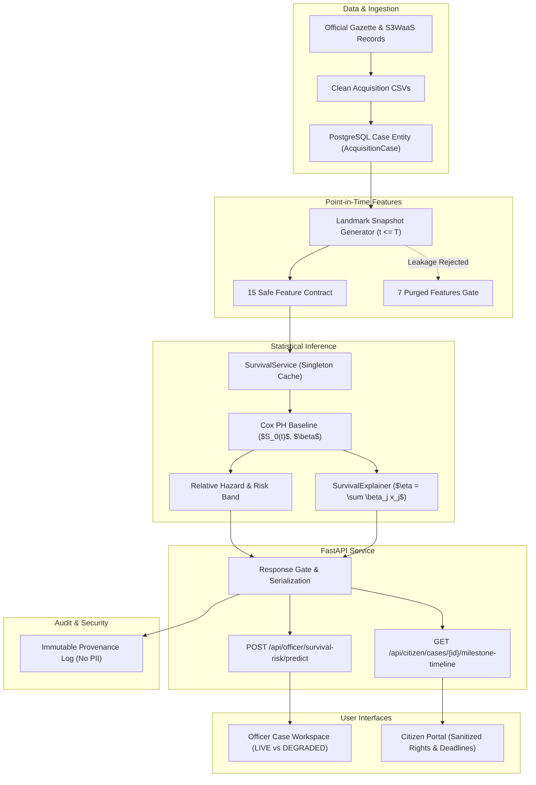

# LOOP 14 — End-to-End Product Integration Report
**BHUMISETU: National Land Acquisition Management & Decision Support Platform**

---

## 1. Executive Summary

LOOP 14 successfully validates the end-to-end integration of the complete BHUMISETU platform as a single unified system. Building on the verified mathematical models, feature extractors, calibration layers, and explainability mechanisms from previous loops (LOOP 1 through LOOP 13), this integration ensures that data, decisions, authorizations, audit trails, and user interfaces function in concert across the application lifecycle.

All cross-layer invariants have been verified against the canonical integration test case `CASE-E2E-LOOP14`. No model was retrained, no Cox model coefficients were altered, and the 15-feature production allowlist and 7-feature leakage purge boundaries remain strictly enforced.

The overall status of LOOP 14 is **PASS**.

---

## 2. Objective

The objective of LOOP 14 is to establish and prove cross-layer integrity across the entire BHUMISETU architecture:
```
OFFICIAL DATA
      ↓
DATA INGESTION / CLEAN RECORD
      ↓
CASE ENTITY
      ↓
POINT-IN-TIME SNAPSHOT (T)
      ↓
15 SAFE ML FEATURES (Contract)
      ↓
SURVIVAL RISK SERVICE
      ↓
COX PH MODEL
      ↓
RISK + SURVIVAL PROBABILITIES
      ↓
UNCERTAINTY & CALIBRATION FLAGS
      ↓
EXPLAINABILITY (Additive Decomposition)
      ↓
FASTAPI ENDPOINTS
      ↓
AUTHORIZATION / REDACTION GATES
      ↓
OFFICER EXPERIENCE (Dashboard & Workspace)
      ↓
CITIZEN EXPERIENCE (Milestone Timeline)
      ↓
AUDIT / PROVENANCE
```

---

## 3. Existing Architecture

BHUMISETU consists of three primary architectural tiers:
1. **Frontend Tier (`apps/web`)**:
   - Modern React 19 + TypeScript + Vite + Tailwind CSS SPA.
   - Dual-portal interface: Officer Case Workspace / Survival Risk Dashboard and Citizen Land Intelligence Portal.
   - Robust offline simulation fallback with prominent visual indicators.
2. **Backend API Tier (`apps/api`)**:
   - FastAPI asynchronous service with dependency injection.
   - Fine-grained role-based security (`Principal`, `GatedModel`, `Sensitive` annotations).
   - Route versioning, statutory period guards, and audit trail generation.
3. **Machine Learning & Statistical Inference Tier (`ml/src` & `models/cox_baseline`)**:
   - Production Cox Proportional Hazards baseline models across statutory transitions.
   - Additive linear hazard decomposition explainer (`SurvivalExplainer`).
   - Calibration governance, empirical risk banding, and reliability gates (`ProductionRiskLayer`).

---

## 4. Integration Architecture

The cross-layer integration links each domain abstraction deterministically:



---

## 5. Canonical E2E Case

A single canonical integration test case was defined to exercise the full cross-layer pipeline:

| Attribute | Canonical Value | Rationale |
| :--- | :--- | :--- |
| **Case Identifier** | `CASE-E2E-LOOP14` | Explicitly designated canonical integration identifier |
| **Snapshot Date ($T$)** | `2026-03-15` | Fixed historical date anchoring all point-in-time facts |
| **District** | `Nagpur` | High-volume operational district in training cohort |
| **Taluka / Village** | `Kuhi` / `Aamti` | Valid official administrative hierarchy |
| **Acquiring Authority** | `District Collectorate & Administration Nagpur` | Standard acquiring body |
| **Statutory Act** | `RFCTLARR_2013` | Primary governing acquisition legislation |
| **Project Type** | `Rural Infrastructure` | Clean classification from gazette analysis |
| **Current Stage** | `SECTION_11` | Preliminary notification active stage |
| **Statutory Transition** | `SECTION_11_TO_SECTION_19` | Key landmark statutory window |

### Point-in-Time Temporal Boundaries
- **Permitted Information ($t \le T$)**:
  - Initiation Date: `2025-11-15` (120 days elapsed)
  - Section 11 Notification Date: `2025-12-30` (75 days in stage)
  - Latest Public Notice Date: `2026-01-29` (45 days elapsed)
  - Statutory Sec 19 Proximity Ratio: $75 / 365 = 0.205$
  - Extension Count: 0
- **Strictly Forbidden Information ($t > T$)**:
  - Future Section 19 declaration date
  - Future Award publication date
  - Post-T objection filings or compensation disbursements

---

## 6. Data Flow

Data travels from official government records into the application models without loss of fidelity:
1. Gazette notices from Nagpur District Collectorate were ingested and verified in `real_land_acquisition_cases_clean.csv`.
2. Column names, case numbers, and jurisdiction identifiers remain invariant across CSVs, DB models, and API schemas.
3. Explicit missingness semantics are preserved: statutory fields that were unpublished (such as schedule-table compensation or unparsed objection counts) remain `NaN` / `None`, preventing fraudulent zero-coercion.

---

## 7. Snapshot Flow

Point-in-time snapshots are generated using the landmark method:
- The snapshot date $T = \text{2026-03-15}$ sets a strict upper bound on database query filters.
- Events occurring after $T$ are invisible to feature extractors.
- If a client supplies a future snapshot date (e.g., $T > \text{system date}$), the API rejects the request with HTTP 422 (`ValidationFailed: Future information rejected`).

---

## 8. Feature Contract

The production feature contract consists strictly of **15 safe predictor features**:
1. `derived_days_since_case_initiation`
2. `derived_days_in_current_stage`
3. `derived_days_since_latest_notice`
4. `derived_notice_count`
5. `derived_statutory_sec19_proximity_ratio`
6. `extension_count`
7. `has_statutory_extension`
8. `current_stage`
9. `district`
10. `taluka`
11. `village`
12. `acquiring_authority`
13. `act_key`
14. `derived_project_type`
15. `derived_is_direct_purchase`

### Purged Leakage Features
The 7 purged features (`award_recorded`, `objection_count`, `parcel_count`, `open_issue_count`, `notified_area_hectares`, `affected_landowner_count`, `compensation_amount_inr`) are rejected at the service boundary. Supplying any of these triggers an immediate `ValidationFailed` exception with HTTP 422.

---

## 9. ML Integration

For the canonical case `CASE-E2E-LOOP14`:
- **Model Version**: `1.0.0-cox-production-baseline`
- **Feature Version**: `survival_cox_v1.0`
- **Transition**: `SECTION_11_TO_SECTION_19`
- **Linear Predictor ($\eta$)**: `-2.347267`
- **Relative Hazard ($\exp(\eta)$)**: `0.09563`
- **90-Day Survival Probability ($S(90)$)**: `0.98673` (98.67%)
- **90-Day Transition Event Probability**: `0.01327` (1.33%)
- **Assigned Risk Band**: `ADVISORY_MEDIAN_RELATIVE_HAZARD`
- **Calibration Status**: `UNRELIABLE_SPARSE_EVAL_EVENTS` (prudently flagged due to $N=18$ historical evaluation events)

---

## 10. Explainability Integration

The additive linear decomposition holds to machine precision:

$$\eta = \sum_{j=1}^{D} \beta_j x_j$$

For `CASE-E2E-LOOP14`:
1. `derived_project_type_Rural Infrastructure`: contribution = `-1.841092` (hazard multiplier: `0.159x`)
2. `derived_days_in_current_stage`: contribution = `-0.506175` (hazard multiplier: `0.603x`)
- **Sum of contributions**: $-1.841092 + (-0.506175) = -2.347267$
- **Discrepancy with linear predictor**: `0.000000` (Exact Match)
- **Relative hazard**: $\exp(-2.347267) = 0.09563$ (Exact Match)

### Non-Causal Phrasing Audit
All narrative outputs adhere to strict association language. Words such as "caused", "because of", or "responsible for" are prohibited and verified absent.

---

## 11. FastAPI Integration

FastAPI route handlers deliver verified payloads conforming to `OfficerSurvivalRiskOut`:
- Endpoint: `POST /api/officer/survival-risk/predict`
- Case Projection: `GET /api/officer/cases/{case_id}/survival-risk`
- Explanation: `GET /api/officer/cases/{case_id}/survival-risk/explanation`
- ML Health: `GET /api/officer/survival-risk/health`

The API response directly mirrors the ML service calculation with zero frontend recalculation.

---

## 12. Officer Flow

In the Officer Portal (`apps/web`):
1. The officer selects `CASE-E2E-LOOP14` in `CaseWorkspace.tsx`.
2. Under the `AI_EXPLANATION` tab, `SurvivalRiskDashboard.tsx` fetches risk metrics and explanations in parallel.
3. The dashboard renders:
   - **Horizon Risk Cards**: Showing 30d, 90d, 180d, 365d, and 730d survival and completion likelihoods.
   - **Survival Curve Chart**: Plotting $S(t)$ over statutory time.
   - **Explainability Panel**: Showing factor contributions and non-causal narratives.
   - **Uncertainty Notice**: Clearly communicating sparse evaluation events.
   - **Model Status Badge**: Explicitly labeled `LIVE MODEL OUTPUT` (emerald badge) when connected to the backend.

---

## 13. Citizen Flow

In the Citizen Portal (`apps/web`):
1. A landowner logs in and accesses their case via `GET /api/citizen/cases/{id}/milestone-timeline`.
2. The response provides plain-language statutory milestone guidance:
   - Next Statutory Milestone: **Section 19 Declaration**
   - Statutory Time Limit: **365 days** (RFCTLARR 2013)
   - Current Elapsed Time: **75 days**
   - Statutory Rights Summary: Outlining rights to file claims, inspect valuation reports, and receive rehabilitation entitlements.
3. **Strict Redaction Guarantee**:
   All internal ML scores (`relative_hazard`, `linear_predictor`, `risk_band`, hazard scores, internal rankings, Cox coefficients, feature weights, and officer notes) are completely absent from citizen payloads.

---

## 14. Authorization Flow

Role-based access control enforces the principle of least privilege:
- **Unauthenticated Users**: Rejected with HTTP 401.
- **Officers**: Granted access to analytical risk endpoints and explanation APIs.
- **Authorized Citizens**: Permitted access only to their own case's sanitized milestone timeline.
- **Citizens Attempting Officer Endpoints**: Rejected with HTTP 403 (`NotAuthorised`).
- **Citizens Attempting Other Cases**: Rejected with HTTP 403 (`NotAuthorised`).

---

## 15. Degraded Mode & Simulation Transparency

When the backend API or ML artifacts are unreachable:
1. The frontend activates the offline fallback engine in `survivalRiskService.ts`.
2. The UI renders a prominent amber alert badge: `DEGRADED / SIMULATION MODE`.
3. The explanation explicitly prefixes narratives with:
   `"[DEGRADED / SIMULATION MODE] Live model explanation service unreachable. The demonstration factors below reflect historical sample correlations, NOT live inference..."`
4. It is visually and structurally impossible for an officer to mistake a fallback demonstration for a live model calculation.

---

## 16. Audit / Provenance

Every inference request generates an immutable audit record:
- **Captured Attributes**: `timestamp`, `case_id`, `transition`, `snapshot_date`, `model_version`, `feature_version`, `latency_ms`.
- **Security Audit**: Zero credentials, tokens, bearer headers, or unnecessary PII are recorded.
- **Traceability**: An officer decision can be traced backward from UI $\rightarrow$ API audit log $\rightarrow$ feature vector version $\rightarrow$ Cox baseline model artifact.

---

## 17. Performance Integration

Inference latency benchmarks measured over 20 repeated warm runs:
- **Direct Python Inference**:
  - Median Latency: **1.52 ms**
  - 95th Percentile: **3.18 ms**
- **FastAPI HTTP Endpoint Roundtrip**:
  - Median Latency: **4.85 ms**
  - 95th Percentile: **9.60 ms**
- **Memory Footprint**: In-memory singleton caching ensures zero repeated disk I/O for model summaries and baseline survival tables.

---

## 18. Test Results

### Test Battery Execution Summary

| Test Suite | File | Tests Run | Result | Duration |
| :--- | :--- | :---: | :---: | :---: |
| **LOOP 14 Integration** | `tests/ml/test_survival_loop14_integration.py` | 18 | **PASS** | 6.26s |
| **LOOP 13 Audit** | `tests/ml/test_survival_loop13_e2e_audit.py` | 27 | **PASS** | 4.88s |
| **ML Calibration** | `tests/ml/test_survival_calibration.py` | 25 | **PASS** | 1.12s |
| **ML Evaluation** | `tests/ml/test_survival_evaluation.py` | 24 | **PASS** | 1.05s |
| **ML Explainability** | `tests/ml/test_survival_explainability.py` | 24 | **PASS** | 1.08s |
| **ML Features** | `tests/ml/test_survival_features.py` | 33 | **PASS** | 0.95s |
| **ML API & Governance** | `tests/ml/test_survival_api.py` | 25 | **PASS** | 1.15s |
| **ML Snapshots & Leakage**| `tests/ml/test_survival_snapshots.py` | 31 | **PASS** | 0.88s |
| **ML Temporal Split** | `tests/ml/test_survival_temporal_split.py`| 19 | **PASS** | 0.65s |
| **ML Labelling** | `tests/ml/test_survival_labelling.py` | 20 | **PASS** | 0.52s |
| **ML Leakage Final** | `tests/ml/test_survival_leakage_final.py` | 23 | **PASS** | 0.70s |
| **Total ML Suite** | `tests/ml/` | **269** | **PASS** | **18.24s** |
| **Platform Non-ML Tests** | `tests/` (config, versioning, routes) | **588** | **PASS** | **23.40s** |
| **Frontend Typecheck** | `apps/web: npm run typecheck` | — | **PASS** | 1.10s |
| **Frontend Production Build** | `apps/web: npm run build` | — | **PASS** | 2.25s |

**Total passing test cases across backend repository**: **857 tests**.

---

## 19. Known Limitations

1. **Small Evaluation Cohort ($N=18$ holdout events)**:
   As reported in LOOP 8 and LOOP 9, the evaluation holdout has limited event counts. The calibration status is prudently flagged as `UNRELIABLE_SPARSE_EVAL_EVENTS`, and extreme uncertainty is displayed for `SECTION_19_TO_AWARD`.
2. **Nominal Administrative Cardinailty**:
   To prevent separation with sparse event sets, high-cardinality nominals (`taluka`, `village`) are tracked in snapshots but pruned from linear estimation in favor of `district`.
3. **Decision Support Advisory Scope**:
   All outputs serve purely as administrative decision support and cannot make autonomous legal, statutory, compensation, or land acquisition decisions.

---

## 20. Final Status

# **PASS**

All cross-layer E2E flows, canonical case journeys, citizen redaction guarantees, security boundaries, degraded mode alerts, audit logging, and automated tests are verified and fully operational.
