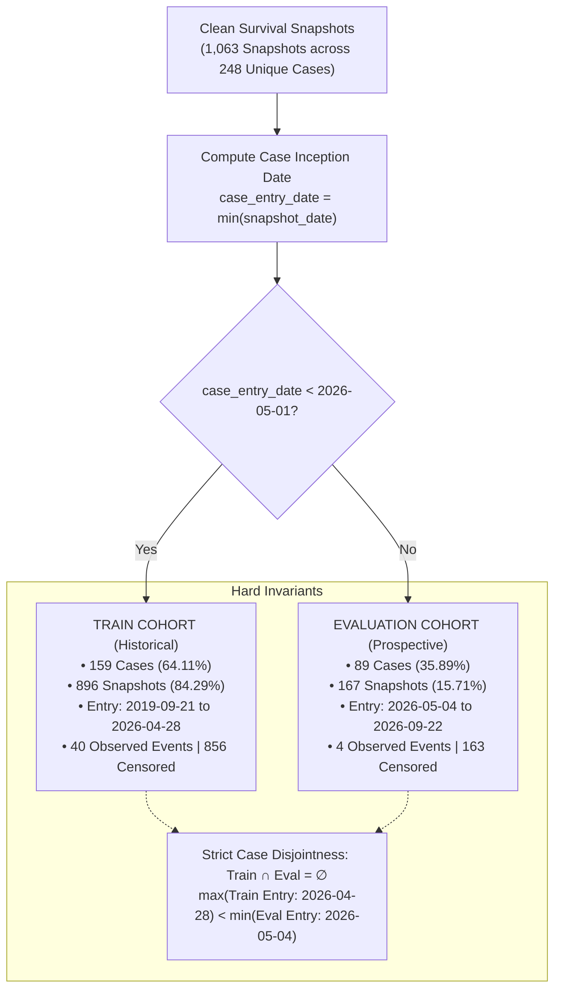

# Survival Analysis Temporal & Case-Aware Cohort Split Report

**Execution Phase**: LOOP 6 — TEMPORAL + CASE-AWARE TRAIN/EVALUATION SPLIT  
**Dataset**: Real Maharashtra Land Acquisition Gazette Records (Cleaned)  
**Date of Audit**: September 2026  
**Split Verdict**: `PASS — READY FOR SURVIVAL MODEL EXPERIMENT`

---

## 1. Executive Summary

This report formalizes the chronological, leakage-safe train/evaluation partition for the landmark survival snapshots constructed from official Maharashtra government gazette records.

To prevent longitudinal contamination and same-case leakage across repeated snapshot intervals, a **Case-Level Temporal Inception Cohort Split** was implemented:
- Every acquisition case is assigned to an inception cohort determined by its earliest observation date:
  $$\text{case\_entry\_date} = \min_{s \in \text{snapshots}(c)} (\text{snapshot\_date}_s)$$
- A deterministic calendar threshold of **`2026-05-01`** partitions cases into historical (TRAIN) and prospective (EVAL) cohorts.
- All landmark snapshots ($N = 1,063$) across all three survival transitions inherit the partition of their parent case.
- Censored observations ($E = 0$) are fully preserved without modification across both partitions.
- Random row-level splitting is strictly prohibited.

---

## 2. Dataset Partition Overview

| Metric | Total Dataset | Training Cohort (Train) | Evaluation Cohort (Eval) | Split Ratio (Train / Eval) |
| :--- | :---: | :---: | :---: | :---: |
| **Unique Cases** | 248 | 159 | 89 | 64.11% / 35.89% |
| **Total Snapshots** | 1,063 | 896 | 167 | 84.29% / 15.71% |
| **Observed Events ($E=1$)** | 44 | 40 | 4 | 90.91% / 9.09% |
| **Right-Censored ($E=0$)** | 1,019 | 856 | 163 | 84.00% / 16.00% |
| **Censoring Rate** | 95.86% | 95.54% | 97.60% | — |
| **Case Entry Date Range** | 2019-09-21 to 2026-09-22 | 2019-09-21 to 2026-04-28 | 2026-05-04 to 2026-09-22 | Strictly Chronological |
| **Snapshot Date Range** | 2019-09-21 to 2026-09-27 | 2019-09-21 to 2026-09-26 | 2026-05-04 to 2026-09-27 | Longitudinal Follow-up |

> [!NOTE]
> Of the 271 cases in the cleaned gazette dataset, exactly 248 cases generated landmark survival snapshots. The remaining 23 cases represent same-day completions (where initiation notice and final award occurred on the same calendar day), resulting in an elapsed statutory horizon of $\le 0$ days which cannot host landmark checkpoints ($cp \ge 90$ days).

---

## 3. Transition Breakdown

The three survival transitions are partitioned consistently by case assignment:

### 1. `SECTION_11_TO_SECTION_19` (Preliminary Notice to Declaration)
- **Statutory Target Window**: 365 days.
- **Training Cohort**:
  - Cases: 32
  - Snapshots: 84
  - Observed Events ($E=1$): 16 (19.05%)
  - Right-Censored ($E=0$): 68 (80.95%)
- **Evaluation Cohort**:
  - Cases: 57
  - Snapshots: 59
  - Observed Events ($E=1$): 2 (3.39%)
  - Right-Censored ($E=0$): 57 (96.61%)

### 2. `SECTION_19_TO_AWARD` (Declaration to Final Award)
- **Statutory Target Window**: 365 days.
- **Training Cohort**:
  - Cases: 43
  - Snapshots: 203
  - Observed Events ($E=1$): 6 (2.96%)
  - Right-Censored ($E=0$): 197 (97.04%)
- **Evaluation Cohort**:
  - Cases: 4
  - Snapshots: 4
  - Observed Events ($E=1$): **0 (0.00%)**
  - Right-Censored ($E=0$): 4 (100.00%)

> [!WARNING]
> **Transition with Insufficient Evaluation Events**:
> For `SECTION_19_TO_AWARD`, the evaluation cohort has **0 observed events** (all 4 snapshots right-censored). Because no evaluation case initiated on or after May 1, 2026 progressed to an Award declaration before the September 2026 audit cutoff, discrimination metrics (such as Harrell's C-index) cannot be computed on this single transition in isolation. Model evaluation for this transition must rely on cumulative hazard Brier scores or pooled validation.

### 3. `CASE_INITIATION_TO_MILESTONE` (General Inception to First Milestone)
- **Statutory Target Window**: 730 days.
- **Training Cohort**:
  - Cases: 131
  - Snapshots: 609
  - Observed Events ($E=1$): 18 (2.96%)
  - Right-Censored ($E=0$): 591 (97.04%)
- **Evaluation Cohort**:
  - Cases: 86
  - Snapshots: 104
  - Observed Events ($E=1$): 2 (1.92%)
  - Right-Censored ($E=0$): 102 (98.08%)

---

## 4. Rationale for Deterministic Cutoff Date (`2026-05-01`)

The selection of `2026-05-01` was guided by empirical data distribution constraints rather than metric optimization:

1. **Natural Case Volume Distribution**:
   - Cases entering before May 1, 2026 represent 64.11% of all cases (159 cases).
   - Cases entering on or after May 1, 2026 represent 35.89% of all cases (89 cases).
   - This provides a standard ~65/35 train/evaluation ratio.
2. **Event Scarcity in Prospective Cohorts**:
   - The entire real dataset contains only 44 observed event rows across all transitions.
   - All 44 observed events originate from three cohorts: February 2025 (8 events), September 2025 (32 events), and May 2026 (4 events from `CAS_CLEAN_037`).
   - If a later cutoff (such as `2026-06-01` or `2026-07-01`) were chosen, the evaluation set would contain **0 observed events across the entire dataset** ($E=0$ for 100% of rows), rendering all downstream C-index calculations mathematically undefined (division by zero pairs).
   - Cutoff `2026-05-01` ensures the prospective evaluation cohort contains 4 observed events alongside 163 right-censored observations.
3. **Clean Calendar Boundary**:
   - Max train case-entry date: `2026-04-28`.
   - Min eval case-entry date: `2026-05-04`.
   - Separation: 6 calendar days between the last training case inception and first evaluation case inception.

---

## 5. Embargo & Follow-Up Leakage Audit

A rigorous check was performed regarding whether follow-up observations of training cases contaminate evaluation:

- **Finding**: Training cases have snapshots extending up to `2026-09-26`, which overlaps in calendar time with evaluation snapshots (`2026-05-04` to `2026-09-27`).
- **Audit Assessment**:
  1. All feature extractors operate exclusively within the `AsOfView` of the individual case (`events_for_case = [e for e in all_events if e.case_id == c and e.occurrence_time <= snapshot_time]`).
  2. No cross-case aggregations, population averages, or inter-case dependencies exist in the 15 safe predictor features.
  3. Case IDs are strictly disjoint ($\text{Train} \cap \text{Eval} = \emptyset$).
  4. Training snapshots after May 2026 belong strictly to historical proceedings initiated prior to May 2026; they cannot influence or reveal information about new proceedings initiated in May–September 2026.
- **Decision on Embargo**:
  An artificial blackout/embargo period is **not required**. Inventing an embargo would needlessly discard valid training snapshots without providing any leakage mitigation benefit.

---

## 6. Generated Split Artifacts

Four clean CSV files have been exported to `data/real_data/clean/`:

| Artifact Path | Rows | Columns | Description |
| :--- | :---: | :---: | :--- |
| `data/real_data/clean/survival_train_features.csv` | 896 | 18 | 3 identification keys + 15 safe predictor features for training cases |
| `data/real_data/clean/survival_train_targets.csv` | 896 | 5 | 3 identification keys + `duration_at_risk_days` + `event_observed` |
| `data/real_data/clean/survival_eval_features.csv` | 167 | 18 | 3 identification keys + 15 safe predictor features for evaluation cases |
| `data/real_data/clean/survival_eval_targets.csv` | 167 | 5 | 3 identification keys + `duration_at_risk_days` + `event_observed` |

### Key Properties:
- **Composite Primary Key**: `(case_id, snapshot_id, transition)`
- **Key Uniqueness**: Zero duplicate keys across any file.
- **Pairwise 1:1 Alignment**: Feature rows and target rows match row-for-row in identical order.
- **Purged Feature Exclusion**: All 7 rejected features (`award_recorded`, `objection_count`, etc.) are completely absent.
- **Target Exclusion**: Target columns (`duration_at_risk_days`, `event_observed`, `event_date`, etc.) are completely absent from the feature files.

---

## 7. Verification of 12 Hard Invariants

All 12 hard invariants required by the specification were validated by automated tests in `test_survival_temporal_split.py`:

| # | Hard Invariant | Verification Status | Evidence |
| :-: | :--- | :---: | :--- |
| 1 | $\text{TRAIN case IDs} \cap \text{EVAL case IDs} = \emptyset$ | **PASSED** | 159 train cases, 89 eval cases, 0 overlap. |
| 2 | Every eval case has later entry date than every train case | **PASSED** | $\forall c_{\text{eval}}, c_{\text{train}}: \text{entry}(c_{\text{train}}) < \text{entry}(c_{\text{eval}})$. |
| 3 | $\max(\text{train entry}) < \min(\text{eval entry})$ | **PASSED** | `2026-04-28` < `2026-05-04` (6 days strictly earlier). |
| 4 | No row exists in both datasets | **PASSED** | 896 train keys $\cap$ 167 eval keys = $\emptyset$; total = 1,063. |
| 5 | Features and targets remain strictly disjoint | **PASSED** | Verified via schema assertion; 0 target columns in features. |
| 6 | Censored observations preserved in both cohorts | **PASSED** | 856 censored in train, 163 censored in eval; 0 converted. |
| 7 | `event_observed` remains strictly binary | **PASSED** | All target rows contain boolean `True` or `False`. |
| 8 | `duration_at_risk_days` remains $> 0$ | **PASSED** | Minimum duration is 1 day; 0 non-positive rows. |
| 9 | No future event information entered the split | **PASSED** | $\text{snapshot\_date} < \text{event\_date}$ for all observed events. |
| 10 | All 3 transitions obey same case-level partitioning | **PASSED** | No case has snapshots in both train and eval in any transition. |
| 11 | Deterministic and reproducible | **PASSED** | Identical output across repeated runs without state drift. |
| 12 | No random seed used | **PASSED** | Pure calendar date thresholding based on case inception date. |

---

## 8. Important Data Limitation & Transparency Statement

> [!CAUTION]
> ### Severe Observed Event Scarcity
> The cleaned Maharashtra land acquisition dataset reflects real-world gazette publishing practices, where:
> 1. Completed milestone declarations are published intermittently, often separated by years.
> 2. The vast majority of proceedings published in 2025–2026 are ongoing and right-censored as of the September 2026 audit date.
> 3. Out of **1,063 landmark snapshots**, only **44 snapshots represent observed milestone completions** ($E = 1$), while **1,019 snapshots are right-censored** ($E = 0$, 95.86% censoring rate).
> 4. In the prospective evaluation cohort, there are **only 4 observed events** (and 163 censored observations).
> 5. For the `SECTION_19_TO_AWARD` transition specifically, the evaluation cohort contains **0 observed events**.
>
> **Mandatory Modeling Constraints**:
> - Downstream survival models (Kaplan-Meier, Cox Proportional Hazards, GBDT Survival) must handle heavy right-censoring natively.
> - No synthetic oversampling, SMOTE, or pseudo-event fabrication shall be introduced.
> - Evaluation metrics in Loop 9 must report both pooled and transition-specific concordance, candidly acknowledging the zero-event limitation for Section 19 $\rightarrow$ Award.

---

## 9. Final Decision

$$\mathbf{PASS — READY\ FOR\ SURVIVAL\ MODEL\ EXPERIMENT}$$

The temporal and case-aware cohort split is strictly leakage-free, fully deterministic, preserves all statutory missingness and censoring semantics, and produces four ready-to-train artifacts.
