# BHUMISETU — UI/UX Modernization Audit (Loop 0)

> **Document Version:** 1.0.0  
> **Status:** Completed (LOOP 0 — Safety + Inventory)  
> **Date:** September 29, 2026  
> **Scope:** Frontend visual system, component inventory, UX critique, accessibility assessment, and modernization roadmap for BHUMISETU (Academic / SIH Prototype).

---

## 1. Executive Summary

BHUMISETU is an academic prototype for **"AI-Powered Land Acquisition Intelligence, Monitoring & Verification"**, designed to address statutory workflows under the **Right to Fair Compensation and Transparency in Land Acquisition, Rehabilitation and Resettlement Act, 2013 (RFCTLARR Act 2013)**, **SVAMITVA**, and the **Digital Personal Data Protection Act, 2023 (DPDP Act 2023)**.

While the application is technically capable—featuring a PostGIS spatial geometry engine, human-in-the-loop OCR review, RERA cross-referencing, and multi-stage statutory case tracking—its user interface suffers from severe visual over-decoration, navigation stacking, and promotional campaign clutter. 

The baseline visual presentation resembles an overcrowded early-2000s portal rather than a clean, trustworthy **2026 Digital Public Infrastructure (DPI)** platform.

This audit establishes the baseline inventory, architectural boundaries, safety constraints, and systematic defects to be addressed across the modernization loops without modifying backend logic, ML models, or statutory business rules.

---

## 2. Technical Architecture & Stack Inventory

| Domain | Technology / Library | Version | Current Role & Notes |
| :--- | :--- | :--- | :--- |
| **Framework** | React | 19.0.1 | Functional components, Hooks, Context API state management. |
| **Build Tool** | Vite | 6.2.3 | Modern ESM bundling with `@vitejs/plugin-react` (5.0.4). |
| **Styling** | Tailwind CSS v4 | 4.1.14 | Imported via `@tailwindcss/vite` and `src/index.css`. |
| **Navigation / Routing** | State-driven (React Context) | N/A | No `react-router-dom`. Managed via `portalMode` (`CITIZEN` vs `OFFICER`), `publicTab`, and `officerTab` in `AppContext.tsx`. |
| **Mapping & GIS** | Leaflet | 1.9.4 | Canvas/SVG vector overlay, tile rendering (OSM, Esri Satellite, CartoDB Light), custom PostGIS SQL client. |
| **Icons** | Lucide React | 0.546.0 | Primary iconography library across all modules. |
| **Animations / Micro-interactions** | Motion (Framer) & Canvas-Confetti | 12.23.24 | Micro-transitions, modal animations, celebration triggers on successful award disbursements. |
| **Typography** | Inter / Plus Jakarta Sans | Web fonts | Clean sans-serif with bilingual Devanagari (`Noto Sans Devanagari`) support. |
| **Data Layer** | Hybrid In-Memory & REST | N/A | Mock datasets (`mockData.ts`, `landIntelligenceData.ts`, `mockReraData.ts`, `historicalCadastralData.ts`) with optional live API synchronization via `backendApi.ts`. |

---

## 3. Page & View Inventory

The application encompasses **25 discrete user views** divided between two primary workspaces:

### 3.1 Government Officer Portal (`portalMode === 'OFFICER'`)

| View Identifier | Component File | Key Responsibilities | Primary Data Dependencies |
| :--- | :--- | :--- | :--- |
| `DASHBOARD` | `src/components/officer/OfficerDashboard.tsx` | High-level executive monitoring, statutory stage breakdown, deadline risk, priority case queue. | `cases`, `currentUser` |
| `CASE_WORKSPACE` | `src/components/officer/CaseWorkspace.tsx` | 360° case file management across 8 tabs (Overview, Parcels, Notices, Objections, Compensation, Validation, AI Risk, RERA). | `selectedCase`, `cases`, `reraService` |
| `RERA_GATEWAY` | `src/components/officer/ReraIntegrationHub.tsx` | Section 11(4) anti-alienation monitoring, illegal plotting detection, real estate promoter records. | `mockReraData.ts`, `reraService` |
| `GIS_MAP` | `src/components/officer/GisMapViewer.tsx` | Leaflet-based spatial engine, PostGIS SQL execution, 1970–2026 cadastral change detection, corridor overlap buffers. | `historicalCadastralData.ts`, `postgis.ts` |
| `OCR_REVIEW` | `src/components/officer/DocumentOcrReviewer.tsx` | Human-in-the-loop multi-script OCR validation, bounding-box review, field-level verification. | `selectedCase.documents` |
| `INTERVENTION_QUEUE` | `src/components/officer/InterventionQueue.tsx` | Administrative action queue for cases with active blocking or major legal/statutory violations. | `cases.validationIssues` |
| `VALIDATION_QUEUE` | `src/components/officer/ValidationHub.tsx` | Statutory rules engine checking Solatium calculation, SIA completion, notice compliance. | `cases.validationIssues` |
| `MODEL_OBSERVABILITY`| `src/components/officer/ModelObservabilityHub.tsx` | ML model performance metrics, calibration curves, concept drift alerts, survival model weights. | Synthetic model telemetry |
| `BULK_IMPORT` | `src/components/officer/BulkImportHub.tsx` | Batch CSV/GeoJSON ingestion interface for legacy village survey sheets. | Mock import pipeline |
| `DPDP_RETENTION` | `src/components/officer/DpdpRetentionHub.tsx` | Data governance dashboard, masking status, ephemeral storage audit, consent logging. | `cases.parcels` |
| `AUDIT_LOG` | `src/components/officer/AuditLogViewer.tsx` | Immutable ledger of administrative decisions, statutory stage overrides, and compensation disbursements. | `auditLogs` in `AppContext` |

### 3.2 Citizen Public Portal (`portalMode === 'CITIZEN'`)

| View Identifier | Component File | Key Responsibilities | Primary Data Dependencies |
| :--- | :--- | :--- | :--- |
| `HOME` | `src/components/public/PublicPortal.tsx` | Sovereign landing page, live announcements, national metrics, quick actions, One Property console. | `HeroRotatingBanner.tsx`, `cases` |
| `SEARCH` | `src/components/citizen/UnifiedLandSearch.tsx` | Multi-jurisdiction parcel discovery via Survey Number, 14-digit ULPIN, or Village. | `SAMPLE_PROPERTY_DEMO`, `mockData` |
| `PROPERTY_INTEL` | `src/components/citizen/PropertyIntelligenceDashboard.tsx` | Single unified card unifying 7/12 RoR, deeds, mutation, AI title risk, and cadastral boundary. | `landIntelligenceData.ts` |
| `DOC_VERIFY` | `src/components/citizen/AiDocumentVerification.tsx` | Citizen deed upload, OCR extraction, and cross-comparison against official revenue registry. | In-memory OCR simulator |
| `RISK_ANALYSIS` | `src/components/citizen/LandRiskAnalysis.tsx` | 12-point title risk check (e-Courts, CERSAI mortgages, corridor buffers, tribal land rules). | `SAMPLE_PROPERTY_DEMO` |
| `TIMELINE` | `src/components/citizen/PropertyTimelineView.tsx` | Transactional history (2018–2026) covering mutations, sales, partition deeds, and encumbrances. | `landIntelligenceData.ts` |
| `MUTATION` | `src/components/citizen/MutationTrackerView.tsx` | Step-by-step Ferfar tracker (Application → 15-day Notice → Site Panchnama → Final RoR Certification).| `SAMPLE_PROPERTY_DEMO.activeMutation` |
| `GIS_MAP` | `src/components/citizen/PropertyMapIntelligence.tsx` | Public-facing cadastral map with parcel boundaries, infrastructure buffers, and road access. | Leaflet, OpenStreetMap |
| `STATE_PORTALS` | `src/components/citizen/StatePortalDirectory.tsx` | Comprehensive directory indexing official state land portals (Mahabhulekh, Bhoomi, AnyRoR, etc.).| `STATE_LAND_DIRECTORY` |
| `SCHEMES` | `src/components/citizen/GovSchemesView.tsx` | 9 Centrally Sponsored Schemes explorer with interactive Citizen Entitlement Advisor. | `govSchemesData.ts` |
| `NOTICES` | `src/components/public/PublicPortal.tsx` | Gazette notifications repository with Section 11/15/19 decrees and public hearing schedules. | `cases` |
| `SEC15` / `GRIEVANCE` | `src/components/public/PublicPortal.tsx` | Statutory Section 15 objection filing form with grounds categorization and file upload. | `submitCitizenObjection` |
| `OBJECTION_TRACK` | `src/components/public/PublicPortal.tsx` | Real-time acknowledgement tracker for submitted objections. | Mock objection database |
| `REPORT` | `src/components/citizen/ReportGeneratorView.tsx` | Custom PDF generation interface for parcel intelligence summaries. | `SAMPLE_PROPERTY_DEMO` |
| `HELP` / `ABOUT` | `src/components/citizen/HelpHowItWorksView.tsx` | Platform methodology disclosures, statutory citations, and step-by-step guides. | Static guidance content |
| `BHUMITRA_MODAL` | `src/components/citizen/BhuMitraAiModal.tsx` | Bilingual conversational assistant for land acquisition questions and scheme guidance. | Knowledge base simulator |

---

## 4. Shared & Cross-Cutting Components

| Component | Path | Current Defect / Role |
| :--- | :--- | :--- |
| `GovHeader` | `src/components/common/GovHeader.tsx` | **Severely oversized.** Contains accessibility strip, brand titles, PM Modi portrait cutout, Digital India banners, and persona selector in a single 130px header block. |
| `GovNavigation` | `src/components/common/GovNavigation.tsx` | **Redundant rendering.** Renders 5 dropdown menus on top of the officer workspace even when the user is in Officer mode. |
| `OfficerNavigation`| `src/components/officer/OfficerNavigation.tsx` | **Nested stacking.** Creates a 4th horizontal toolbar below `GovHeader` and `GovNavigation`. |
| `GovFooter` | `src/components/common/GovFooter.tsx` | **Excessively heavy.** Contains stacked campaign banners, multiple link columns, web visitor counter, and duplicate academic disclaimers. |
| `GovSchemeBanners`| `src/components/common/GovSchemeBanners.tsx` | Renders huge leaderboard banners and sidebar advertising strips inside operational officer screens. |
| `GigwSchemeScrollBanner`| `src/components/common/GigwSchemeScrollBanner.tsx` | Horizontal scrolling scheme carousel inserted into operational views. |
| `ToastContainer` | `src/components/common/ToastContainer.tsx` | Toast feedback system; functionally solid. |
| `DemoLoginModal` | `src/components/common/DemoLoginModal.tsx` | Role switching modal for 6 demo users; requires clearer fictional/prototype labeling. |

---

## 5. Major UX & Visual Problems

### 5.1 The "5-Toolbar" Stacked Header Problem
On the Officer workspace, the user is subjected to **5 sequential horizontal bars** before reaching any operational content:
1. GIGW Accessibility Strip (`36px`)
2. Primary Brand Header with PM Modi portrait and Viksit Bharat graphics (`96px`)
3. Citizen Primary Navigation Bar (`52px`)
4. Officer Workspace Title Bar (`40px`)
5. Officer Module Sub-Navigation Bar (`48px`)
* **Total dead vertical space:** `~272px` (over 38% of a standard 700px viewport!).

### 5.2 Promotional Clutter in an Operational Workspace
The `OfficerDashboard` component inserts promotional components (`GovSchemeLeaderboardBanner`, `GigwSchemeScrollBanner`, and political quotes) directly above the case queue. An administrative officer looking for breached statutory deadlines must scroll past marketing billboards.

### 5.3 Ambiguous Mode Separation
The visual transition between **Citizen Portal** and **Officer Workspace** is muddy. Because `GovNavigation` remains mounted during Officer mode, the officer sees citizen-facing items like "BhuMitra AI" and "Public Schemes" directly above their statutory case files.

### 5.4 High Contrast & Dark Blue Overuse
Excessive heavy navy blocks (`#002642`, `#0b3866`, `#00172d`) give the interface a dated, suffocating visual weight. Modern 2026 digital public services rely on airy, neutral white and off-white canvas spaces with crisp navy accents.

### 5.5 Visual Hierarchy & "Loud" Badges
Almost every badge, card, and row uses competing primary colors (bright orange, emerald green, purple, and red). When everything is highlighted, nothing is prioritised. High-risk statutory breaches fail to stand out because low-priority status labels use equally vibrant pills.

---

## 6. Accessibility & Responsiveness Assessment

### 6.1 Accessibility Deficiencies (WCAG 2.1 AA / GIGW 3.0 Baseline)
- **Status Indicators:** Several table rows and status badges convey state using color alone without distinct shapes or text descriptions.
- **Heading Order Violations:** Multiple pages jump from `<h2>` directly to `<h4>`, disrupting assistive technology outline navigation.
- **Contrast Ratios:** White text placed on gradient backgrounds (`from-[#f37021] to-[#e65100]`) frequently falls below the required 4.5:1 contrast ratio on small screens.
- **Focus Indicators:** Custom buttons and interactive pills lack explicit, visible `:focus-visible` rings for keyboard navigation.

### 6.2 Responsive Breakpoint Failures
- **320px–430px (Mobile):** Stacked headers cause vertical height to consume the entire screen. Tables in `OfficerDashboard` and `CaseWorkspace` overflow horizontally.
- **768px–1024px (Tablet):** Header pills wrap into 3–4 staggered rows, creating layout shifts and misaligned action buttons.
- **1440px+ (Desktop):** Lack of max-width containment on certain views creates awkwardly stretched full-width tables with poor readability line lengths.

---

## 7. Safety-Critical Code & Functional Constraints

To adhere strictly to project boundaries, the following modules and functions **must not be functionally modified** during the visual modernization:

| File Path | Critical Logic / State to Preserve | Allowed Changes |
| :--- | :--- | :--- |
| `src/context/AppContext.tsx` | All case management state, objection handling (`submitCitizenObjection`, `disposeObjection`), stage transition logic, payment disbursement calculations, validation issue resolution. | Zero functional changes. UI may read state and dispatch existing actions. |
| `src/components/officer/CaseWorkspace.tsx` | `transitionCaseStage`, `disposeObjection`, `disbursePayout`, `waiveValidationIssue`, `resolveValidationIssue`, `overrideCaseRisk`. | Re-structure visual layout, tabs, hierarchy, and cards. Do not alter action signatures or dispatch logic. |
| `src/components/officer/GisMapViewer.tsx` | `postgis.ts` integration, spatial calculations (`ST_Area`, `ST_Perimeter`, `ST_Buffer`), Leaflet map layers. | Modernize toolbar, layer panel, legend, and container framing. Do not change coordinate systems or query logic. |
| `src/components/officer/DocumentOcrReviewer.tsx` | Field edit handler (`correctOcrField`), field confirmation (`confirmOcrField`), bounding box coordinate mapping. | Modernize 3-column layout (Document List, PDF Preview, Verification Panel). |
| `src/services/backendApi.ts` & `src/services/reraService.ts` | API endpoints, live backend polling, fallback mock retrieval, RERA cross-referencing logic. | Zero changes. |

---

## 8. Systematic Modernization Roadmap (Loop 1–19)

```mermaid
graph TD
    L0[Loop 0: Safety & Audit] --> L1[Loop 1: Central Design Tokens & System]
    L1 --> L2[Loop 2: Unified Global Header & Shell]
    L2 --> L3[Loop 3: Officer Command Center Dashboard]
    L3 --> L4[Loop 4: 360° Case Workspace & Milestone Pipeline]
    L4 --> L5[Loop 5: Decision-Support AI Risk UI]
    L5 --> L6[Loop 6: Professional GIS & Spatial Viewer]
    L6 --> L7[Loop 7: Document & Human-in-the-Loop OCR Workspace]
    L7 --> L8[Loop 8: Distinct Plain-Language Citizen Portal]
    L8 --> L9[Loop 9: Responsive Optimization across Breakpoints]
    L9 --> L10[Loop 10: Strict WCAG 2.1 AA Accessibility Pass]
    L10 --> L11[Loop 11: Promotional Clutter Elimination]
    L11 --> L12[Loop 12: Micro-Interactions & Transitions]
    L12 --> L13[Loop 13: Clean Data Visualization]
    L13 --> L14[Loop 14: Error, Empty & Loading States]
    L14 --> L15[Loop 15: Cross-Page Visual Consistency Pass]
    L15 --> L16[Loop 16: Prototype Credibility & Trust Audit]
    L16 --> L17[Loop 17: Frontend Performance Optimization]
    L17 --> L18[Loop 18: Visual Regression QA & Screenshots]
    L18 --> L19[Loop 19: Final Build Verification & Documentation]
```

---

## 9. Conclusion & Safety Sign-off

- [x] Complete frontend code inspection performed.
- [x] Page inventory, shared components, and duplicates mapped.
- [x] Root causes of visual obsolescence diagnosed (5-tier stacked headers, operational campaign banners, hardcoded colors, lack of whitespace).
- [x] Safety boundaries established: backend, ML algorithms, spatial computations, and Context API workflows are completely protected.
- [x] Zero code modifications committed during this inspection phase.

**LOOP 0 IS COMPLETE. Awaiting user approval to proceed to LOOP 1 (Design System & Central Tokens).**
